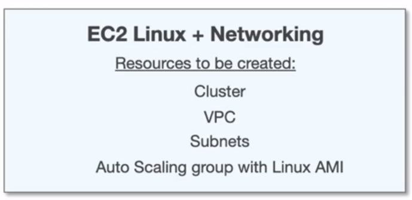
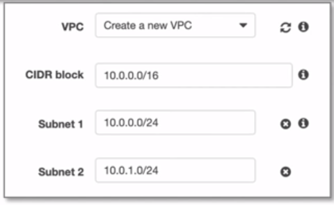
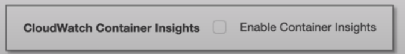
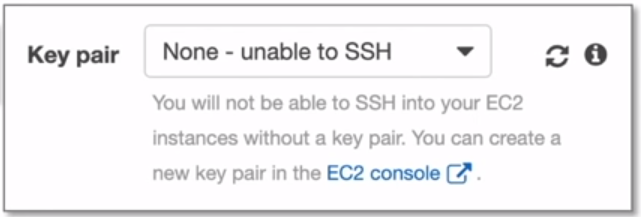
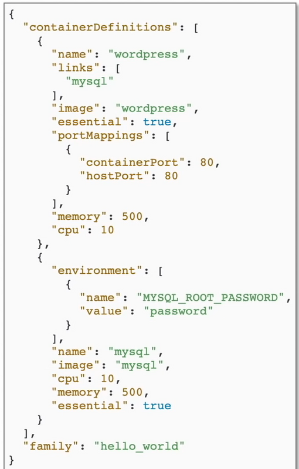

# Elastic Container Service ( ECS )

## Introduction

Fully-managed **container** orchestration service.
Highly secure, reliable, and scalable way to
run containers

## Components of ECS

- **Cluster**
  - Multiple EC2 instances which will house the docker
container
- **Task Definition**
  - A JSON file that defines the configuration of ( upto 10 )
containers you want to run
- **Task**
  - Launches containers defined in Task Definition.
Tasks do not remaining running once workload is complete
- **Service**
  - Ensures tasks remaining running eg. web-apps servers
- **Container Agent**
  - Binary on each EC2 instance which monitors,
starts and stops tasks

## Creating an ECS Cluster

To create an ECS cluster in aws console, the following steps
must be taken:

1. Create Cluster
2. Choose between use spots or on demand
3. Choose EC2 instance type
4. Number of instances
5. EBS Storage Volume
6. EC2 can be **Amazon Linux 1** or **Amazon Linux 2**
7. Assign an IAM Role
8. Option to turn on CloudWatch Container Insights
9. *Choose a Key Pair

*\*You can SSH into on EC2 Container Instance and make
changes but its not generally recommended*

## Task Definition File

  
  

  You can define multiple containers within
  a task definition

  The ( docker ) **images**
  can be provided either via **ECR** or an official
  docker repository, eg. Docker Hub

  You must have one **essential**
  container. If this container fails or stops than all
  containers will be stopped

  AWS has a wizard to create Task Definitions instead
  having to create a file by hand
  

## Elastic Container Registry ( ECR )

A fully-managed Docker container registry that makes
it easy for developers to **store**, **manage**,
and **deploy** Docker container images

