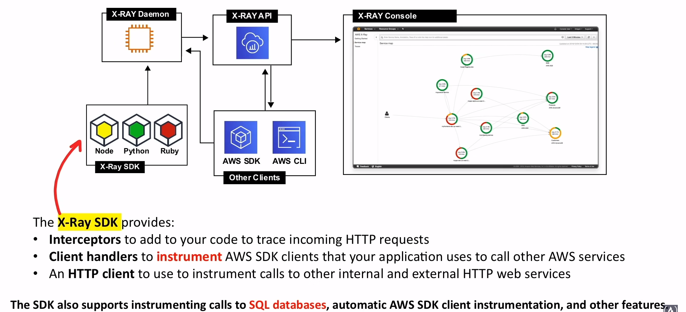
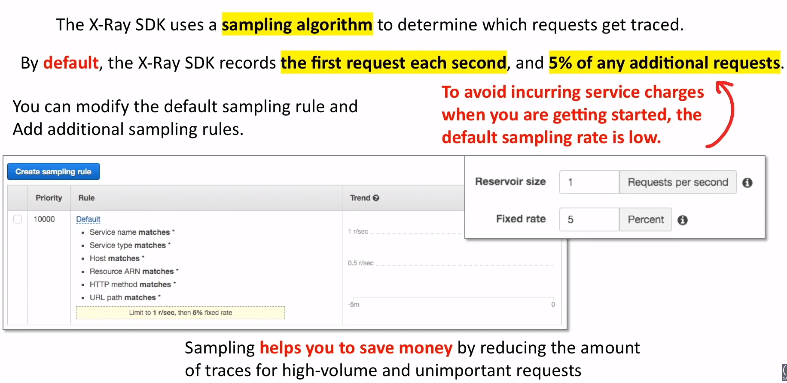
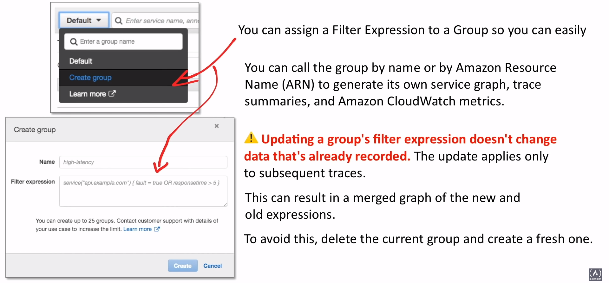

# X-Ray

Helps developers **analyze and debug applications**
utilizing <span class="text-red">microservice</span> architecture

## Introduction

### What is Micro-service architecture?

Micro-service is an architectural and organizational approach
to software development where software is composed of
**small independent** services that communicate over
well-defined APIs


These services are owned by small, self-contained teams

Microservice architectures make applications easier to scale
and faster to develop, enabling innovation and accelerating
time-to-market for new features

## What is a Distributed Tracing?

Distributed tracing, also called distributed request trancing,
is a method used to profile and monitor apps, especially
those built using a microservice architecture. Distributed tracing
helps pinpoint where failures occur and what causes
**poor performance**

## What is a Performance Monitoring?

Monitoring and management of performance and availability of
software apps. APM strives to detect and diagnose complex
application performance problems to maintain an expected
level of service

## X-Ray as Distributed Tracing System

- Collects data about requests that your application serves
- View, filter collect data to identify **issues** and
avenues for **optimization**

For any traced request to your application, you can see
detailed information not only about the request and response,
but also about calls that your application makes to downstream
AWS resources, micro-services, databases and HTTP web APIs

## The Anatomy of X-Ray



## Instrumentation

### What is Instrumenting?

The ability to monitor or measure the level of a
product's performance, to diagnose errors, and
to write trace information

```javascript
const app = express();
const AWSXRay = require('aws-xray-sdk');

app.use(AWSXRay.express.openSegment('MyApp'));

app.get('/', function(req, res) {
  res.render('index.html');
});

app.use(AWSXRay.express.closeSegment());
```

## X-Ray Daemon

<div style="display: flex; gap: 1rem">
  
  <div style="order: 1;">
  Instead of sending trace data directly to X-Ray,
  the SDK sends **JSON segment documents** to a
  daemon process listening for UDP traffic

  The X-Ray daemon **buffers segments** in a queue
  and uploads them to X-Ray in batches

  The daemon is available for Linux, Windows, and Mac,
  and use included on Elastic Beanstalk and Lambda platforms

  X-Ray uses trace data for the AWS resources that power your
  cloud applications to generate a detailed **service graph**
  </div>
</div>

## X-Ray Concepts

### Overview

1. X-Ray receives data from services as **segments**
2. X-Ray then groups segments that have a common request
into **traces**
3. X-Ray process the traces to generate a **service graph** that
provides a visual representation of your app

### Service Graph


### Segments

The compute resources running your application logic **send data**
about their work as **segments**

A segment can send tho following information:

- **The host:** Hostname, alias, or IP
- **The request:** Method, client address, path, user agent
- **The response:** Status, content
- **The work done:** Start and end times, subsegments
- **Issues that occur:** Errors, faults, and exceptions, including
automatic capture of exception stacks

### Subsegments

Subsegments provide more granular timing information and detail
about downstream calls that your app made to fulfill the original
request

A subsegment can contain additional details about a call to an
AWS service, an external HTTP API, or an SQL database

You can even
<span class="text-red">**define arbitrary subsegments**</span>
to instrument specific functions or lines of code in your application

```javascript
const AWS = Require('aws-sdk');
const AWSXRay = require('aws-xray-sdk');

exports.handler = (event, context, callback) => {
  const segment = AWSXRay.getSegment();
  const subsegment = segment.addNewSubSegment('custom-subsegment');

  processWithManyTasks();
  subsegment.close();

  callback();
}

function processWithManyTasks() {
  // Many many tasks...
}
```

### Traces

A trace collects all segments generated by a single request

A **trace ID** tracks the path of a request through your application

The first supported service that the HTTP request interacts with
**adds a trace ID header** to the **request**, and
propagate it downstream to track the latency, disposition,
and other request data

### Sampling



### Trace Header

All requests are traced, up to configurable minimum.
After reaching that minimum,
<span class="text-red">**a percentage of requests are traced
to avoid unnecessary cost**</span>

The sampling decision and trace ID are added to HTTP request
in **tracing headers** named **X-Amzn-Trace-Id**


### Filter Expressions


### Groups



### Annotations & Metadata

You can add other information to the segment document as
**annotation** and **metadata**

Annotations and metadata are aggregated at the trace level, and
can be added to any segment/subsegment

- **Annotation**
  - Key-value pairs that are **indexed** for use with
  filter expressions
  - X-Ray indexes up to
  <span class="text-red">**50 annotations**</span> per trace
  - Use annotations to record data that you want to use to
  group traces in the console, or when calling
  the GetTraceSummary API
- **Metadata**
  - Key-value pairs that are **not indexed**
  - The values can be of any type, including objects and lists
  - Use metadata to record data you want to store in the trace
  but don't need to use for searching traces

You can view annotations and metadata in the
<span class="text-red">**segment/subsegment details**</span>
in the X-Ray console

### Errors, Faults, and Exceptions

When an exception occurs while your app is serving an instrumented
request the X-Ray SDK records
<span class="text-red">**exceptions details**</span> and the
<span class="text-red">**stack trace**</span>
( if available )

|               |                   |                       |
|---------------|-------------------|-----------------------|
| **Errors**    | Client errors     | 400 / 4XX errors      |
| **Faults**    | Server faults     | 500 / 5XX errors      |
| **Throttled** | Throttling errors | 429 Too Many Requests |

You can view exceptions under
<span class="text-red">**segment detail**</span>
in the X-Ray console

## X-Ray - AWS Service Integration

- **Lambda**
- **API Gateway**
- **Elastic Load Balancer ( ELB )**
- **Simple Notification Service ( SNS )**
- **Simple Queue Service ( SQS )**
- **Amazon EC2**
- App Mesh
- CloudTrail
- CloudWatch
- AWS Config
- Elastic Beanstalk ( EB )
- Elastic Container Services ( ECS )
- ECS Fargate

*\* Services in bold have more use cases.*

## X-Ray - Supported Languages

- Go
- Java
- Node Js
- Python
- Ruby
- .Net
- PHP

## Cheat Sheet

- X-Ray **helps developers analyze and debug applications** that
utilize **microservice** architecture
- X-Ray is a **Distributed Tracing System**, it is a method used
to profile and monitor apps, especially those build using a
microservice architecture to pinpoint where failures occur and
what causes poor performance
- **X-Ray Daemon** is a software application that listens for
traffic on UDP port 2000, gathers raw segment data, and
relays it to the AWS X-Ray API. Data is generally not sent
directly the X-Ray API and passes through the X-Ray Daemon
which uploads in bulk
- **Segments** provides the resource's name, details about
the request, and details about the work done
- **Subsegments** provide more granular timing information and
detail about downstream calls that your app made to
fullfil the original request
- **Service Graph** is a flow chart visualization of average
response for micro-services and to visually
pinpoint failure
- **Traces** collects all segments generated by a single request
so you can track the path of requests through multiple services
- **Sampling** is an algorithm that decides which request
should be traced. By **Default** X-Ray SDK
<span class="text-red">**records the first request each second**</span>
and
<span class="text-red">**5% of any additional request**</span>

- **Tracing Header** is name **X-Amzn-Trace-Id** and identifies
a trace which passed along to downstream services
- **Filter Expressions** allows you to narrow down specify
paths or users
- **Groups** allow save FilterExpressions so you can quickly
filter traces
- **Annotations and Metadata** allow to capture additional
information key-value pairs
  - Annotations are **indexed** for use with filter expressions
  with a limit of 50
  - Metadata are **not indexed**. Use Metadata to record data
  you want tot store in the trace but don't need to use
  for searching traces
- **Errors** are 400 / 4XX errors
- **Faults** are 500 / 5XX errors
- **Throttle** is 429 Too Many Requests
- X-Ray supports the following **Languages:**
  - Go
  - Java
  - Node Js
  - Python
  - Ruby
  - .Net
  - PHP
- X- Ray support **AWS Service Integrations** with the following:
  - **Lambda**
  - **API Gateway**
  - **Elastic Load Balancer ( ELB )**
  - **Simple Notification Service ( SNS )**
  - **Simple Queue Service ( SQS )**
  - **Amazon EC2**
  - App Mesh
  - CloudTrail
  - CloudWatch
  - AWS Config
  - Elastic Beanstalk ( EB )
  - Elastic Container Services ( ECS )
  - ECS Fargate

<style>
.text-red {
  color: red;
}
</style>
