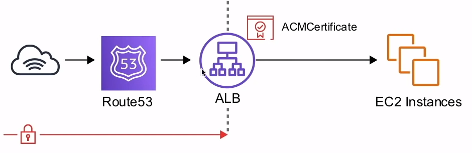
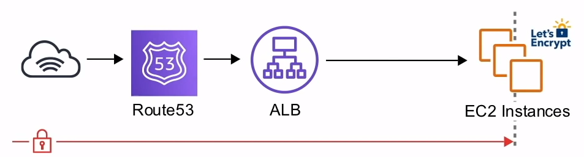

# ACM

**Provision**, **manage**, and **deploy** public and private
SSL/TLS certificates for use with AWS services

## Introduction

ACM handles the complexity of creating and managing public
**SSL/TLS** certificates for you AWS based websites and applications

ACM handles two kinds of certificates:

1. **Public** - Certificates provided by ACM
<>**( Free )**

2. **Private** - Certificates you import
<>**( $400 / month )!!!**

ACM can handle multiple subdomains and wildcard domains

ACM can be **attached** to the following AWS resources:

- ELB
- CloudFront
- Api Gateway
- Elastic Beanstalk ( though ELB )

## ACM Examples

### Terminating SSL at the Load Balancer

All traffic in-transit beyond the ALB is unencrypted

You can add as many EC2 instances to the ALB and you don't need
to install certificates on each instance. Theoretically
less secure

### Terminating SSL End-to-End

Traffic is encrypted in-transit all the way to the application

Guarantees encryption end-to-end. More complicated to
maintain certificates

