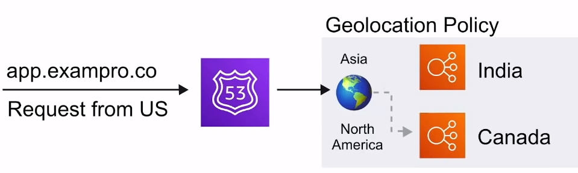

# Route53

Highly available and scalable cloud Domain Name System
( DNS ).
**Register and manage domains**,
create DNS routing rules, eg. failover

## Introduction

Route53 is a Domain Name Service **think** Godaddy or NameCheap
but with more synergies with AWS services

You can:

- Register and manage domains
- Create various records sets on domains
- Implements complex traffic flows eg. Blue/Green deploy, failover
- Continuously monitor records via health checks
- Resolve VPC's outside of AWS

## Use Case

Use Route53 to get your custom domains to point to your AWS Resources

1. Incoming Internet traffic
2. Route traffic to our web-app backend by ALB
3. Route traffic to an instance we use to tweak our AMI
4. Route traffic to API gateway which powers our API
5. Route traffic to CloudFront which serves our
S3 static hosted website
6. Route traffic to an Elastic IP ( EIP ) which is a
static IP that hosts our company Minecraft server

## Record Sets

We create record sets which allows us to point our naked domain
( exampro.co ) and sub-domains via Domain records

For example we can send our www subdomain using an A record to
point a specific IP address

Aws has their own special Alias Record which extends DNS functionality.
It will route traffic to specific AWS resources

Alias records are smart where they can detect the change of
an IP address and continuously keep that endpoint pointed to
the correct resource

In most cases you want to be using **Alias** when routing
traffic to AWS resources

## Routing Policies

There are
**7 different types** of
Routing policies available inside Route53

### Summary

- **Simple Routing**
  - Default routing policy, multiple addresses result
  in random selection
- **Weighted Routing**
  - Route traffic based on weighted values to split traffic
- **Latency-Based Routing**
  - Route traffic to region resource with lowest latency
- **Failover Routing**
  - Route traffic if primary endpoint is unhealthy to
  secondary endpoint
- **Geolocation Routing**
  - Route traffic based on the location of you users
- **Geo-Proximity Routing**
  - Route traffic based on the location of your resources and,
  optionally, shift traffic from resources in one location
  to resources in another
- **Multi-Value Answer Routing**
  - Respond to DNS queries with up to eight healthy records
  selected at random

### Simple Routing

Simple Routing Policies are the most basic routing policy
in Route53 **Default Policy**

- You have 1 record and provide multiple IP addresses
- When multiple values are specified for a record, Route53
will return all values back to the user in a **random order**

For example, if you had a record for 'www.exampro.co' with 3
different IP address values, user would be directly
**randomly to 1 of them**
when visiting the domain

### Weighted Routing

Weighted Routing Policies let you split up traffic based on
different 'weights' assigned

This allows you to send a certain percentage of overall traffic
to one server, and have any other traffic apart from that
directed to a completely different server

For example, if you had an ALB running experimental features
you could test against a small amount traffic at random to
minimize the impact of affect

### Latency-Based Routing

Latency Based Routing allows you to direct traffic based on
the lowest network latency possible for you end-user
**based on region**

Requires a latency resource record to be set for the EC2 or ELB
resource that hosts your application in each region

For example, you have two copies of your web-app backend by ALB.
One in California, Us and another in Montreal, Canada. An request
comes in from Toronto, it will be routed to Montreal since
it will have lower latency

### Failover Routing

Failover Routing Policy allow you to create active/passive
setups in situations where you want a primary site in one
location, and secondary data recovery site in another

Route53 automatically monitors health-checks from your primary
site to determine the health of end-points. If an end-point is
determined to be in a failed state, all traffic is automatically
directed to the secondary location

For example, we have a primary and secondary web-app backend
by ALB. Route53 determines our primary is unhealthy and fails
over to secondary ALB

### Geolocation Routing

Geolocation Routing Policy allow you to direct traffic
based on the geographic location of where the request
originated from

For example, this would let you route all traffic coming
from North American regions, where queries from other regions
could be directed to servers hosted in that region ( potentially
with pricing and language specific to that region )

### Geo-Proximity Routing

Geo-Proximity Routing Policies allow you to direct traffic based
on the geographic location of your users, and your AWS resources

You can route more or less traffic to a specific resource by
specifying a **Bias** value

Bias values expand or shrink the size of the geographic region
form which traffic is routed to. **You must use Route53
traffic flow** in order to use Geo-Proximity routing policies

### Multi-Value Answer Routing

Multi-Value Answer RoutingPolicies let you configure Route53
to return multiple values such as IP addresses for you
web-servers, in response to DNS queries

Multiple values can be specified for almost any record. Route53
automatically performs health-checks on resources and only
returns values of ones deemed healthy

Similar to Simple Routing, however with an added health check
for your record set resources

## Health Checks

- Checks health every
**30s** by default.
Can be reduce to every
**10s**

- A health check can **initial a failover** if status
is returned unhealthy
- A CloudWatch Alarm can be created to alert you of status unhealthy
- A health check can
**monitor other health checks**
to create a chain of reactions

Can create to **50 health checks** for AWS endpoints that
are within or linked to the same AWS account

### Pricing

|                                                                                            | **AWS Endpoints**                  | **Non-AWS Endpoints**              |
|--------------------------------------------------------------------------------------------|------------------------------------|------------------------------------|
| Basic Health Checks                                                                        | $0.50 per health check / month     | $0.75 per health check / month     |
| Optional health check features: HTTPS; String Matching; Fast Interval; Latency Measurement | $1.00 / month per optional feature | $2.00 / month per optional feature |

## Resolver

Formally known as **.2 resolver**

A regional service that lets you route DNS queries between your
VPCs and your network

DNS Resolution for **Hybrid Environments** ( On-Promise and
Cloud )

## Cheat Sheet

- Route53 is a DNS provider, register and manage domains,
create record sets. Think Godaddy or NameCheap
- **Simple Routing**
  - Default routing policy, multiple addresses result
  in random selection
- **Weighted Routing**
  - Route traffic based on weighted values to split traffic
- **Latency-Based Routing**
  - Route traffic to region resource with lowest latency
- **Failover Routing**
  - Route traffic if primary endpoint is unhealthy to
  secondary endpoint
- **Geolocation Routing**
  - Route traffic based on the location of you users
- **Geo-Proximity Routing**
  - Route traffic based on the location of your resources and,
  optionally, shift traffic from resources in one location
  to resources in another
- **Multi-Value Answer Routing**
  - Respond to DNS queries with up to eight healthy records
  selected at random
- **Traffic Flow**
  - Visual editor, for chaining routing policies, can version
  policy records for easy rollback
- **AWS  Alias Record**
  - Smart DNS record, detects changes IPs for AWS resources
  and adjusts automatically
- **Route53 Resolver**
  - Lets you regionally route DNS queries between your VPCs
  and your network **Hybrid Environments**
- Health checks can be created to monitor and automatically
over endpoints. You can have health checks monitoring other
health checks

