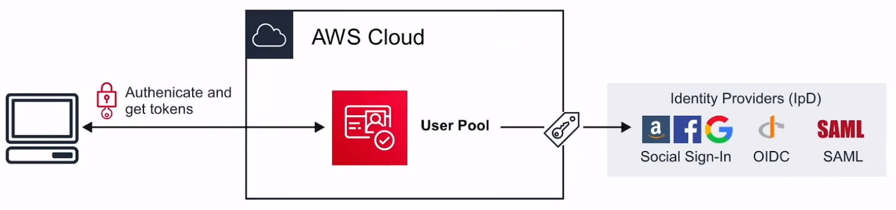

# Amazon Cognito

Decentralized Managed
**Authentication**.
Sign-up, sign-in integration for yours apps.
Social identity provider eg. Facebook, Google.

## Introduction

### Cognito User Pools

User directory with authentication to IpD to grant
access to your app

### Cognito Identity Pools

Provide temporary credentials for users to access
AWS services

### Cognito Sync

Syncs user data and preferences across all devices

## Web Identity Federation and IpD

### Web Identity Federation

To exchange identity and security information between an
identity provider ( IdP ) and an application

### Identity Provider ( IdP )

A trusted provider of your user identity that lets you use
authenticate to access other services. Identity providers
could be:
**Facebook, Amazon, Google,
Twitter, Github, LinkedIn**

## Cognito User Pools

**User Pools** are user directories used to manage the
actions for web and mobiles apps such as:

- Sign-up
- Sign-in
- Account recovery
- Account confirmation

Allows users to sign-in directly to the User Pool, or
using Web Identity Federation

Uses AWS Cognito as the identity broker between AWS and
the identity provider

Successful user authentication generates a JWTs

User Pools can be thought of as the account used
to access the system, ie. email address and password

## Cognito Identity Pools

**Identity Pools** provide
**temporary AWS credentials**
to access services eg. S3, DynamoDB. Identity Pools can be
thought of as the actual mechanism authorizing access
to the AWS resources

## Cognito Sync

Sync **user data** and **preferences** across devices with
one line of code

Cognito uses **push synchronization** to push updates and
synchronize data. Uses SNS to send notifications to all
user devices when data in the cloud changes

## Cheat Sheet

- Cognito is decentralized managed authentication system.
When you need to easily add authentication to your mobile
or desktop app think Cognito
- **User Pools** user directory, allows users to authenticate
using OAuth to IpD such as Facebook, Google, Amazon to connect
to web-applications. cognito User Pool is in itself a IpD
- User Pools use **JWTs** for to persist authentication
- **Identity Pools** provide **temporary AWS credentials**
to access services eg. S3, DynamoDB
- **Cognito Sync** can sync **user data** and **preferences**
across devices with one line of code ( powered by SNS )
- **Web Identity Federation** exchange identity and security
information between an identity provider ( IdP )
- **Identity Provider ( IdP )** a trusted provider of your
user identity that lets you use authenticate to access
other services. Eg. Facebook, Twitter, Google and Amazon
- **OIDC** is a type of identity Provider which uses OAuth
- **SAML** is a type of identity Provider which uses SSO

