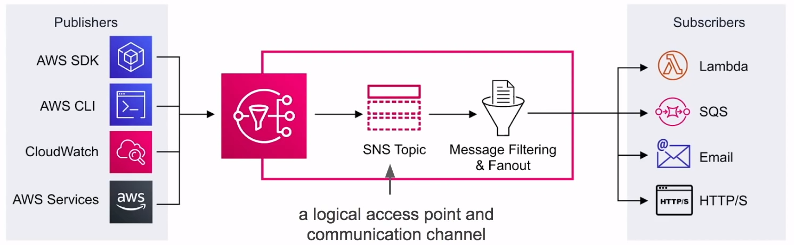

# Simple Notification Service ( SNS )

**Subscribe** and
**send notifications**
via text message, email, webhooks, lambdas, SQS and
mobile notifications

## Introduction

**Simple Notification Service ( SNS )** is a highly available,
durable, secure, fully managed
**pub/sub messaging**
service that enables you to
**decouple**
micro-services, distributed systems, and serverless applications.

### Application Integration

- Publishers **push** events to an SNS Topic
- Subscribers subscribe to SNS Topic to have events **pushed**
to them

### What is Pub/Sub?

Publish-Subscribe pattern commonly implemented in
**messaging systems**. In a pub/sub system the sender of
messages ( **publishers** ) do not send their messages directly
to receivers. They instead send their messages to an
**event bus**. The event bus
categorizes their messages into groups. Then receivers of
messages ( **subscribers** ) subscribe to these groups.
Whenever new messages appear within their subscription the
messages are immediately delivered to them.

- Publisher have no knowledge of who their subscribers are
- Subscribers do **not pull** for messages
- Messages are instead automatically and immediately
**pushed** to subscribers
- Messages and events are interchangeable terms in pub/sub  

## SNS Topics

**Topics** allow you to group multiple subscriptions together.

A topic is able to deliver to multiple protocols at once, eg.
Email, text message, http/s

When topics deliver messages to subscribers it will automatically
format your message according to the subscriber's chosen protocol

You can encrypt Topics via **KMS**

**Publishers don't care about the subscribers protocol.**

**Subscribers listen for incoming messages.**

## SNS Subscriptions

A subscription can only subscribe to one protocol and one topic

The following protocols:

- **HTTP and HTTPS**
  - Create webhooks into your web-application
- **Email**
  - Good for internal email notifications
  ( only supports **plain text**)
- **Email-JSON**
  - Sends you json via email
- **Amazon SQS**
  - Place SNS message into SQS queue
- **AWS Lambda**
  - Triggers a lambda function
- **SMS**
  - Send a text message
- **Platform Application Endpoint**
  - Mobile Push

## Application As Subscriber

Send push notification messages directly to apps on
**mobile devices**

Push notification messages sent to a mobile endpoint can
appear in the mobile app as message alerts, badge, updates,
or even sound alerts

### Push Notification Types

- **ADM**
  - Amazon Device Messaging
- **APNs**
  - Apple Push Notification Services
- **Baidu**
  - Baidu Cloud Push
- **FCM**
  - Firebase Cloud Messaging
- **MPNS**
  - Microsoft Push Notification Service For Windows Phone
- **WNS**
  - Windows Push Notification Service

## Cheat Sheet

- **Simple Notification Services ( SNS )** is a fully managed
pub/sub messaging service
- SNS is for **Application Integration**. It allows decoupled
services and apps to communicate with each other
- **Topic** a logical access point and communication channel
- A topic is able to deliver to multiple protocols
- You can encrypt topics via KMS
- **Publishers** use the AWS API via AWS CLI or SDK to push
messages to a topic. Many AWS services integrate with SNS
and act as publishers
- **Subscriptions** subscribe to topics. When a topic receives
a message it automatically and immediately pushes messages to
subscribers
- All messages published to SNS are stored redundantly across
multiple Availability Zones ( AZ )
- The following protocols:
  - **HTTP and HTTPS**
    - Create webhooks into your web-application
  - **Email**
    - Good for internal email notifications
    ( only supports **plain text**)
  - **Email-JSON**
    - Sends you json via email
  - **Amazon SQS**
    - Place SNS message into SQS queue
  - **AWS Lambda**
    - Triggers a lambda function
  - **SMS**
    - Send a text message
  - **Platform Application Endpoint**
    - Mobile Push

