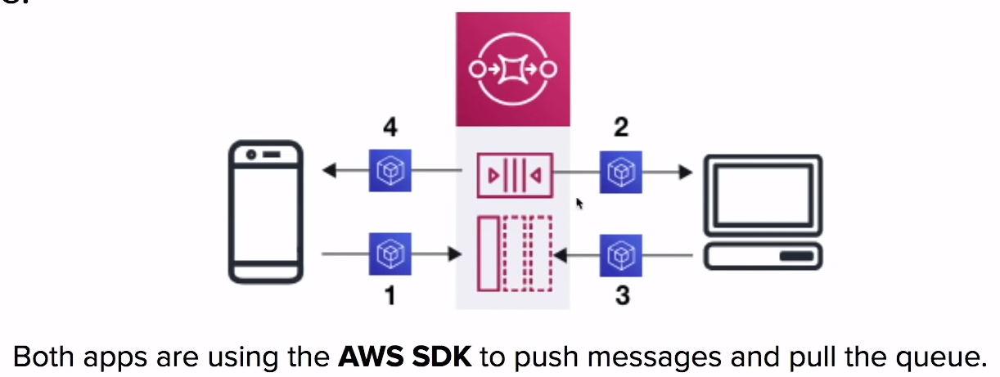

# Simple Queue Services ( SQS )

Fully managed
**queueing service**
that enables you to decouple and scale micro-services,
distributed systems, and serverless applications

## Introduction

SQS is for **Application Integration**

AWS SQS a solution for the distributed **queueing** of
messages generated by your application. It connects isolate
applications together by passing along message to one
another

A **queue** is a temporary repository for messages that are
awaiting processing

Using the **AWS SDK** you write code which publishes messages
onto the queue and you pull the queue for messages

**SQS is pull based. Not push based!**

### What is a Messaging System?

Used to provide asynchronous communication and decouple processes
via messages/events from a sender and receiver
( producer and consumer )

### Queueing

- Not reactive.
- Simple communication.
- Generally will delete messages once they are consume
- **Not Real-time** have to pull.

Eg:

- SQS
- Sidekiq
- RabbitMQ

### Streaming

Multiple consumers can **react**
to events ( messages ), Events live in the stream for long
periods of time, so complex operation can be applied.
**Real-time**

Eg:

- Kinesis
- Nats
- Kafka

## SQS Use Case

1. App publishes messages to the queue
2. Other app pulls the queue and find the message and
does something
3. Other app reports that they completed their task and
marks the message for completion
4. Origin app pulls the queue and sees the message is no
longer in the queue

## SQS Limits

### Message Size

The size of a message can be between **1 byte and 256KB**

**Amazon SQS Extended Client Library
for Java**

lets you send messages **256KB to 2GB** in size.
The message will be stored in S3 and library will reference
the S3 object

### Message Retention

How long SQS will hold onto a message in the queue before
dropping it from the queue ( deleting it )

Message retention by **default is 4 days**

Message retention can be adjusted from a minimum of
**60 seconds** to a max of **14 days**

## Queue Types

### Standard Queues

AWS SQS **Standard Queues** allow you a **nearly-unlimited**
number of transactions per seconds

Guarantees that a message will be delivered **at least once**

**More than one copy** of a message could be potentially
delivered **out of order**

Provides **best-effort ordering** that helps ensure a message
is generally delivered in the same order that it was sent

### FIFO Queues

AWS SQS **First-In-First-Out** queues support multiple ordered
message groups within a single queue

Limited to **300** transactions yer second

SQS FIFO queues have all the same capabilities of a
Standard Queue

## SQS - Visibility Timeout

How do we prevent another app from reading a message while another
one is busy with that message?
( Avoid someone doing the same task )

A **visibility time-out** is the period of time that messages
are **invisible in the SQS queue**, after a reader picks up
that message

Messages will be **deleted** from the queue
**after a job has processed**. ( before the visibility
time-out expires )

If a job is **NOT** processed before the visibility time-out
period, the message will **become visible again** and another
reader will process it

This can result in the same message being delivered **twice**!

### Visibility Timeout Values

- 30 seconds by default
- 0 seconds minimum
- 12 hours maximum

## SQS - Short vs Long Polling

**Polling** is the method in which we retrieve messages from
the queues

### Short Polling

**Short polling ( default )** returns messages immediately,
even if the message queue being polled is empty

When you need a message **right away**, shorting polling is what
you want use

### Long Polling

Long polling waits until message **arrives in the queue**,
or the **long pol timeout expires**

Long polling makes it **inexpensive to retrieve messages**
from you queue as soon as the messages are available

Using long polling will reduce the cost because you can
**reduce the number of empty receives**

**Most use-case** you want to use
Long polling

You can enable long polling when receiving a message by setting
the wait time in seconds on the **ReceiveMessageRequest**

## Cheat Sheet

- SQS is a queueing service using messages with a queue.
Think Sidekiq or RabbitMQ
- SQS is used for Application Integration, it lets decouple
services and apps to talk to each other
- To read SQS use need to **pull** the queue using the AWS SDK.
SQS is **not pushed-based**
- SQS support both Standard and FIFO queues
  - Standard allows nearly unlimited messages per seconds,
  does not guarantee order of delivery, always delivers
  al least once, you must protect again duplicate messages
  being processed
  - FIFO maintains the order of messages with a 300 limit
- There are two kinds of polling, Sort ( default ) and Long
  - Short Polling returns messages immediately, event if the
  message queue being polled is empty
  - Long Polling waits until message arrives in the queue,
  or the long poll timeout expires
- In majority of cases **Long polling** is preferred over
short polling
- **Visibility timeout** is the period of time that messages
are invisible in the SQS queue
- Messages wil be deleted from queue after a job has processed.
( before visibility timeout expires )
- If visibility timeout expires that a job will become visible
to the queue
- The default visibility timeout is 30 seconds. timeout can be
0 seconds to a maximum of 12 hours
- SQS can retain messages from 60 seconds to 14 days and
by default is 4 days
- Message size between 1 byte to 256KB, Extended Client Library
for Java can increase to 2GB

