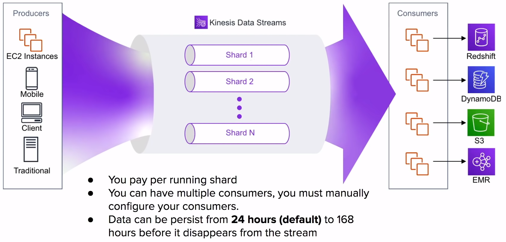
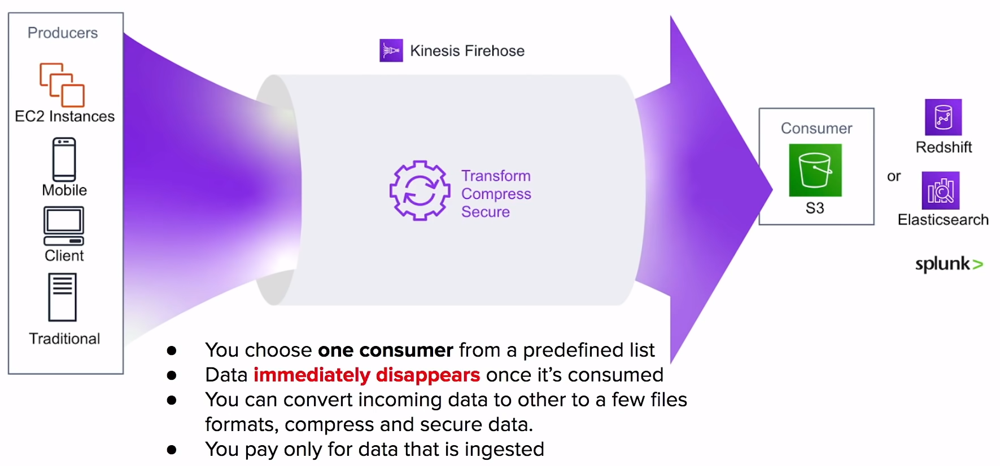
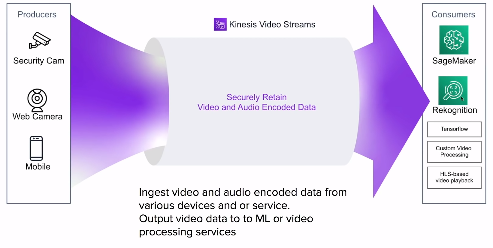
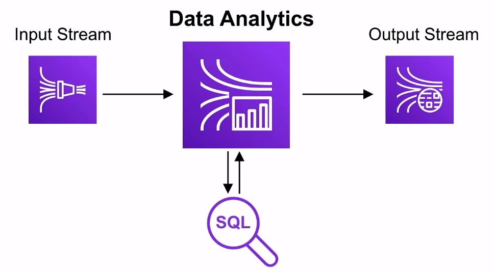

# Kinesis

Scalable and durable **real-time**
**data streaming**
service to ingest, and analyze data in real-time
from multiple resources

## Introduction

Amazon Kinesis is the AWS fully managed solution for
**collecting**, **processing** and
**analyzing streaming data** in the cloud

When you need
**real time**
think Kinesis

### Streaming Data Examples

- Stock Prices
- Game Data ( as the players plays )
- Social Network Data
- Geospatial Data
- Click Stream Data

### Kinesis Streams Types

- Kinesis Data Streams
- Kinesis Firehose Delivery Streams
- Kinesis Video Analytics
- Kinesis Data Analytics

## Kinesis Data Streams

## Kinesis Firehose Delivery Streams

## Kinesis Video Analytics

## Kinesis Data Analytics

You can specific Firehose or Data Streams as an input
and an output.

Data that pass through Data Analytics is run through
**custom SQL** you provide and the results are then output.

This allows for real-time analytics of your data

## Cheat Sheet

- **Amazon Kinesis** is the AWS solution for **collecting**
**processing** and **analyzing streaming data** in the cloud.
When you need **real time**
think Kinesis
- **Kinesis Data Streams** - Pay per running shard, data
can persist within the stream, data is ordered and every
consumer keep its own position.
Consumers have to be manually added ( coded ), Data persists
for **24 hours ( default )** to **168 hours**
- **Kinesis Firehose** - Pay for only the data ingested, data
**immediately disappears** once processed. Consumer of choice
is from a predefined set of services: S3, Redshift, ElasticSearch
or Splunk
- **Kinesis Data Analytics** - Allow you to perform
**queries in real-time**. Needs a Kinesis Data Streams/Firehose
as the input and output
- **Kinesis Video Analytics** securely ingests and stores video
and audio encoded data to consumers such as SageMaker, Rekognition
or other service to apply ML and video processing
- KPL ( Kinesis Producer Library ) is a Java library to write
data to a stream

