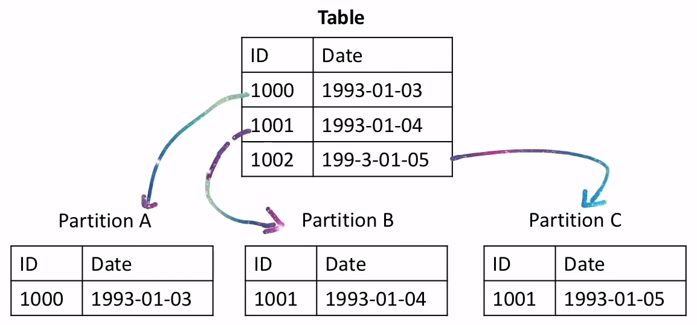
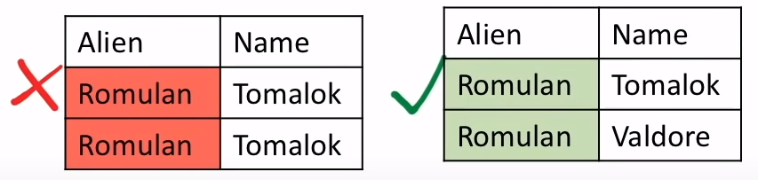
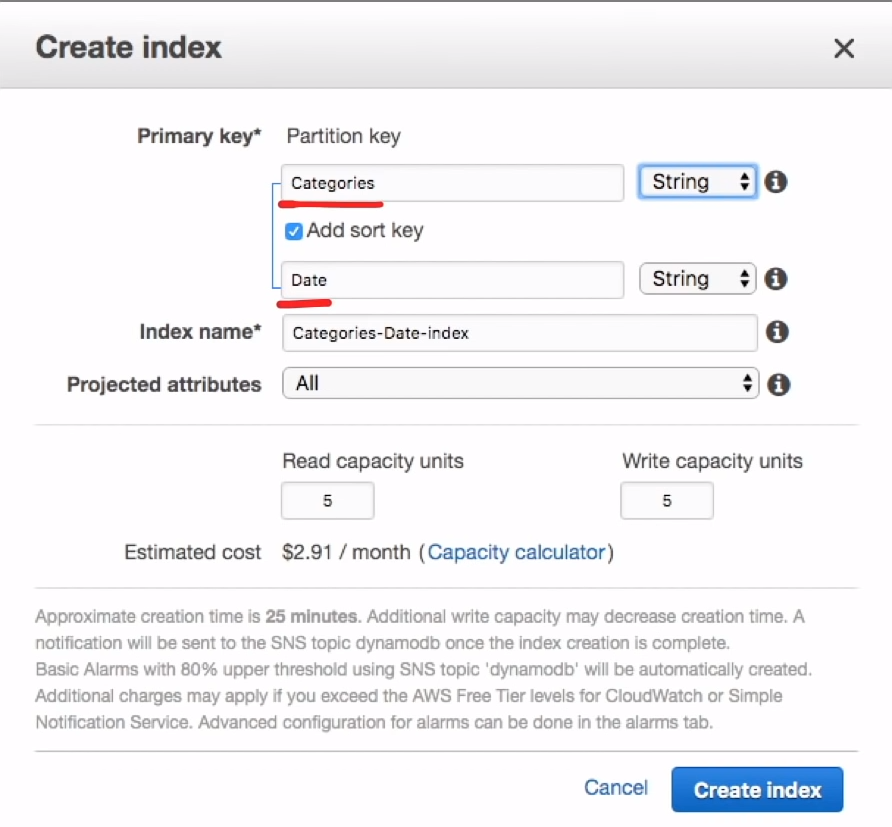

# DynamoDB

**A key-value** and **document** NoSQL database which can
<span class="text-red">**guarantee consistent reads and
writes**</span> at any scale

## Introduction

**DynamoDB** is a NoSQL **key/value** and **document** database
for internet-scale applications

There are many features:

- Fully managed
- Multi-region
- Multi-master
- Durable database
- Build-in security
- Backup and restore
- In-memory caching

Provides:

- Eventual Consistent Reads ( default )
- Strongly Consistent Reads

**All data is stored in SSD storage and is spread across
3 different AZs**

### What is NoSQL?

NoSQL is database which is
<span class="text-red">**neither relational**</span> and
<span class="text-red">**does not**</span> use SQL to
query the data for results

### What is Key/Value Store?

A form of data storage which has a **key** which references
a **value** and nothing more

```json
{
  "title": "Just Do It"
}
```

### What is a Document Store?

A form of data storage which has **nested data** structure

```json
{
  "serie": "DS9",
  "episodes": [
    {
      "season": 1,
      "episodes": 19,
      "title": "Just Do It"
    }
  ]
}
```

## Anatomy of DynamoDB


## Read Consistency

When data needs to be updated it has to write updates to all
copies. **It is possible for data to be**
<span class="text-red">**inconsistent**</span> when reading
from a copy which has yet to be updated

You have the ability to choose **the read consistency** in
DynamoDB to meet your needs

### Eventual Consistent Reads

- Use by default
- When copies are being updated it is possible for you to read
and be returned an inconsistent copy
- <span class="text-red">**Reads are fast**</span> but there
is <span class="text-red">**no guarantee of consistent**</span>
- All copies of data eventually
<span class="text-red">**become generally consistent within
a second**</span>

### Strongly Consistent Reads

- When copies are being updated and you attempt to read,
it will not return a result until all copies are consistent
- You have
<span class="text-red">**a guarantee of consistency**</span>
but the trade off is
<span class="text-red">**higher latency ( slower reads )**</span>
- All copies of data
<span class="text-red">**will be consistent within a second**</span>

## Partitions

### What is a Partition?

A partition is an allocation of storage for a table, backed by
Solid State Drives ( SSDs ) and automatically replicated
across multiples Availability Zones ( AZ ) within an
AWS Region

A partition is when
**you slice your table up into smaller chunks of data**
( a partition ).
<span class="text-red">**It speeds up reads**</span> for
very large tables by logically grouping similar data together



DynamoDB <span class="text-red">**automatically**</span>
creates partitions for you as your data grows

DynamoDB starts off with a single partition

There are two cases where DynamoDB will create a new partitions:

1. For every **10GB** of data
2. When you exceed the RCUs or WCUs for single partition

Each partition cas maximum of **3000 RCUs** and **1000 WCUs**

- **RCU** - Read Capacity Unit
- **WCU** - Write Capacity Unit

## Primary Keys

When your create a table you have to define a **primary key**.
The primary key determines **where and how** your data will be
stored in partitions

**The primary key cannot be changed later.**

DynamoDB doesn't have Date datatype so for dates you have
to use string

- Using only Partition Key is called a **Simple** Primary Key
- Using both a Partition and Sort is called a **Composite**
Primary Key

## Primary Keys Design

Two things when designing your Primary Key

Distinct - The key should be as distinct ( unique ) as possible
Uniform - The key should evenly divide data

### Simple Primary Key

- Only Partition Key
- No two items can have the same Partition Key



### Composite Primary Key

- Partition + Sort Key
- Two items can have the same partition key, but
partition and sort key combined must be unique


## Query and Scan

The best to learn what **Query** and **Scan** can do is to play
around with the DynamoDB console

### Query

- Allow you to **find items** in a table based on
primary key values
- Query any table or secondary index that has a
**composite** primary key ( partition and sort key )
- By default reads as **Eventually Consistent** ( if you
want Strongly Consistent set `ConsistentRead` to `true` )
- By default return all attributes for items
- You can return specific attributes by using
`ProjectExpression`
- By default is sorted **ascending**. Set `ScanIndexForward`
to `false` to reverse or to descending

Example of the payload of a Query. There are many more options
you can supply

```json
{
  "ConsistentRead": true,
  "ScanIndexForward": true,
  "ProjectionExpression": "id, name, createdAt, updatedAt",
  "limit": 20,
}
```

### Scan

- Scan **thorough all items** and then return one or more items
through filters
- Scans can be performed on tables and secondary indexes
- By default return all attributes for items
- You can return specific attributes by using
`ProjectExpression`
- Scan operations are sequential. You can speed up a scan
through parallel scans using `Segments` and `Total Segments`
parameters

**Avoid Scans When Possible.**

- Much **less efficient** that running a query
- As a table **grows**, scans take **longer** to complete
- A large table can use
**all you provisioned throughput** in a single scan

## Provisioned Capacity

**Provisioned Throughput Capacity** is the **maximum** amount
of capacity your application is allowed to **read** or
**write** per second from a table or index

Throughput is measure in capacity units:

- **RCUs** is Read Capacity Units
- **WCUs** is Write Capacity Units

You can set DynamoDB for provisioned to scale capacity **up**
and **down** based on utilization

If you go beyond your capacity you'll get the error
`ProvisionedThroughputExceededException`

This is known as Throttling. Requests that are throttled
will be dropped ( data loss )

## On-Demand Capacity

**On-Demand Capacity** is pay per request. So you pay only for
what you use

On-demand mode is a good for:

- New tables with unknown workloads
- Unpredictable application traffic
- These easy of paying for only what you use

The throughput is limited by the **default** upper limits
for a table:

- 40.000 RCUs
- 40.000 WCUs

Since there **is no hard limit** impose by the user, On-demand
could become very expensive based on the emerging scenario

## Calculating Reads

### Read Capacity Units ( RCU )

A read capacity unit represents:

- One **strongly** consistent read per second
- Or two **eventually** consistent reads per second
- For an item up to 4KB in size

### How to Calculate RCUs for Strong

1. Round data up to nearest 4
2. Divide data by 4
3. Times by number of reads

Eg.

- 50 reads at 40Kb per item
  - `(40/4) * 50 = 500 RCUs`
- 10 reads at 6Kb per item
  - `(8/4) * 10 = 20 RCUs`
- 33 reads at 17Kb per item
  - `(20/4) * 33 = 132 RCUs`

### How to Calculate RCUs for Eventual

1. Round data up to nearest 4
2. Divide data by 4
3. Times by number of reads
4. Divide final number by 2
5. Round up to the nearest whole number

Eg.

- 50 reads at 40Kb per item
  - `(40/4) * 50 / 2 = 250 RCUs`
- 10 reads at 6Kb per item
  - `(8/4) * 10 / 2 = 16.5 = 17 RCUs`
- 33 reads at 17Kb per item
  - `(20/4) * 33 / 2 = 35 RCUs`

### Write Capacity Units ( WCU )

A write capacity unit represents:

- One write per second
- For an item up to 1KB in size

### How to Calculate WCUs

1. Round data up to nearest 1
2. Times by number of writes

Eg.

- 50 writes at 40KB per item
  - `40 x 50 = 2.000 WCUs`
- 11 writes at 1KB per item
  - `1 x 11 = 11 WCUs`
- 18 writes at 500 Bytes per item
  - `1 x 18 = 18 WCUs`

## Global Tables

Amazon DynamoDB global tables provide a fully managed solution
for deploying a **multi-region**, multi-master database, without
having to build and maintain your own replication solution

To create a global tables you must first:

1. Use KMS CMK ( Custom Master Key )
2. Enable Streams
3. Stream Type of New and Old Image

## Transactions

### What is a Transaction ?

Represents a change that will occur to the database. If any
dependent conditions fail that a transaction will rollback

Transaction are ACID:

- **A**tomicity
- **C**onsistency
- **I**solation
- **D**urability

DynamoDB transactions allow for **all-or-nothing** changes to
multiple items both **within and across tables**

DynamoDB performs **two** underlying reads or writes of every
item in the transaction:

1. One to prepare the transaction
2. Another to commit the transaction

There two underlying read/write operations are visible in your
**Amazon CloudWatch** metrics

You can use `ConditionCheck` with DynamoDB transactions to do
pre-conditional checks

## Time to Live ( TTL )

Time to Live ( TTL ) lets you have items in DynamoDB **expires**
( deleted ) at a given time

TTL is great for keeping databases small and manageable and
suited for temporary continuous data

eg. session data, event logs, usage patterns

Put in the **TTL attribute** name which will have a string in
DateTime format that will determine when this record will
be deleted

DynamoDB **does't have a DateTime datatype!**. To use TTL you
must use a string which needs to be in **Epoch** format
( Datetime represented as numbers )

*A smaller database result in money saved!*

## Streams

When you enable a **stream** on a table, DynamoDB captures every
modification to data items so you can react those changes

When an **Insert**, **Update** or **Delete** occurs, the change
will be captured and sent to **lambda function**

- Changes are sent in batches at time to your custom lambda
- Changes are sent to the your custom lambda in near real-time
- Each stream record appears exactly once in the stream
- For each item that is modified  the stream records appear
in the same sequence as the actual modifications

## Common Exceptions

### ThrottlingException

Rate of requests exceeds the allowed throughput. This exception
might be returned if you perform any of the following operations
too rapidly: **CreateTable**, **UpdateTable**, **DeleteTable**

### ProvisionedThroughputExceededException

You exceeded your maximum allowed provisioned throughput for
a table or for one or more global secondary indexes

The AWS SDK will **automatically retry** with **Exponential Backoffs**
when an error occurs, ie, it will attempt the request again
50ms 100ms 200ms 400ms up to a minute before stopping

## Indexes

### What is an Index?

A database index is a **copy** of selected columns of data in
a database which is used to quickly sort

DynamoDB has two types of indexes:

1. LSI - Local Secondary Index
( can only be created with initial table)
2. GSI - Global Secondary Index

**You should generally use Global over Local.**

**Strong Consistency Is a Deciding Factor.**
A local secondary index **can provide** strong consistency
A global secondary index **cannot provide** strong consistency

### Local Secondary Index ( LSI )

It's "local" in that every partition of an LSI is scoped to
a base table partition that **has the same partition key value**

The total size of indexed items for any one partition key value
**can't exceed 10GB**

**Shares provisioned throughput** settings for read and write
activity with the table it is indexing

Limited to 5 per table ( default )

---

- LSIs are created with the initial table
- LSIs cannot be added, modified, or deleted after creation
- An LSI needs **both** a partition and sort key
- The partition key mus **be the same** as the base table
- The sort key should **be different** from the base table


### Global Secondary Index ( GSI )

It's considered "global" because queries on the index can
**span all of the data in the base table, across all partitions**

The indexes have no size restrictions ( unlimited )

They have their own provisioned throughput settings. They consume
capacity but not from the base table

Limited to 20 per table ( default )

---

- GSI can be added, modified or deleted at anytime.
- The partition key should **be different** from the base table
- The sort key is optional but no required



### LSI vs GSI

| **Characteristics**                          | **Local Secondary Index**                                                           | **Global Secondary Index**                                        |
|----------------------------------------------|-------------------------------------------------------------------------------------|-------------------------------------------------------------------|
| **Key Schema**                               | Composite                                                                           | Simple or Composite                                               |
| **Key Attributes**                           | Partition key must be same as base table                                            | Partition and sort key can be any attribute                       |
| **Size Restriction Per Partition Key Value** | All indexed items must be 10GB or less                                              | Unlimited                                                         |
| **Online Index Operations**                  | Create index on table creation                                                      | Add, modify, or delete index at anytime                           |
| **Queries and Partitions**                   | Query over a single partition, as specified by the partition key value in the query | Query over the entire table, across all partitions                |
| **Read Consistency**                         | Strongly or eventual consistency                                                    | Only eventual consistency                                         |
| **Provisioned Throughput Consumption**       | Share capacity units with base table                                                | Has its own capacity                                              |
| **Projected Attributes**                     | Can request attributes that are not projected in to the index                       | Can only request the attributes that are projected into the index |

## Accelerator ( DAX )

DAX is a fully managed **in-memory cache** for dynamoDB that
runs in a cluster

DynamoDB response times can be in **single-digit** milliseconds.
Dax can reduce response times to **microseconds**

- A DAX cluster consists of one or more nodes
- Each node runs its own instance of the DAX caching software
- One of the nodes serves as the primary node for the cluster
- Additional nodes ( if present ) serve as read replicas
- Your app can access DAX by specifying the endpoint for
the DAX cluster
- The DAX client software works with the cluster endpoint to
perform intelligent load balancing and routing
- Incoming requests are evenly distributed across all of
the nodes in the cluster

### Use Cases

DAX is ideal for:

- Apps that require the **faster possible response time**
for reads, eg. real-time bidding, social gaming, and
trading applications
- Apps that **read a small number of items** more
frequency than others
- Apps that are **read-intensive**, but are also cost-sensitive
- Apps that require repeated reads against a large set of data

DAX is **NOT** ideal for:

- Apps that require strongly consistent reads
- Apps that do not require microsecond response times for reads,
or that do not need to offload repeated read activity from
underlying tables
- Apps that are **write-intensive**, or that do not perform
much read activity
- Apps that are already using a different caching solution
with DynamoDB, and are using their own client-side logic
for working with that caching solution

## Cheat Sheet

- DynamoDB is a fully managed **NoSQL** key/value and
document database
- DynamoDB is suited for workloads with any amounts of data that
**require predictable read and write performance** and automatic
scaling from large to small and everywhere in between
- DynamoDB scales up and down to support whatever
**read and write capacity you specify** per second in provisioned
capacity mode or you can set tt to On-Demand mode and there is
little to no capacity planning
- DynamoDB can be set to support
**Eventually Consistent Reads ( defaults )** and
**Strongly Consistent Reads** on a per-call basis
- **Eventually Consistent Reads** data is returned immediately
but data can be inconsistent. Copies of data will be
generally consistent in 1 second
- **Strongly Consistent Reads** will always read from the leader
partition since it always has an up-to-date copy. Data will never
be inconsistent but latency may be higher. Copies of
data will be consistent with a guarantee of 1 second
- DynamoDB stores 3 copies of data on SSD drives across 3 AZs
in a region
- DynamoDB most common datatype are **B** ( Binary ),
**N** ( Number ), **S** ( String )
- Tables consist of **items** ( rows ) and items consist of
**attributes** ( columns )
- A **Partition** is when DynamoDB slices your table up into
smaller chunks of data, this speeds up reads for very large tables
- DynamoDB automatically creates Partitions for:
  - Every 10GB of data
  - When you exceed RCUs ( 3000 ) or WCUs ( 1000 ) limits
  for a single partition
  - When DynamoDB sees a pattern of a hot partition,
  it will split that partition in an attempt to fix the issue
- DynamoDB will try to **evenly split** the RCUs and WCUs
across partitions
- Primary keys define **where and how** your data will be
stored in partitions
- Primary key comes in two types:
  - **Simple** - Primary Key ( Using only a Partition Key )
  - **Composite** - Primary Key ( Using both a Partition and
  Sort Key )
- Partition key is also knows as **HASH**
- Sort key is also known as **RANGE**
- When creating a Simple Primary Key the Partition Key value
must be unique
- When creating a Composite Primary Key the combined Partition
and Sort key value must be unique
- When using Sort key records on the partition are logically
group together in Ascending order
- **DynamoDB Global Tables** provide fully managed solution for
deploying multi-region, multi-master databases
- DynamoDB supports transactions via the **TransactWriteItems**
and **TransactGetItems** API calls
- **Transactions** let you query multiple tables at once
and is an all-or-nothing approach ( all API calls must
succeed )
- **DynamoDB Streams** allows to setup a lambda function
triggered every time data is modified in a table to react
to changes
  - Streams do not consume RCUs
- DynamoDB has two types of Indexes:
  - **LSI** - Local Secondary Indexes
    - Supports **strongly** or eventual consistency reads
    - Can only be created with initial table ( cannot be
    modified and cannot deleted unless also deleting
    the table )
    - Only Composite primary key type
    - 10GB or less per partition
    - Share capacity units with base table
    - Must share Partition Key ( PK ) with base table
  - **GSI** - Global Secondary Index
    - Only eventual consistency reads. Cannot provide
    strong consistency
    - Can create, modify or delete at anytime
    - Simple and Composite Primary key types
    - Can havo whatever attributes as Partition Keys ( PK )
    or Sort Key ( SK )
    - No size restriction per partition
    - Has its own capacity settings
- **Scan**
  - Your table(s) should be designed in such a way that
  your workload primary access patterns **do not use Scans**.
  Overall, scans should be needed sparingly, eg. infrequent report
  - Scans through all items in a table and then returns one more
  items through filters
  - By default returns all attributes for every item.
  Use **ProjectExpression** to limit
  - Scans are sequential, you can speed up a scan through parallel
  scans using **Segments** and **Total Segments**
  - Scans can be slow, especially with very large tables and
  can easily consume your provisioned throughput
  - Scans are one of the most expensive ways to access data
  in DynamoDB
- **Query**
  - Find items based on primary key values
  - Table must have a composite key in order to be able
  to query
  - By default queries are Eventually Consistent. Set
  **ConsistentRead** to **True** to changes Strongly Consistent
  - By default returns all attributes for each item found by
  a query. Use **ProjectExpression** to limit
  - By default is sorted ascending. Set **ScanIndexForward**
  to **False** to reverse order to descending
- DynamoDB has two capacity modes **Provisioned** and
  **On-Demand**
- You can switch between these modes once every 24 hours
- **Provisioned Throughput Capacity** is the maximum amount
of capacity your application is allowed to
**read** or **write** **per second** from
a table or index
  - **Provisioned** is suited for predictable or steady
  state workloads
  - **RCUs** - Read Capacity Units
  - **WCUs** - Write Capacity Units
  - You should enable Auto Scaling with
  Provisioned capacity mode. In this mode, you set a floor
  and ceiling to between these values on your behalf and
  throttle calls that go above the ceiling for to long
  - If you go beyond your provisioned capacity, you'll get
  an exception: **ProvisionedThroughputExceededException**
  ( throttling )
  - **Throttling** is when requests are blocked due to read
  or write frequency higher than set thresholds. eg, exceeding
  set provisioned capacity, partitions splitting,
  table/index capacity mismatch
- **On-Demand Capacity** is pay per request. So you pay only
for what you use
  - On-Demand is suited for **new** or **unpredictable** workloads
  - The throughput is only limited by the default upper limits
  for a table ( 40K RCUs and 40K WCUs )
  - Throttling can occur if you exceed double your previous
  peak capacity within 30 minutes. Eg, if you previous
  peaked to a maximum of 30K ops/sec, you could not peak
  immediately to 90K ops/sec but you could to 60K ops/sec
  - Since there is no hard limit On-Demand could become very
  expensive based on emerging scenarios
- **Calculating Reads ( RCU )**
  - A read capacity unit represent: **one** **strongly consistent**
  read capacity per second, or **two** **eventually consistent**
  reads per second, for an item up to **4KB** in size
  - How to calculate RCUs for **strong**
    - Round data up to nearest 4, eg, 10 to 12
    - Divide previous step by 4, eg, 12 / 4 = 3
    - Multiple by number of reads, eg, 3 x 50 = 150 RCUs
  - How to calculate RCUs for **eventual**
    - Round data up to nearest 4, eg, 10 to 12
    - Divide previous step by 4, eg, 12 / 4 = 3
    - Multiple by number of reads, eg, 3 x 50 = 150 RCUs
    - Divide final number by 2, eg, 150 / 2 = 75
    - Round up to the nearest whole number, eg, 16.4 to 17
- **Calculating Writes ( WCU )**
  - A write capacity unit represents: one write per second,
  for an item up to **1KB** in size
  - How to calculate Writes
    - Round data up to nearest 4, eg, 10 to 12
    - Multiple by number of reads, eg, 12 x 10 = 120 WCUs
- **DynamoDB Accelerator ( DAX )** is fully managed in-memory
write through cache for DynamoDB that runs in a cluster
  - **Reads are eventually consistent**
  - Incoming requests are evenly distributed across all of
  the nodes in the cluster
  - DAX is can reduce read response times to **microseconds**
  - **DAX is ideal for:**
    - Fastest responses times possible
    - Apps that read a small number of items more frequently
    - Apps that are **read intensive**
  - **DAX is not ideal for:**
    - Apps that require strongly consistent reads
    - Apps that do not require microsecond read response times
    - Apps that are **write intensive**, or that do not perform
    much read activity
    - If you don't need DAX consider using **ElastiCache**
- DynamoDB notable commands API commands using th CLI eg.
**aws dynamodb <command>**
  - **get-item** returns a set of attributes for the item with
  the given primary key. If no matching item, then it does not
  return any data and there will be no item element in the response
  - **put-item** Creates a new item, or replaces an old item
  with a new item. If an item that has the same primary key
  as the new item already exists in the specified table, the
  new item completely replaces the existing item
  - **update-item** edits an existing item's attributes, or adds
  a new item to the table if it does not already exist
  - **batch-get-item** returns the attributes of one or more
  items from one or more tables. You identify requested items
  by primary key. A single operation can retrieve up to
  **16MB of data**, which can contain as many as **100 items**
  - **batch-write-item** puts or deletes multiple items in
  one or more tables. Can write up to **16MB of data**, which
  can comprise as many as **25 put or delete requests**.
  Individual items to be written can be **as large as 400KB**
  - **create-table** adds a new table to your account
  table names must be unique within each Region
  - **update-table** Modifies the provisioned throughput settings,
  global secondary indexes, or DynamoDB Streams settings for
  a given table
  - **delete-table** operation deletes a table and all of
  its items
  - **transact-get-items** is a synchronous operation that
  atomically retrieves multiple items from one or more tables,
  but not from indexes, in a single account and region.
  Call can contain up to **25 objects**. The aggregate size
  of the items in the transaction **cannot exceed 4MB**
  - **transact-write-items** a synchronous write operation that
  group up to **25 action requests**. These actions can target
  items in different tables, but not in different AWS accounts
  or regions, and no two actions can target the same item
  - **query** finds items based on primary key values. You can
  query table or secondary index that has a composite
  primary key
  - **scan** returns one or more items and item attributes by
  accessing every item in a table or a secondary index

<style>
.text-red {
  color: red;
}
</style>
