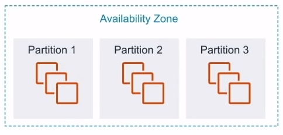
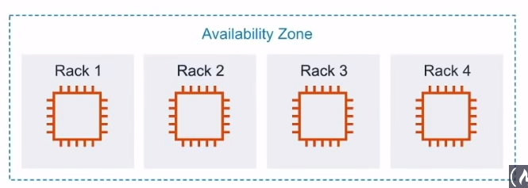
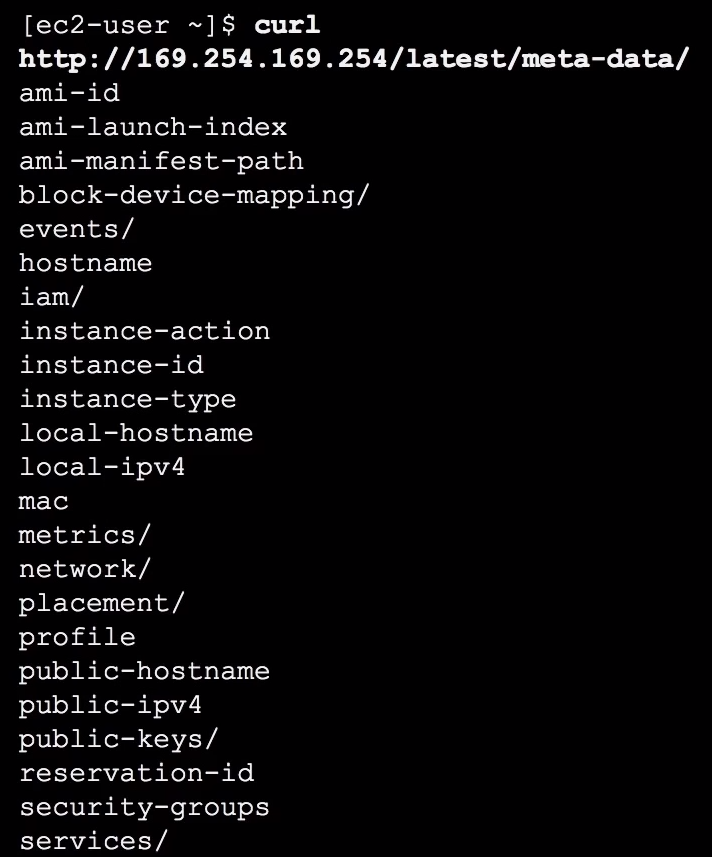

# Elastic Cloud Compute ( EC2 )

Cloud Computing Service. Choose your
**OS**, **Storage**, **Memory**, **Network Throughput**.
Launch and SSH into your server
**within minutes**

## Introduction

Elastic Compute Cloud ( EC2 ) is a **highly configurable server**.
EC2 is resizable **compute capacity**.
It takes **minutes** to launch new instances. Anything and everything
on AWS uses EC2 instances underneath

Choose your OS via **Amazon Virtual Machine ( AMI )**

- RedHat
- Ubuntu
- Windows
- Amazon Linux
- Open SUSE

Choose your **instance type**

- t2.nano - 1 vCPU - 0.5GB Mem - $4.75/month
- C4.8xlarge - 36 vCPU - 60GB Mem - $1161/month

Add storage **( EBS, EFS )**

- SSD
- HDD
- Virtual Magnetic Tape
- Multiple Volumes

Configure your instance

- Security Groups
- Key Pairs
- User Data
- IAM Roles
- Placement Groups

## Instance Types and Usage

### General Purpose

**A1 | T3 | T3a | T2 | M5 | M5a | M4.**

Balance of compute memory and networking resources

#### Use cases

Web servers and code repositories

### Compute Optimized

**C5 | C5n | C4.**

Ideal for compute bound applications that benefit from
high performance processor

#### Use cases

Scientific modeling, dedicated gaming servers and
ad server engine

### Memory Optimized

**R5 | R5a | X1e | High Memory | z1d.**

Fast performance for workloads that process large data sets
in memory

#### Use cases

In-Memory caches, in-memory databases, real-time big data analytics

### Accelerated Optimized

**P3 | | P2 | G3 | F1.**

Hardware accelerators, or co-processors

#### Use cases

Machine learning, computacional finance, seismic analysis,
speech recognition

### Storage Optimized

**I3 | I3en | D2 | H1.**

High, sequential read and write access to very large data
sets on local storage

#### Use cases

NoSQL, in-memory or transactional databases, data warehouse

## Instances Size

EC2 Instance sizes **generally double** in price and key attributes

| **Name**      | **vCPU** | **On-Demand per hour** | **On-Demand per month** | **** |
|---------------|----------|------------------------|-------------------------|------|
| **t2.small**  | 1        | $0.023                 | $16.79                  |      |
| **t2.medium** | 2        | $0.0464                | $33.87                  |      |
| **t2.large**  | 2        | $0.0928                | $67.74                  |      |
| **t2.xlarge** | 4        | $0.1856                | $135.48                 |      |

## Instance Profile

Instead of embedding your AWS credentials
( Access Key and Secret ) in your code so your
instance has permission to access certain services
you can **attach a role to an instance** via
**instance profile**

**You want to**
**always avoid embedding your AWS credentials**
**when possible**

An **Instance Profile** holds a reference to a role.
The EC2 instance is associated with the instance profile.
When you select an IAM role when launching an EC2 instance,
AWS will automatically create the instance profile for you.
Profiles are not easily viewed via the AWS Console

## Placement Groups

Placement Groups let you to choose
**the logical placement**
of your instances to optimize for **communication**,
**performance** or **durability**. Placement groups
are **free**

### Cluster

- Packs instances close together inside an **AZ**
- Low-Latency network performance for tightly-coupled
node-to-node communication
- Well suited for High Performance Computing ( HPC ) apps
- Clusters cannot be multi-AZ

### Partition

- Spreads instances across logical partitions
- Each partition do not share the underlying hardware
with each other ( rack per partition )
- Well suited for large distributed and replicated workloads
( Hadoop, Cassandra, Kafka)

### Spread

- Each instance is placed on a different rack
- When critical instances should be keep separate from each other
- You can spread a max of 7 instances. Spreads can be multi-AZ

## UsedData

You can provide an EC2 with **UserData** which is a **script**
that will be automatically run when launching an EC2 instance.
You could install package, apply updates or anything you like

This example sets up an apache web-server

From within the EC2 instance, if you were to SSH in and CURL
this special URL you can see the UserData script
eg. `curl http://169.254.169.254/latest/user-data`

## MetaData

From within your EC2 instance you can access information
about the EC2 via a special url endpoint at
**169.254.169.253**

You would SSH into your EC2 instance and can use the
curl command
`curl https://169.254.169.254/latest/meta-data`

- **/public-ipv4** - Get the current public IPV4 address
- **/ami-id** - The AMI ID used to launch this EC2 instance
- **/instance-type** - The instance type of this EC2 instance

Combine metadata with user-data scripts to perform all sorts
of advances AWS staging automation

## Cheat Sheet

- **Elastic Compute Cloud ( EC2 )** is a Cloud Computing Service
- Configure your EC2 by choosing your **OS**, **Storage**, **Memory**,
**Network Throughput**
- Launch and SSH into your server **within minutes**
- EC2 comes in variety instance types specialized for
different roles:
  - **General Purpose** balance of compute, memory and
  networking resources
  - **Compute Optimized** ideal for compute bound applications
  that benefit from high performance processor
  - **Memory Optimized** fast performance for workloads that
  process large data sets in memory
  - **Accelerated Optimized** hardware accelerators, or co-processors
  - **Storage Optimized** high, sequential, read and write
  access to very large data sets on local storage
- Instance Sizes **generally double** in price and key attributes
- **Placement Groups** let you to choose the logical placement
of your instance to optimize for communication, performance or
durability. Placement groups are **free**
- **UserData** a script that will  be automatically run when
launching an EC2 instance
- **MetaData** meta data about the current instance. You
access this meta data via a local endpoint whin SSH'd
into the EC2 instance, eg. `curl http://169.254.169.254/latest/meta-data`
meta data could be the instance type, current address etc...
- **Instance Profiles** a container for an IAM role that you
can to pass role information to an EC2 instance when
the instance starts

