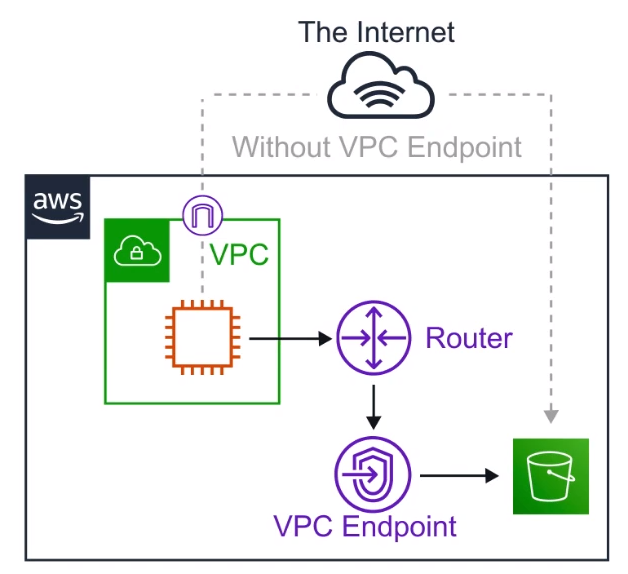

# VPC Endpoints

Think of a secret tunnel where you don't have to leave
the AWS network

## Introduction

**VPC Endpoint** allow you to
**privately connect your VPC to other AWS services**,
and VPC endpoint services

There are **2 types** of VPC Endpoints

1. Interface Endpoints
2. Gateway Endpoints

- **Eliminates** the need for an **Internet Gateway**,
**NAT device**, **VPN connection** or **AWS Direct Connect**
connections
- **Instances** in the VPC **do not require a public IP address**
to communicate with service resources
- **Traffic** between your VPC and other services
**does not leave the AWS Network**

- **Horizontally scaled**, **redundant**, and **highly available**
VPC component
- Allows secure communication between instances and services,
**without adding availability risks or bandwidth constraints**
on your traffic

### Interface Endpoints

**Interface Endpoints** are
**Elastic Network Interfaces ( ENI )**
with a **private IP address**. They serve as an entry point
for traffic going to a supported service

Interface endpoints are powered by **AWS PrivateLink**.
Access service hosted on AWS easily and securely by
keeping your network traffic within the AWS network

- Pricing per VPC endpoint per AZ $0.01/hour
- Pricing per GB data processed $0.01/hour
- ~$7.5/month

### Gateway Endpoints

A **Gateway Endpoints** is a gateway that is a target
**for a specific route** in your **route table**, used
for traffic destined for a supported AWS service

To create a Gateway Endpoint, you must specify the VPC in
which you want to create the endpoint, and the service to
which you want to establish the connection

AWS Gateway Endpoint currently only support 2 services,
DynamoDB and Amazon S3

**VPC Gateway Endpoint are Free!**

## Cheat Sheet

- VPC Endpoints help keey to traffic betwwen AWS service
**within the AWS Network**
- There are two kinds of VPC Endpoints. **Interface and Gateway**
- Interface Endpoints **cost money**, Gateway Endpoints
**are free**
- Interface Endpoints uses Elastic Network Interface ( ENI )
with Private IP ( powered by AWS PrivateLink )
- Gateway Endpoints is a target for a specific route in
your route table
- Interface Endpoints support many AWS services
- Gateway Endpoints only support DynamoDB and S3

