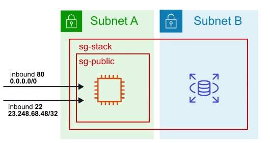

# VPC Security Groups

A **virtual firewall** that controls the traffic
to and from EC2 instances

## Introduction

Security Groups acts as a **virtual firewall** at the
instance level

Security Groups are associated with EC2 instances

Each security group contains a set of rules that
filter traffic coming **into ( inbound )** and
**out of ( outbound )** EC2 instances

There are no "DENY" rules. **All traffic is blocked by default**
unless a rules specifically allows it

**Multiple Instances** across multiple subnets can belong
a **Security Group**

## Use Cases

### Case 1

You can specify the source to be an IP range or a
specific IP ( **/32** is a specific IP address )

### Case 2

You can specify the source to be another security group

### Case 3

An instance can **belong to multiple Security Groups**, and
rules are **permissive** ( instead of restrictive ).
Meaning if you have one security group which has no Allow
and you add an allow to another that it will allow

## Limits

You can have **up to 10.000 Security Groups in a Region**
( default is 2.500 )

You can have **60 inbound and outbound rules** per security group

**16 Security Groups** per Elastic Network Interface ( ENI )
( default 5 )

## Cheat Sheet

- Security Groups acts as a firewall at the instance level
- Unless allowed specifically, all **inbound traffic** is
**blocked by default**
- All **outbound traffic** from the instance is
**allowed by default**
- You can specify for the source to be either an IP range,
single IP address or another Security Group
- Security Groups are **STATEFUL**, if traffic is allowed inbound
it is also allowed outbound
- Any changes to a Security Group take effect immediately
- EC2 instances can belong to multiple Security Groups
- Security Groups can contain multiple EC2 instances
- You **cannot block specific IP addresses** with Security Groups,
for this you would need a Network Access Control List
( NACL )
- You can have up to 10.000 Security Groups per Region,
default is 2.500
- You can have 60 inbound and outbound rules per security group
- You can have 16 Security Groups associated to an ENI,
default 5

