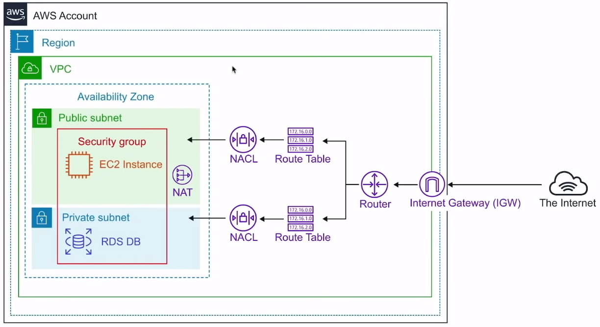
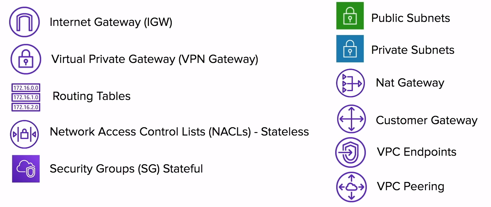
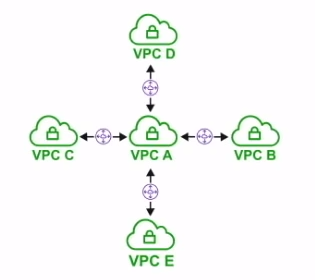
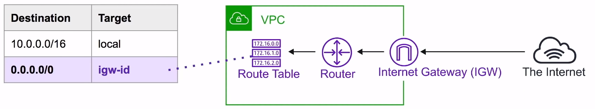
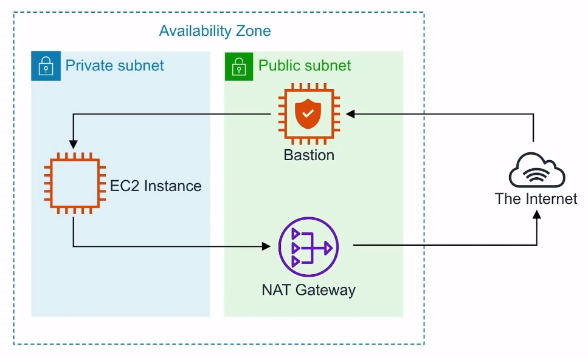
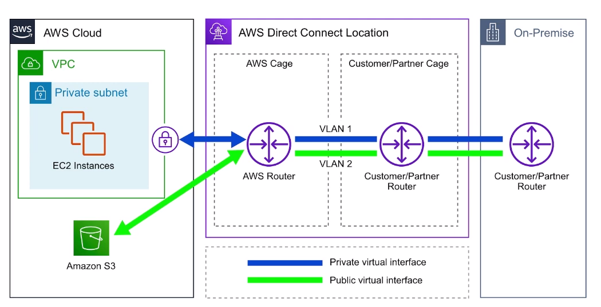

# Virtual Private Cloud ( VPC )

Provision a **logically isolated section of the AWS Cloud**
where you can launch AWS resources in a **virtual network**
that you define

## Introduction

Think of a AWS VPC as your own **personal data center**.
**Gives you complete control over your**
**virtual networking environment**

## Core Components

Combining these components and services is what makes up
your VPC

## Key Features

- VPCs are **Region Specific** they are do not span regions
- You can create up to **5 VPC** per region
- Every region comes with a default VPC
- You can have **200 subnets** per VPC
- You can use **IPv4 Cidr Block** and in addition to a
**APv6 Cidr Blocks** ( the address of the VPC )
- **Cost nothing:** VPC's, Route Tables, Nacls, Internet
Gateways, Security Groups and Subnets, VPC Peering
- **Some things cost money:** NAT Gateway,
VPC endpoints, VPN Gateway, Customer Gateway
- **DNS hostname** should your instance have
domain name addresses

## Default VPC

AWS has a default VPC in every region so you can **immediately**
deploy instances

- Create a VPC with size /16 IPv4 CIDR block
( 172.31.0.0/16 )
- Create a size /20 **default subnet in each AZ**
- Create an **Internet Gateway** and connect it
to your default VPC
- Create a **default security group** and associate it
with your default VPC
- Create a **default network access control list ( NACL )**
and associate it with your default VPC
- Associate the **default DHCP** options set for your
AWS account with your default VPC
- When you create a VPC, it automatically has a main route table

## Default Everywhere IP

0.0.0.0/0 is also know as **default**

It represents
**all possible IP addresses**

When we specify **0.0.0.0/0** in our route table for IGW we
are allow internet access

When we specify **0.0.0.0/0** in our security groups
inbound rules we are allowing all traffic from internet
access our public resources

When you see **0.0.0.0/0**, just think of giving access from
anywhere of the internet

## VPC Peering

**VPC Peering** allows you to connect one VPC with another a
**direct network route** using **private IP addresses**

- Instances on peered. VPCs **behave** just like they are on
the **same network**
- Connect VPCs across **same** or **different**
**AWS accounts** and **regions**
- **No Transitive Peering** ( peering must take place directly
between VCPs )
- **No overlapping CIDR Block**

## Route Tables

Route tables are used to determine where **network traffic**
is **direct**

Each **subnet** in your VPC **must be associated** with a
route table

A subnet can only be associated
**with one route table at a time**, but you can
associate multiple subnets with the same route table

## Internet Gateway ( IGW )

The Internet Gateway allows **your VPC**
**access to the internet**

**IGW** does two things:

1. Provide a target in your VPC route tables for internet-routable
traffic
2. Perform network address translation ( NAT ) for instances
that have been assigned
**public**
**IPv4 addresses**

To route out to the internet you need to add in your
route tables you need to add a route to the internet gateway
and set the destination to be **0.0.0.0/0**

## Bastion / Jumpbox

Bastions are EC2 instances which are security harden. They
are designed to help you gain access to your EC2 instances
by SSH or RCP. That are in a
**private subnet**

They are also known as Jump boxes because you are jumping from
one box to access another

NAT Gateways/instances are only intended for EC2 instances
to gain outbound access to the internet for things such as
security updates, NATs cannot/should not be used as Bastions

System manager's **Sessions Manager** replaces the need for bastions

## Direct Connect

AWS Direct Connect is the AWS solution for establishing
**dedicated network** connections
from on-premises locations to AWS

**Very fast network**
Lower bandwidth **50M-500M** or Higher Bandwidth
**1GB or 10GB**

Helps **reduce network costs** and **increase bandwidth throughput**
( great for high traffic networks)

Provides a **more consistent network experience** than a typical
internet-based connection ( reliable and secure )

