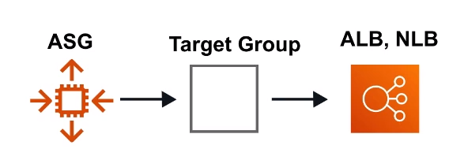

# Auto Scaling Groups ( ASG )

Set scaling rules which will automatically launch additional
EC2 instance or shutdown instances to meet current demand

## Introduction

Auto Scaling Groups ( ASG ) contains a collection of
EC2 instances thar are treated as a group for the
purposes of automatic scaling and management

Automatic scaling can occur via:

1. Capacity Settings
2. Health Checks Replacement
3. Scaling Policies

## Capacity Settings

The size of an Auto Scaling Group is based on **Min**,
**Max** and **Desired Capacity**

**Min** is how may EC2 instances should at
least be running

**Max** is number EC2 instances allowed
to be running

**Desired Capacity** is how many EC2 instances
you want to ideally run

ASG will always launch instances to meet
minimum capacity

## Health Checks Replacement

### EC2 Health Checks Type

ASG will perform a health check on EC2 instances to determine
if there is a software or hardware issue. This is based on
the **EC2 Status Checks**. If an instance is considered unhealthy.
ASG will terminante and launch a new instance

### ELB Health Checks Type

ASG will perform a health check based on the ELB health check.
ELB can perform health checks by pinging an HTTP(S) endpoint
with an expected response. If ELB determines a instance is
unhealthy it forwards this information to ASG which will
terminate the unhealthy instance

## Scaling Policies

- **Scaling Out:** Adding More Instances
- **Scaling In:** Removing More Instances

### Target Tracking Scaling Policy

Maintains a specific metric at a target value

eg. If **Average CPU Utilization** exceeds 75% then add
another server

### Simple Scaling Policy ( LEGACY )

Scales when an **alarm is breached**

  <strong>
  Not recommended, simple scaling policy. Use scaling polices
  with steps now
  </strong>

### Scaling Policy With Steps

Scales when an **alarm is breached**, can
**escalates based on alarm** value changing

## ELB Integration

ASG can be associated with Elastic Load Balancers ( ELB ).
When ASG is associated with ELB richer health checks can be set

**Classic Load Balancers** are associated **directly** to
the ASG

**Application and Network Load Balancers** are associated
**indirectly** via their Target Groups

## Use Case

<ol style="flex-basis: 60ch;">
  <li>Burst of traffic from the internet hits our domain</li>
  <li>Route53 points that traffic to our load balancer</li>
  <li>Our load balancer passed the traffic to its target group</li>
  <li>The target group is associated with our ASG and sends
  the traffic to instances registered with our ASG</li>
  <li>The ASG Scaling Policy will check if our instances
  are near capacity</li>
  <li>The Scaling Policy determines we need another instance,
  and it launches an new EC2 instance with the associated
  launch configuration to our ASG</li>
</ol>

  

## Launch Configuration

A launch configuration is an instance configuration template
that an ASG uses to launch EC2 instances

A launch configuration is the same process as launching an
EC2 instance except you are saving that configuration
to launch an instance for later

Launch Configuration **cannot be edited**. When you need to update
your Launch Configuration you create a new one or clone the existing
configuration and then manually associate that new Launch Configuration

**Launch Template** are Launch Configurations with Versioning.
Every one appears to still use Launch Configurations

## Cheat Sheet

- An ASG is a collection of EC2 instances grouped for scaling
and management
- **Scalding Out** add servers
- **Scalding In** remove servers
- **Scaling Up** increase the size of an instance,
eg, updating Launch Configuration with larger size
- Size of an ASG is based on a **Min**, **Max** and
**Desired Capacity**
- **Target Scaling Policy** scales based on when target
value for a metric is breached, eg. Average CPU
Utilization exceed 75%
- **Simple Scaling Policy ( Legacy )** triggers a scaling
when an alarm is breached
- **Scaling Policy With Steps** allows you to create steps based
on emulation alarm values
- **Desired Capacity** is how many EC2 instances you
want to ideally run
- An ASG  will always launch instances to meet minimum capacity
- **Health Checks** determine the current state of an instance
in the ASG
- Health Checks can be run against either an ELB or the EC2 instances
- When an Autoscaling launches a new instance it uses a
Launch Configuration which holds the configuration values for
for that new instance eg. AMI, InstanceType, Role
- Launch Configuration cannot be edited and must be cloned
or a new one created
- Launch Configuration must be manually update in by editing
the Auto Scaling settings

