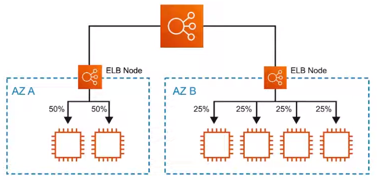

# Elastic Load Balancer ( ELB )

**Distributes** incoming application traffic across multiple
targets, such as Amazon EC2 instances, container, IP addresses,
and Lambda functions

## Introduction

Load Balancers can be physical hardware or virtual software that
accepts incoming traffic, and then distributes the traffic
to multiple targets. The can **balance** the load via different
rules. These rules vary based on types of load balancers

**Elastic Load Balancer** is th AWS solution for load balancing
traffic, and there are 3 types available:

1. Application Load Balancer - ALB ( HTTP/HTTPS )
2. Network Load Balancer - NLB ( TCP/UDP )
3. Classic Load Balancer - CLB ( LEGACY )

## Rules of Traffic

### Listeners

Incoming traffic is evaluate against listeners. Listeners
evaluate any traffic that is matches the Listener's port.
For CLB, EC2 instances are directly registered on the
Load Balancer

### Rules ( Not available for CLB )

Listeners will then invoke rules to decide what to do with
the traffic. Generally the next step is to forward
traffic to a Target Group

### Target Groups ( Not available for CLB )

EC2 instances are registered as targets to a Target Group

---

**For ALB or NLB** traffic is sent to the Listeners.
When the port matches it then checks the rules
what do to. The rules will forward the traffic
to a Target Group. The target group will evenly
distribute the traffic to instances registered
to that target group

**For CLB** traffic is sent to the Listeners. When the port
matches it then it forwards the traffic to any EC2 instance
that are registered to Classic Load Balancer.
CBL does not allow you to apply rules to listeners

## Application Load Balancer ( ALB )

**ALB** are designed to balance **HTTP** and **HTTPS**
traffic

They **operate at Layer 7 ( OSI Model )**

ALB has a feature called **Request routing** which allows
you to add routing rules to your listeners based on the
HTTP protocol

Web Application Firewall ( WAF ) can be attached to ALB

Great for Web Application

## Network Load Balancer ( NLB )

**NLB** are designed to balance **TCP/UDP**

They **operate at Layer 4 ( OSI Model )**

Can handle **millions of requests per second** while still
maintaining extremely low latency

Can preform Cross-Zone Load Balancing

Great for Multiplayer Video Gamos or When network
performance is critical

## Classic Load Balancer ( CLB ) - LEGACY

In was AWS first load balancer **( legacy )**

Can balance **HTTP**, **HTTPS** or **TCP** traffic
( not at the same time )

It can use **Layer 7-specific features ( OSI Model )** such as
**sticky sessions**

It can also use **strict Layer 4 ( OSI Model )** balancing
for purely TCP applications

Can preform Cross-Zone Load Balancing

It will respond with a **504 error ( timeout )** if the
underlying application is not responding, eg,
**at the web-server or database level**

Not recommended for use, instead use **NBL** or **ALB**

## Sticky Sessions

Sticky Sessions is an advanced load balancing method that
allows you to **bind a user's session to a specific EC2 instance**

Ensure all **requests** from hat session are
**sent to the same instance**

Typically **utilized** with a **Classic Load Balancer**

**Can be enable for ALB** though can only be set on a
Target Group not individual EC2 instances

Cookies are used to remember which EC2 instance

Useful when specific information
**is only stored locally on a single instance**

## X Forwarded For Header

If you **need th IPv4 address** of a user, check the
**X-Forwarded-For** header

The **X-Forwarded-For ( XFF )** header is a command method for
identifying the **originating IP address** of a client connecting
to a web server through an HTTP proxy or a load balancer  

## Health Checks

Instances that are monitored by the ELB **report back**
Health Checks as **InService, or OutOfService**

Health Checks communicate directly with the instance
to determine its state

ELB **does not terminate ( kill ) unhealthy instance**.
It will just redirect traffic to healthy instances

For ALB and NLB the Health Checks are found on the
**Target Group**

## Cross Zone Load Balancing

Only for **Classic** AND **Network** Load Balancer

### Cross Zone Load Balancing Enabled

Requests are distributed evenly across the instances
**in all enabled** AZ

### Cross Zone Load Balancing Disabled

Requests are distributed evenly across the instances
**in only** is AZ

## Request Routing

Apply rules to incoming equest and then **forward** or
**redirect** traffic

You can perform the following verifications:

- Host Header
- Source IP
- Path
- HTTP Header
- HTTP Header Method
- Query String

## CheatSheet

- There are three Elastic Load Balancers:
  - Application Load Balancer ( ALB )
  - Network Load Balancer ( NLB )
  - Classic Load Balancer ( CLB )
- A ELB must have **at least two** AZ
- ELB **cannot go cross-region**. You must create one per region
- ALB has **Listeners**, **Rules** and **Target Groups** to
route traffic
- NLB has **Listeners** and **Target Groups** to route traffic
- CLB has **Listeners** and EC2 instances are **directly registered**
as targets to CLB
- ELB is for HTTP(S) traffic and the name implies it good
for Web Application
- NLB is for TCP/UDP is good for high network throughput,
eg, Video Games
- CLB is legacy and its recommended to use ALB or NLB
- Use **X-Forwarded-For ( XFF )** to get original IP of incoming
traffic passing through ELB
- You can attach Web Application Firewall ( WAF ) to ALB but
not to NLB or CLB
- You can attach Amazon Certification Manager SSL to any of
the ELB for SSL
- ALB has advances Request Routing rules here you can route
based on subdomain header, path and other HTTP(S) information
- Sticky Sessions can e enable for CLB or ALB and sessions are
remembered via Cookies

