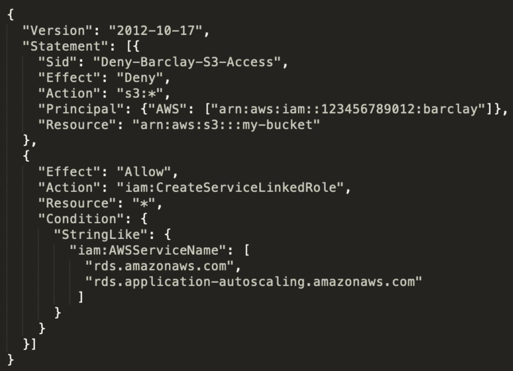

# Identity Access Management ( IAM )

Manages **access** of AWS **users** and **resources**

## Introduction

IAM allows **management** of access of **users**
and **resources**

## Core Components

### IAM Users

End users who log into the console or interact with
AWS resources programmatically

### IAM Groups

Group up your Users so the all share permission level
of the group, eg, Administrators, Developers, Auditors

### IAM Roles

Associate permissions to a Role and then assign this to
Users or Groups

### IAM Policies

JSON documents which grant permissions for a specific
user, group, or role to access service. Policies are attached
to **IAM Identities**

---

A user can belong to a group. Roles can be applied to
groups to quickly add and remove permissions
in-masse to users

A user can have a role directly attached and policy can
be directly attached to a user ( called an **Inline Policy**)

Roles can have many policies attached

Various AWS resources allow you attach roles directly to them

## Types of Policies

### Managed Policies

A policy which is managed by AWS, which you cannot edit.
Managed policies are labeled with an **orange box**

### Customer Managed Policies

A policy created by the customer which is editable.
Customer policies have no symbol beside them

### Inline Policy

A policy which is directly attached to the user

## Policy Structure

- **Version** policy language version. **2012-10-17** is the
latest version
- **Statement** container for the policy element you are
allowed to have multiples
- **SID** a way of labeling your statement ( optional )
- **Effect** Set whether the policy will ALLOW or DENY
- **Principal** account, user, role, or federated user to
which you would like to allow or deny access
- **Action** list of actions that the policy allows or denies
- **Resource** the resource to which the action(s) applies
- **Condition** circumstances under which the policy grants permissions

## Password Policy

In IAM you can set a **Password Policy** to set the minimum
requirements of a password and **rotate** passwords so users
have to update their passwords after X days

## Access Keys

Access keys allow users to interact with AWS service
**programmatically** via the AWS CLI or AWS SDK

You're allowed two Access keys per user

## Multi Factor Authentication

Multi-factor authentication ( MFA ) can be turned on per user

The user has to turn on MFA themselves, Administrator cannot
directly enforce users to have MFA

They Administrator account could create a policy
requiring MFA to access certain resources

## Temporary Security Credentials

Temporary credentials are just like Programmatic Access Keys
except they ae **temporary**

Temporary credentials are useful in scenarios that involve:

- Identity Federation
- Delegation
- Cross-Account Access
- IAM Roles

The can last from **minutes** to an **hour**

They **are not stored with the user** but are generated
dynamically and provided to the user when requested

The are the basis for **roles** and **identity federation**

## Identity Federation

### What is Identity Federation?

The means of linking a person's electronic **identity**
and attributes, stored across multiple distinct
identity management systems

Identity federation allows users to exit on a
different platform. Eg, Users are on Facebook but
gain access as if they are a user in AWS

IAM supports two types of identity federation

1. Enterprise identity federation
   1. SAML ( Microsoft Active Directory )
   2. Custom Federation Broker
2. Web identity federation
   1. Amazon
   2. Facebook
   3. Google
   4. OpenID Connect ( OICD ) 2.0

OpenID Connect ( OICD ) is an authentication layer on to of
**OAuth 2.0**, an authorization framework

## Security Token Service ( STS )

A web service that enables you to request **temporary**,
**limited-privilege credentials** for IAM users or for
federated users

Aws Security Token Service ( STS ) is a **global service**,
and all AWS STS requests go to a single endpoint at
`https://sts.amazonaws.com`

An STS will return:

- AccessKeyID
- SecretAccessKey
- Session Token
- Expiration

You can use the following API actions to obtain STS:

- AssumeRole
- AssumeRoleWithSAML
- AssumeRoleWithWebIdentity
- decodeAuthorizationMessage
- GetAccessKeyInfo
- GetCallerIdentity
- GetFederationToken
- GetSessionToken

## Cheat Sheet

- **Identity Access Management** is used to manage **access**
to users and resources
- IAM is a universal system. Applied to all regions
at the same time. IAM is a **free service**
- A root account is the account initially created whet AWS
is set up ( full administrator )
- New IAM accounts have no permissions by default until granted
- New users get assigned an Access Key Id and Secret when you
give them programmatic access
- Access Keys are only used for CLI nad SDK
( cannot access console )
- Access Keys are only shown one when created. If lost they must
be deleted/re-created again
- Always setup MFA for Root Accounts
- Users mus enable MFA on their own, Administrator cannot
turn it on for each user
- IAM allows your set password policies to set minimum password
requirements or rotate passwords
- **IAM Identities** as Users, Groups, and Roles
- **IAM Users** End users who log into the console or interact
with AWS resources programmatically
- **IAM Groups** Group up your Users so the all share permission
level of the group, eg, Administrators, Developers, Auditors
- **IAM Roles** Associate permissions to a Role and then assign
this to Users or Groups
- **IAM Policies** JSON documents which grant permissions
for a specific user, group, or role to access service.
Policies are attached to **IAM Identities**
- **Managed Policies** are policies provided by AWS and cannot
be edited
- **Customer Managed Policies** are policies created by use
the customer, which you can edit
- **Inline Policies** are policies which are directly attached
to a user

