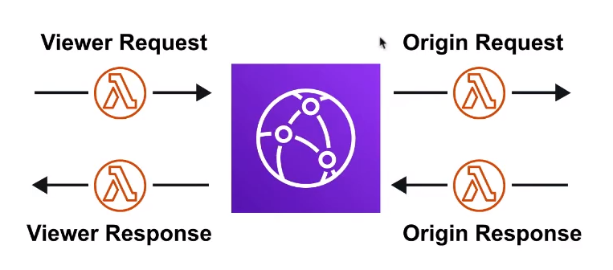

# CloudFront

Content Distribution Network ( CDN )
Creates cached copies of your website at
various Edge Locations around the world

## Introduction

### Content Delivery Network ( CDN )

A CDN is a distributed network of servers which delivers web
pages and content to users based on their
**geographical location**, the **origin of the webpage**,
and a **content delivery**

Can be used to **deliver an entire website** including static,
dynamic and streaming data

Requests for content are served from the nearest Edge Location
for the best possible performance

## Core Components

### Origin

The location where all of original files are located.
for example an S3 Bucket, EC2 instance, ELB, or Route53

### Edge Location

The location where web content will be cached.
This is different that an AWS Region or AZ

### Distribution

A collection of Edge Locations which defines
how cached content should behave

## Distributions

A distribution is a collection of Edge Locations.
You specify the Origin eg. S3, EC2, ELB, or Route53

It replicates copies based on your **Price Class**

There are 2 types of distributions

1. Web ( for websites )
2. RTMP ( for streaming media )

### Behaviors

Redirect to HTTPs, Restrict HTTP Methods,
Restrict Viewer Access, Set TTLs

### Invalidations

You can manually invalidate cache on specific files via
invalidations

### Error Pages

You can serve up custom error pages, eg 404

### Restrictions

You can use **Geo-Restriction** to blacklist or
whitelist specific countries

## Lambda Edge

We use Lambda@Edge functions to **override the behavior** of
**request and response**

The 4 available Lambda@Edge functions

1. **Viewer request** - When CloudFront receives a request
from a viewer
2. **Origin request** - Before CloudFront forwards a request
to the origin
3. **Origin response** - When CloudFront receives a response
from the origin
4. **Viewer response** - Before CloudFront returns the response
to the viewer

## Protection

By default a distribution **allows everyone to have access**

**Origin Access Identity ( OAI )** - A virtual user identity
that will be used to give your CloudFront Distribution
permission to fetch a private object

In order to use Signed URLs or Signed Cockles you need to
have an **OAI**

**Signed URLs** ( Not the same thing as S3 presigned URL )

A url with provides temporary access to cached objects

**Signed Cookies.**

A cookie which is passed along with the request to CloudFront.
The advantage of using a Cookie is you want to provide access
to multiple restricted files. Eg, Video Streaming

## Cheat Sheet

- CloudFront is a CDN ( Content Distribution Network ). It makes
website load fast by serving cached content
- CloudFront distributes cached copy at **Edge Locations**
- Edge Locations are't just not read-only, you can write
to them, eg. PUT objects
- **TTL** ( Time to live ) defines how long until the cache expires
- When you invalidate your cache, you are forcing it to
immediately expires ( refreshes cached data )
- Refreshing the cache **cost money because of transfer costs**
to update Edge Locations
- **Origin** is the address of where the origin copies of your
files reside eg. S3, EC2, ELB, or Route53
- **Distribution** defines a collection of Edge Locations and
behavior on how it should handle your cached content
- **Distributions** has 2 types:
  - **Web Distribution** - Static Website Content
  - **RTMP** - Streaming media
- **Origin Access Identity ( OAI )** is used access private
S3 Buckets
- Access to cached content can be protected via
**Signed URLs** or **Signed Cookies**
- **Lambda@Edge** allows you to pass each request through a Lambda
to change the behavior of the response

