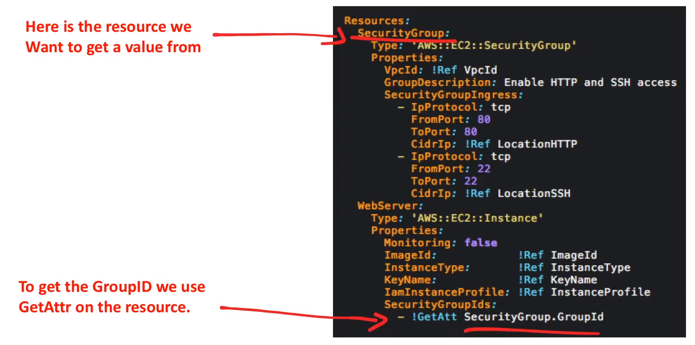
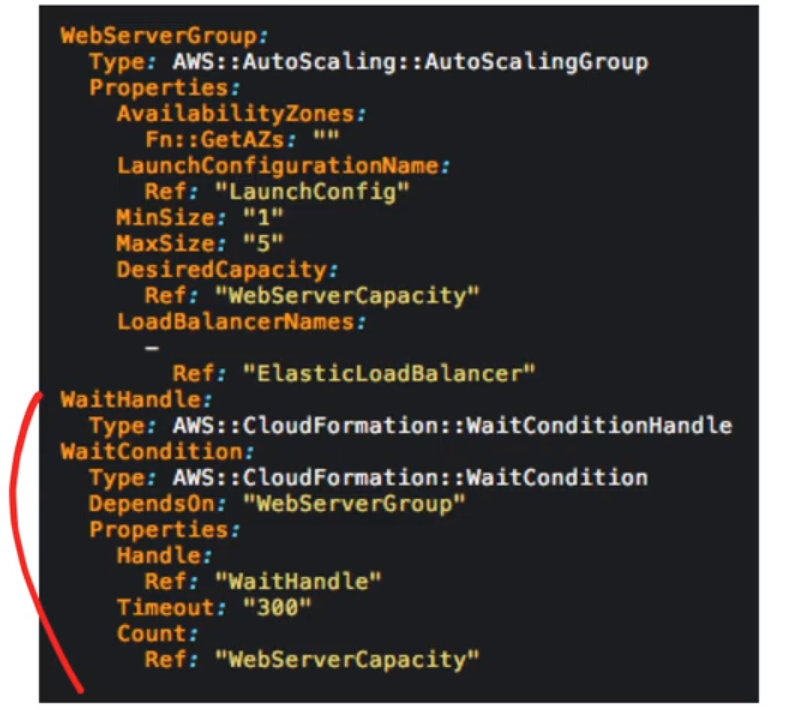

# CloudFormation

A templating Language that **defines AWS resources**
to be provisioned. **Automating** the creation of
resources via code

## Introduction

### What is Infrastructure As Code? ( IaC )

The process of managing and provisioning computer data centers
( eg, AWS ) through machine-readable definition files
( eg, YAML, JSON files ) rather than physical hardware
configuration files or interactivo configuration tools
( stop doing manual configuration! )

### Use Case

People yap a monthly subscription and we run a Minecraft server.
They choose **where** they want and **what size** of server they
want to run

We can use their **inputs** and use an AWS Lambda to create a
new CloudFormation stack. We have a lambda send them the email
of their new Minecraft Server IP address and details

## Template Formats

CloudFormation can be written in tow different formats

### JSON


### YAML


## Template Anatomy

### MetaData

Additional information about the template

### Description

A description of what this template is suppose to do

### Parameters

Values to pass to your template at runtime

### Mappings

A lookup table. Maps keys to values so you change your values
to something else

### Conditions

Whether resources are created or properties are assigned

### Transform

Applies macros ( like applying a mod which change the
anatomy to be custom )

### Resources

A resource you want to create eg. IAM Role, EC2 instance,
Lambda, RDS

CloudFormation Templates **requires** you to
**at least list one resource**

### Outputs

Values that returned eg. An ip-address of new server created

## Stack Updates

**When you need to make a change to stack** instead of deleting
and re-creating the stack. You can modify the CloudFormation
template and push a stack update and CloudFormation will
**intelligently** change or delete and re-create resources

There are two ways to perform a stack update

1. **Direct Update:** You directly update a stack, you submit
changes and AWS CloudFormation immediately deploys them.
**Use direct updates when you want to quickly deploy your updates**
2. **Executing Change Sets:** You can preview the changes to
CLoudFormation will make to your stack, and then decide
whether to apply those changes.
**Use change sets when you want to ensure that CloudFormation**
**doesn't make unintentional changes**

---

When you submit an update, CloudFormation updates differently
depending on the state of you're resources and circumstances:

**Update with No Interruption:**

1. Updates the resources **without disrupting** operation
2. And **without changing** the resource's physical ID

**Updates with Some Interruption:**

1. Updates the resource **with some interruption**
2. And **retains** the physical ID

**Replacement:**

1. **Re-creates** the resource during an update
2. Also **generate new** physical ID

## Prevent Stack Updates

You may want certain resources not to be updated.
Preventing a stack-update could be to prevent **data loss**
or **interruption to service**

**StackPolicy** is a JSON document that defines the update
actions that can be performed on designated resources


## Nested Stacks

NestedStacks allow you te reference CFN templates inside of another
CFN templates:

1. Create modular templates **( reusability )**
2. Assemble large templates **( reduce complexity )**

- You can nest stacks on to nested stacks
- Parent stacks have immediate access to child stacks
- The root stack is accessible by all nested stacks

## Drift Detection

### What is Drift?

Drift is hen your stack's actual configuration differs
( has drifted ) by what CloudFormation expects

### Why does Drift Happen?

When developers start making manual ad-hoc changes to
the stack ( most common example is deleting resources )
Instead of changing configuration by updating and
relaunching the CloudFormation template

### CloudFormation "Detecte Drift" Feature

CloudFormation can detect drift and tell you if resources
deleted or hae been modified

### Nest Stacks and Drift Detection

When detecting drift on a stack, CloudFormation does not detect
drift on any nested stacks that belong to that stack. Instead,
you can initiate a drift detection operation directly on
the nested stack

### Stack Drift Status

- **DELETED** - The resource has been deleted
- **MODIFIED** - There has been a change to the resource
- **NOT_CHECKED** - CloudFormation hasn't checked resource
- **IN_SYNC** - Everything is as expected

## Rollbacks

When you **create**, **update** or **destroy** a stack you could
encounter and error:

Eg. Your CloudFormation template has a syntax error

Eg. Your stack is trying to delete a resource which
no longer exists

CloudFormation will attempt to **Rollback** in case of an error
put your stack back to its previous State

Rollbacks are turned on **by default**. Yu can ignore rollback
by using the **--ignore-rollback** flag via the AWS CLI

Rollback can fail. Sometimes you'll have to investigate and
change resource configuration or possibly need to reach out
to paid AWS Support to resolve the failed rollback

- When a rollback is in progress you'll see **ROLLBACK_IN_PROGRESS**
- When a rollback succeeds you'll see **UPDATE_ROLLBACK_COMPLETE**
- When a rollback fails you'll see **UPDATE_ROLLBACK_FAILED**

## Pseudo Parameters

**Parameters that are predefined** by AWS CloudFormation.
You do not declare them in your template.
Use them the same way as you would a parameter, as the
argument for the **Ref** function

```yaml
Outputs:
  MyStacksRegion:
    Value: !Ref "AWS::Region"
```

### Parameters Most Common

| **Parameter**      | **Description**                                                                                     | **Example**                                                                                         |
|--------------------|-----------------------------------------------------------------------------------------------------|-----------------------------------------------------------------------------------------------------|
| **AWS::Partition** | Returns the partition that the resource is in                                                       | aws-us-gov                                                                                          |
| **AWS::Region**    | Returns a string representation the AWS Region in which the encompassing resource is being created  | us-east-1                                                                                           |
| **AWS::StackId**   | Returns the ID of the stack as specified white the AWS CloudFormation create-stack command          | arn:aws:cloudformation:us-west-2:123456789012:stack/test-stack/c29bcb7d-d948-4436-850a-1d91b0df546c |
| **AWS::StackName** | Returns the name of the stack as specified white the AWS CloudFormation create-stack command        | my-cfn-stack                                                                                        |
| **AWS::URLSuffix** | Return the suffix for a domain. The suffix is typically `amazonaws.com`, but might differ by region | amazon.com.cn                                                                                       |

## Resource Attributes

### CreationPolicy

Prevent its status from reaching create complete until AWS CloudFormation
receives a specified number of success signal or the timeout
period is exceded

```yaml
Resources:
  Type: AWS::AutoScaling::AutoScalingGroup
  CreationPolicy:
    ResourceSignal:
      Count: 3
      Timeout: PT15M
```

### DeletionPolicy

Reserve or ( i some cases ) backup a resource when its stack
is deleted. **Delete**, **Retain** or **Snapshot**

```yaml
Resources:
  MyObInstance:
    Type: AWS::RDS::DBInstance
    DeletionPolicy: Snapshot
```

### UpdatePolicy

How to handle an update for ASG, ElastiCache, Domain or
Lambda Alias

```yaml
UpdatePolicy:
  AutoScalingReplacingUpdate:
    WillReplace: True
```

### UpdateReplacePolicy

To retain or ( in some cases ) backup the existing physical instance
of a resource when it is replaced during a stack update operation.
**Delete**, **Retain** or **Snapshot**

```yaml
Resources:
  MyObInstance:
    Type: AWS::RDS::DBInstance
    UpdateReplacePolicy: Snapshot
```

### DependsOn

That resource is created only after the creation of the resource
specified in **DependsOn** attribute

```yaml
Resources:
  MyEC2Instance:
    Type: AWS::EC2::Instance
    DependsOn: MyObInstance
  MyObInstance:
    Type: AWS::RDS::DBInstance
```

## Intrinsic Functions

Use intrinsic functions in your templates to
**assign values to properties that are not available until runtime**

| **Function**             | **Description**                                                                                              |
|--------------------------|--------------------------------------------------------------------------------------------------------------|
| **fn::Base64**           | Returns the Base64 representation of the input string                                                        |
| **fn::Cidr**             | Returns an array of CIDR addresses blocks                                                                    |
| ***Condition Functions** | Fn::And Fn::Equals Fn::If Fn::Not Fn::Or                                                                     |
| **fn::FindInMap**        | Returns the value corresponding to keys in a two-level map that is declared in the Mappings section          |
| **fn::Transform**        | A macro to perform custom processing on part of a stack template                                             |
| **fn::GetAZs**           | Returns an array that lists Availability Zones for a specified region                                        |
| **fn::ImportValue**      | Returns the value of an output exported by another stack                                                     |
| **fn::Join**             | Appends a set of values into a single value, separated by the specified delimiter                            |
| **fn::Select**           | Returns a single object from a list of object by index                                                       |
| **fn::Split**            | Split a string into a list of string values so that you can select an element from the resulting string list |
| **fn::Sub**              | Substitute variables in an input string with values that you specify                                         |
| **fn::GetAttr**          | Returns the value of an attribute from a resource in the template                                            |
| **Ref**                  | Returns the value of the specified parameter or resource                                                     |

## Ref And Get Attr

### Ref

Ref returns **different things** fo different resources.
You need to look up each resource in the AWS Docs to
what it returns. Eg, ARN, Resource Name, Physical ID


### Fn::GetAttr

GetAttr allows you to access many different variables
on a resources. You'll need to check the AWS Docs to see
what is available per resource



When you need a value for a resource **and cant't get it from**
Ref **you can get it from** Fn::GetAttr

## Wait Conditions

Wait conditions **wait** for a **condition**

They are used in two cases:

1. To coordinate **stack resource creation** with configuration
actions that are **external to the stack** creation
2. **To track the status** of a configuration process

**WaitCondition** is very similar to **CreationPolicy**
AWS recommends using **CreationPolicy** for **EC2** and **ASG**

- **CreationPolicy** waits on the dependent resource
- **WaitCondition** waits on the wait condition ( external )



## Cheat Sheet

- When being asked to **automate** the provisioning of resource
**think CloudFormation**
- When Infrastructure as Code ( IaC ) is mentioned
**think CloudFormation**
- CloudFormation can be written in either JSON or YAML
- When CloudFormation encounters an error it will rollback with
**ROLLBACK_IN_PROGRESS**
- CloudFormation templates larger that 51.200 bytes
( 0.05MB ) are too large to upload directly, and must be
imported into CloudFormation via an S3 bucket
- **NestedStacks** helps you break up your CloudFormation template
into smaller reusable templates that can be composed into
larger templates
- **At least one resource** under resource property must be defined
for a CloudFormation template **to be valid**
- CloudFormation **Template Sections**
  - **Metadata** - Extra information about your template
  - **Description** - A description of what the template
  is suppose to do
  - **Parameters** - Is how you get user inputs into templates
  - **Transforms** - Applies macros ( like applying a mod which
  change the anatomy to be custom )
  - **Outputs** - Are values you can use to import into
  other stacks
  - **Mappings** - Maps keys to values, just like lookup table
  - **Resources** - Defines the resources you want to provision,
  **at least one resources is required**
  - **Conditions** - Are whether resources are created or
  properties are assigned
- **Stack Updates** can be preformed two different ways:
  - **Direct Updates**
    - You directly update the stack
    - You submit changes and AWS CloudFormation
    immediately deploys them
  - **Executing Change Sets**
    - You can preview the changes to CloudFormation will
    make to your stack ( Change Set )
    Then decide whether you want to apply those changes
- **Stack Updates** will **change state of your resources** based
on circumstances:
  - **Update with No Interruption** - Updates the resource
  **without disrupting** operation and **without changing**
  the resource's physical ID
  - **Updates with Some Interruptions** - Updates the resource
  **with some interruption** and **retains** the physical ID
  - **Replacement** - **Recreates** the resource during an update,
  also **generates new** physical ID
  - You can use a **StackPolicy** to prevent stack updates on
  resources to prevent data loss or interruption to services
- **Drift Detection** feature lets CloudFormation tell you when
your expected configuration has changed to due manual overrides.
Eg. A CFN create an SG but a Developer deletes it
- **Rollbacks** occur when a CloudFormation encounters an error
when you create, update, or destroy a stack
  - When a rollback is in progress you'll see **ROLLBACK_IN_PROGRESS**
  - When a rollback succeeds you'll see **UPDATE_ROLLBACK_COMPLETE**
  - When a rollback fails you'll see **UPDATE_ROLLBACK_FAILED**
- **Pseudo Parameters** are predefined parameters.
Eg. !Ref AWS::Region return us-east-1
- Resource Attributes
  - **CreationPolicy** - Prevent its status from reaching create
  complete until AWS CloudFormation receives a specified
  number of success signal or the timeout period is exceded
  - **DeletionPolicy** - Reserve or ( in some cases ) backup
  a resource when its stack is deleted.
  **Delete**, **Retain** or **Snapshot**
  - **UpdatePolicy** - How to handle an update for ASG,
  ElastiCache, Domain or Lambda Alias
  - **UpdateReplacePolicy** - To retain or ( in some cases )
  backup the existing physical instance of a resource when
  it is replaced during a stack update operation.
  **Delete**, **Retain** or **Snapshot**
  - **DependsOn** - That resource is created only after the creation
  of the resource specified in the DependsOn attribute
- **Intrinsic Functions** allow you to assign properties that
  are not available until runtime. Most important **two**
  to know:
  - **Ref** - Returns the value of the specified parameter
  or resource
  - **Fn:GetAttr** - Returns the value of an attribute
  from a resource in the template
- aws cloudformation **create-stack** - CLI command to create
a stack
- aws cloudformation **update-stack** - CLI command to update
a stack
- **Serverless Application Model ( SAM )** is an **extension**
of CloudFormation that lets you define serverless applications

<style>
.text-red {
  color: red;
}
</style>
