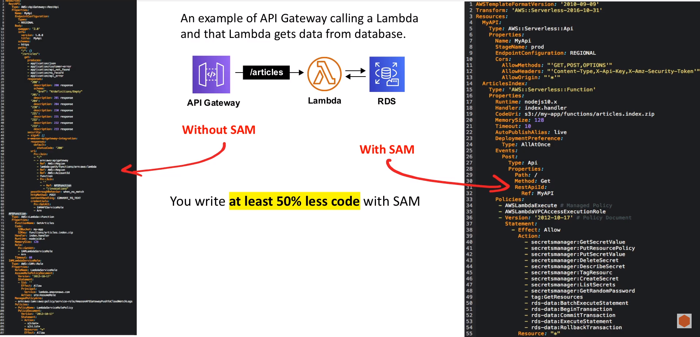

# Serverless Application Model

An **extension of CloudFormation** that lets you define
**serverless application**

## Introduction

SAM is both an **AWS CLI Tool** and a **CloudFormation Macro**
which makes it effortless to define and deploy serverless applications

### What is a Macro?

A replacement output sequence according to a define procedure.
The mapping process that instantiates a macro use into a specific
sequence is known as macro expansion

A macro **allows you to change the rules on how code works**,
allowing you to embed a language with a language. Macros serve
to make code **more human readable** or
**allow to write less code**. Creating a language within another
launch is called a DSL ( Domain Specific Language ).
By using macros you are creating a DSL

CloudFormation allows you to specify macros through the **Transform**
attribute. This is how SAM is used

```yaml
Transform: 'AWS:SERVERLESS-2016-10-31'
```

SAM gives you new resource types:

- AWS::Serverless::Function
- AWS::Serverless::API
- AWS::Serverless::SimpleTable

## Sam Vs CloudFormation



## SAM CLI

**SAM has a CLI** which makes it easy to **run**, **package**
and **deploy** serverless applications or lambdas

|                        |                                                                                                              |
|------------------------|--------------------------------------------------------------------------------------------------------------|
| sam build              | Prepare the lambda source code to be deployed by packaging it for upload                                     |
| sam deploy             | Upload the lambda package code ( artifact ) and then deploy                                                  |
| sam init               | Initialize a new serverless project, creating all the folders an files to get started                        |
| sam local invoke       | Generate sample payloads from different event sources, such as Amazon S3, Amazon API Gateway, and Amazon SNS |
| sam local start-api    | Run a single lambda locally                                                                                  |
| sam local start-lambda | Run your serverless application locally fro quick development and testing                                    |
| sam logs               | Fetches logs that are generated by your Lambda Function                                                      |
| sam package            | Packages an AWS SAM application. Create a zp, and uploads it to S3                                           |
| sam publish            | Publishes your packaged SAM application to AWS Serverless Application Repository                             |
| sam validate           | Validates an AWS SAM template ( great for finding syntax bugs )                                              |

<style>
.text-red {
  color: red;
}
</style>
