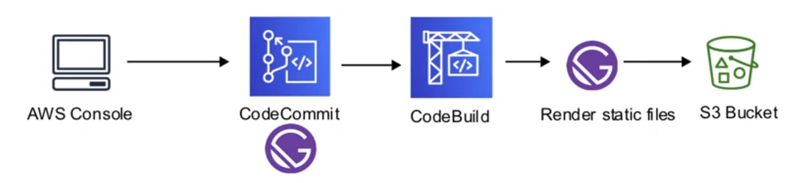
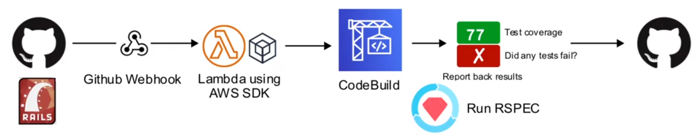

# CodeBuild

A full-managed **build pipeline** to create temporary
server to build and test code projects

## Introduction

- A full managed **build service** in the cloud
- Compiles your source code, **run unit tests**, and
**produce artifacts** that are ready to deploy
- Eliminates the need provision, manage, and scale your
own build servers
- Provides pre-packaged build environment for popular programming
languages and build tools such as Apache Maven, Gradle,
and more
- You can also customize build environments to use your
own build tools
- Scales automatically to meet peak build requests

## Build Environments

Docker Images managed by CodeBuild. Check the image to see what
comes pre-installed

- Amazon Linux 2
- Amazon Linux 2
- Ubuntu 18.04
- Ubuntu 18.04
- Windows Server Core 2016

## Use Cases

### Generate out Static Page from a JAMStack

A website build with Gatsby needs to render out Static Pages
and delivery for S3 static website hosting



### Run Test Code and Report Test Coverage

A developer needs to ensure their code passes all tests before
being allowed to make a Pull Request



## Buildspec YML

The Buildspec provides the **build instructions**.
The Buildspec.yml needs to be at the root of your project folder

### Properties

- **Version** - The build spec version ( 0.2 recommended )
  - Affects default shell in the build environment
    - 0.1 Runs each build command in a separate instance
    - 0.2 Runs all build commands in the same instance
- **Phases** - Tho commands runs during each phase of the build
  - **install** - Only for installing packages in the build env
  - **pre_build** - Commands that run before building
  - **build** - Commands that you run during the build
  - **post_build** - Commands run after the build
- **Artifacts** - here we can find the build output and
how to prepares it for uploading to the S3 output bucket

```yaml
version: 0.2

phases:
  install:
    commands:
      - bundle install
  pre_build:
    commands:
      - service postgresql start
      - export DATABASE_CLEANER_ALLOW_REMOTE_DATABAS_URL=true
      - export RAILS_ENV=test
  build:
    commands:
      - bundle exec rake db:create
      - bundle exec rake db:schema:load
      - bundle exec rake db:migrate
  post_build:
    commands:
      - bundle exec rspec
      - bundle exec cucumber
```

## CheatSheet

- **CodeBuild** is a fully-managed **build pipeline** to create
temporary servers to build and test code
- Compile source code, runs unit tests, and produces artifacts
that are ready to deploy
- Provides pre-packaged build environment or you can build your
own environments as a Docker container
- Uses a **Buildspec.yml** to provide build instructions
This file must stored in the root of your project
  - Version 0.1 - runs each build command in a separate instance
  - Version 0.2 - runs all build commands in the same instance
  - Commands run through different **phases**:
    - **install** - only for installing packages in the
    build env
    - **pre_build** - commands that run before building
    - **build** - commands That you run during the build
    - **post_build** - commands run after the build

<style>
.text-red {
  color: red;
}
</style>
