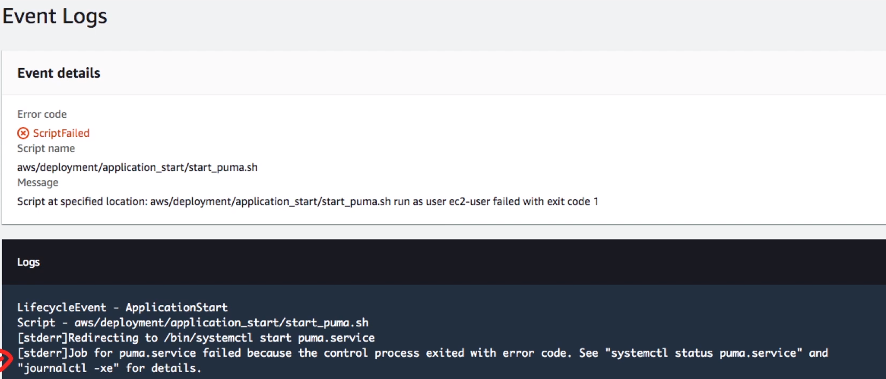

# CodeDeploy

A fully-managed **deploy pipeline** to deploy to
staging or production environments

## Introduction

- A fully managed **deploy service** in the cloud
- Can deploy EC2, On-Promise, Lambda, or ECS
- Rapidly release new features
- Update AWS Lambda function versions
- Avoid downtime during application deployment
- Perform **In-Place** or **Blue/Green** deployments
- Integrates with existing CI/CD tools. Eg. Jenkins, CodePipeline
- Integrates with existing config management tools.
Eg. Puppet, Chef, Ansible

## Core Components

### Application

The unique identifier for the application being deployed.
Ensure the correct combination of revision, deployment configuration,
and group are referenced during deployment

### Deployment Groups

A set of EC2 instances or Lambda Functions where the new revision
is deployed to

### Deployment

This is the process nad components used to apply a new
application revision

### Deployment Configuration

A set of deployment rules used during deployment - with success/failure
conditions included

### AppSpec File

Contains the deployment actions that CodeDeploy should execute
during deployment

### Revision

This is everything required to deploy a new version.
AppSpec file, application files, config files, executables

## In Place

- The app on each instance in the deployment group is stopped
- The latest app revision is installed, and the new version
of the application is started and validated
- You can use a load balancer so hat each instance is deregistered
during its deployment and then restored to service after the
deployment is complete
- Only deployments that use th **EC2 or On-Promise** compute
platform **can use in-place deployment**

## Blue Green

- Instances are provisioned for the replacement environment
- The latest application revision is installed on the
replacement instances
- An optional wait time occurs for activities such as applications
testing and system verification
- Instances in the replacement environment are registered with
an ELB, causing traffic to be rerouted to them
- Instances in the original environment are deregistered and
can be terminated or kept running for other uses

## appsync.yml

## Lifecycle Hooks

When you do a deploy, you can view the events and see if anything
ails and how long each Event takes. These events happens sequentially

---

When an event fails you can go in an **investigate** what happened

## CodeDeploy Agent and ServiceRole

### Agent

You will need to install the CodeDeploy Agent.
So the EC2 instance can report back to CodeDeploy

### ServiceRole

You may need to create a CodeDeploy Service Role based
on your deployment strategy

## Cheat Sheet

- A fully-managed **deploy pipeline** to deploy to staging or
production environments
- Can deploy to EC2, On-Promise, Lambda or ECS
- Can Perform **In-Place** or **Blue/Green** deployment
  - **In-Place** - Instances are briefly taken offline, updates
  are applied to existing servers
  - **Blue/Green** - Replaces instances with new instances.
  Swapping environments
- CodeDeploy Core Components
  - **Application** - Encompasses all other components.
  Unique ID of the application being deployed
  - **Deployment Groups** - A set of EC2 instances or
  Lambda Functions where the new revision is deployed to
  - **Deployments** - This process and components used to
  apply a new applications revision
  - **Deployment Configuration** - A set of deployment rules
  used during deployment - with success/failure conditions
  - **AppSpec File** - Contains the deployment actions that
  CodeDeploy should execute during deployment
  - **Revision** - The is everything required to deploy a
  new version: AppSpec file, application files, config files,
  executables
- **The AppSpec.yml** describes the deploy instructions and must
be part of the deploy artifact
- You need to install the CodeDeployAgent on the EC2 instance
so it can communicate with CodeDeploy
- You need to CodeDeployServiceRole to your EC2 instance
so they have permission to communicate to CodeDeploy
and so CodeDeploy has permissions to replicate servers or ASGs

