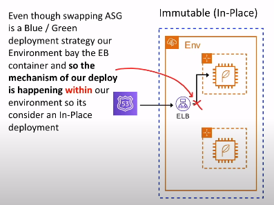
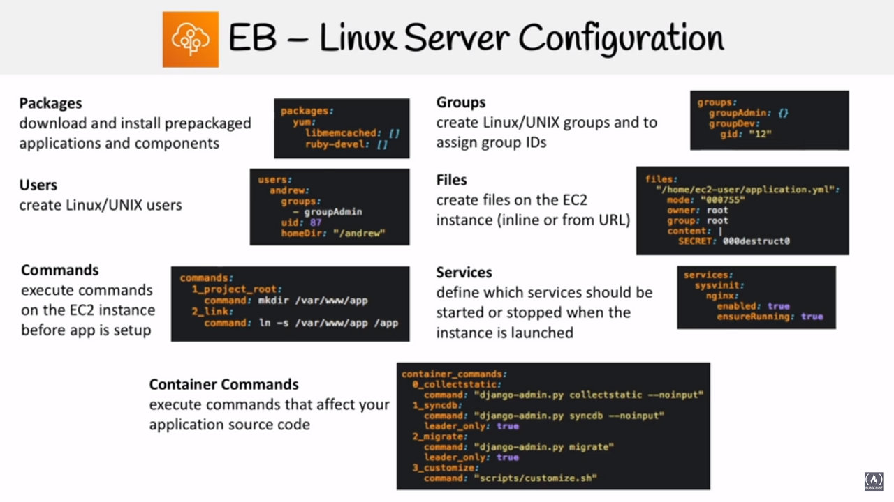

# Elastic Beanstalk

## Introducción

Administración y despliegue rápido en AWS
sin preocuparse por capas de infraestructura.
Es una plataforma como servicio ( PAAS )

### ¿Qué es una plataforma como servicio?

Una plataforma que permite a los clientes desarrollar,
correr y administrar aplicaciones sin tener
la complejidad de construir y/o mantener una infraestructura,
la cual deba ser desplegada para alojar aplicaciones

Es muy fácil escoger la plataforma, subir tu código y ejecutarlo
con mínimos conocimientos en infraestructura

**No se recomienda este servicio para aplicaciones en
<span class="text-red">Producción</span>**
( solo aplica para grandes empresas )

EBS usa una plantilla de CloudFormation, la cual tiene los
siguientes servicios:

- Elastic Load Balancer
- Autoscaling Groups
- RDS Database
- Instancias pre-configuradas ( o personalizadas ) EC2
- Monitoreo ( CloudWatch, SNS )
- Metodologías de desarrollo: In-Place and Blue/Green
- Seguridad ( contraseñas rotativas )
- Puede correr ambientes **Dockerized**

## Lenguajes Soportados

- Ruby ➡️ Rails
- Python ➡️ Django
- PHP ➡️ Laravel
- Java ➡️ Spring
- NodeJs ➡️ Express

## Web vs Worker Environment

La primera vez que vas a crear una aplicaciones en Elastic Beanstalk,
tendrás que elegir un ambiente, dentro de las opciones tienes
web y worker. Por lo que, si necesitas construir una
aplicación web, puedes eligir un `web environment`,
pero si buscas ejecutar tareas en segundo plano, la mejor
opción es un `work environment`

En la mayoría de los casos estarás construyendo
aplicaciones web, y estas necesitarán un ambiente de trabajo,
por lo que puedes crear ambos, un `web environment` y
un `worker environment`  y luego interconectarlos entre ellos

## Tipos Web Environment

- Simple Instance Env
  - Use ASG pero la capacidad deseada se establece en 1
  para asegurarse que el servidor siempre se encuentre ejecutándose
  - No usa ELB para ahorrar en costos
  - Posee una dirección IP pública que sirve para un dirigir
  el tráfico hacia el servidor
- Load Balanced Env
  - Usa ASG configurado para escalar
  - Usa un ELB
  - Diseñado para escalar

## Deployment Policies

Existen las siguientes políticas de desarrollo disponibles para
Elastic Beanstalk

| **Deployment Policies**           | **Load Balanced Env** | **Single Instance Env** |
|-----------------------------------|:---------------------:|:-----------------------:|
| **All at once**                   | 🟢                    | 🟢                      |
| **Rolling**                       | 🟢                    | 🔴                      |
| **Rolling with additional batch** | 🟢                    | 🔴                      |
| **Immutable**                     | 🟢                    | 🟢                      |

### All At One

1. Despliega una nueva versión de todas las instancias
al mismo tiempo
2. Deja todas las instancias **fuera de servicio**
3. Los servicios vuelven a estar disponibles

Este método es el más <span class="text-green">**rápido**</span>
pero también es el más <span class="text-red">**peligroso**</span>

#### En caso de falla

Necesitas hacer un roll back a los cambios y hacer
de nuevo un despliegue a la versión original
para todas las instancias

### Rolling

1. Implementa la nueva versión de la aplicación
en un lote ( batch ) de instancias a la vez
2. Pone las instancias que se encuentran en el lote
fuera de servicio mientras se encuentra en proceso de despliegue
3. Vuelve a adjuntar instancias actualizadas
4. Pasa al siguiente lote, sacándolos de servicio
5. Vuelve a unir esas instancias

*\* Este proceso se hace N cantidad de veces hasta actualizar
todas las instancias*

#### En caso de fallo

Debe realizar una actualización `rolling` adicional para
para revertir los cambios

### Rolling with Additional batch

1. Se inicia una instancia que se usará para reemplazar un lote
2. Implemente la versión actualizada de la aplicación
en un nuevo lote
3. Reemplaza un lote antiguo por el nuevo lote actualizado

`Rolling with Additional batch` asegura que nuestra capacidad
nunca se reduzca. <span class="text-red">Esto es importante
para aplicaciones donde una reducción en la capacidad podría
causar problemas de disponibilidad para los usuarios</span>

#### En caso de fallo

Debe realizar una actualización `rolling` adicional para
para revertir los cambios

### Inmutable

1. Crea un nuevo grupo ASG con instancias EC2
2. Implementa la versión actualizada de la aplicación
en las nuevas instancias EC2
3. Apunta el ELB al nuevo ASG y elimine el antiguo ASG que
terminará la antigua instancia EC2

Esta es la <span class="text-blue">**forma más segura**</span>
de desplegar para aplicaciones críticas

#### En caso de fallo

Simplemente se terminan las nuevas instancias ya que
las instancias existentes instancias no sufrieron cambios

## Métodos de Despliegue

| **Método**                        | **Impacto en caso de fallo en el despliegue**                                                | **Tiempo de Despliegue** | **¿Fuera de Servicio?** | **¿Cambia DNS?** | **Proceso de roll back** | **Código desplegado en las instancias** |
|-----------------------------------|----------------------------------------------------------------------------------------------|--------------------------|:-----------------------:|:----------------:|:------------------------:|:---------------------------------------:|
| **All at once**                   | Fuera de servicio                                                                            | 🕛                       | Si                      | No               | Manual                   | Existing                                |
| **Rolling**                       | Solo lote ( batch ) fuera de servicio; Si falla un lote, fallan todos; Hacer nuevo `Rolling` | 🕛🕛                     | No                      | No               | Manual                   | Existing                                |
| **Rolling with additional batch** | Similar que Rolling                                                                          | 🕛🕛🕛                   | No                      | No               | Manual                   | New and Existing                        |
| **Immutable**                     | Mínimo                                                                                       | 🕛🕛🕛🕛                 | No                      | No               | Terminate New            | New                                     |
| **Blue/Green**                    | Mínimo                                                                                       | 🕛🕛🕛🕛                 | No                      | Si               | Cambiar URL              | New                                     |

## Despliegue In-Place vs Blue/Green

Los despliegues In-Place y Blue/Green
<span class="text-red">no son tiene una definición definitiva,</span>
es el contexto que puede cambiar el alcance de lo que significan

### Posibles definiciones de In-Place

- Alcance de Elastic Beanstalk Env
  - Todas las políticas de despliegue proporcionadas por EB
  podrían ser consideradas In-Place ya que están
  dentro del alcance de un único entorno de EB
  - `All at once`, `Rolling`, `Rolling and additional batch`
  e `Inmutable`
- Alcance del mismo servidor ( no reemplaza el servidor )
  - Las políticas de despliegue que no implican que el servidor
  que se sustituye
  - `All at once`, `Rolling` y `Rolling and additional batch`
- Alcance de un servidor no interrumpido
  - El tráfico nunca es desviado del
  el servidor (`taken-of-service`). Implementa `Zero-downtime`
  despliegues donde el Blue/Green se produce en el servidor
  - EB no puede hacer esto. Capistrano + Ruby on Rails + Unicorn
  es un caso famoso de este método de despliegue

### Blue/Green Deployment in EB

<div style="display: flex; gap: 16px;">
  
  
</div>

*\*Blue/Green con EB requiere que su base de datos
estén **fuera** de los envs de EB porque los envs se terminan
con la pérdida de todos sus recursos*

## Archivos de configuración

Los entornos EB se pueden personalizar mediante archivos de configuración

- **.ebextensions** es una carpeta oculta llamada en la raíz
de su proyecto que contiene los archivos de configuración
- **.config** es la extensión para los archivos de configuración
que necesitan para ser almacenado en .ebextensions

## Manifiesto de entorno

Archivo llamado **env.yml** que se almacena
en la raíz de su proyecto

Al crear un nuevo entorno EB, este archivo le permite configurar
los valores predeterminados como:

- El nombre del env ( EnvironmentName )
- Elección del lenguaje de programación ( SolutionStack )
- Etc

*\*Este formato de archivo incluye soporte para grupos de entorno.
Para usar grupos, especifique el nombre del entorno en el manifiesto
con un símbolo "+" al final. P.ej. exapro-prod+*

## Configuración en servidor Linux



## CLI de EB

```bash
aws elasticbeanstalk help
```

## Imagen Personalizada de EB

Cuando crea un entorno EB, puede especificar una AMI
para usar en lugar de la AMI de EB estándar

Una AMI personalizada puede
<span class="text-red">**mejora los tiempos de
configuración inicial**</span>
cuando se lanzan instancias en su entorno

Se suelen usar cuando **necesita instalar una gran
cantidad de software** que
no está incluido en las AMI estándar.

### Pasos para Usar una Imagen Personalizada


## Configuración RDS

Se puede agregar una base de datos
**dentro** o **fuera** de su EB Env

### Dentro de EB

- Destinado a entornos de <span class="text-red">**general desarrollo**</span>
- Se crea la base de datos dentro de EB
- Cuando se termina el entorno EB, la base de datos también
se terminará.

### Entorno EB exterior

- Destinado a entornos de <span class="text-red">**producción**</span>
- Crea la base de datos desde RDS por separado para EB
- Cuando finalice el entorno EB, la base de datos permanecerá

## Cheat Sheet

- Elastic Beanstalk se encarga del despliegue
desde el aprovisionamiento de capacidad, el equilibrio de carga,
el auto-escalado hasta la monitorización del estado de la aplicación
- Use EB cuando quiera ejecutar una aplicación web pero no quiera
tener que pensar en la infraestructura
- No cuesta nada utilizar EB ( sólo los recursos que
que proporciona, por ejemplo, RDS, ELB, EC2 )
- Recomendado para aplicaciones de prueba o desarrollo.
No se recomienda para uso en producción ( grandes empresas )
- Se puede elegir entre las siguientes plataformas
pre-configuradas: Java, .Net, PHP, Node Js, Python, Ruby, Go
y Docker
- Puede ejecutar contenedores en EB tanto en `Single-container`
o `Multi-container`, estos contenedores se ejecutan en ECS
en lugar de EC2
- Puedes lanzar un **Web Environment** o un **Worker Environment**
  - **Web Environment**
    - **Single-Instance Env** lanza una sola instancia de EC2,se
  asigna una EIP ( Elastic IP addresses ) a la instancia EC2
    - **Load Balanced Env** lanza EC2s detrás de un ELB gestionado
  por un ASG
  - **Worker Environment** crea una cola SQS, instala el
  demonio SQS en las instancias EC2, y tiene una política
  de escalado ASG que añadirá o eliminará instancias
  basado en el tamaño de la cola
- Eb tiene las siguientes **Deployment Policies**:
  - **All at once** saca a todos los servidores fuera de servicio,
  aplica los cambios, vuelve a poner los servidores
  en servicio, rápido, tiene tiempo de inactividad
  - **Rolling** actualiza los servidores por lotes,
  capacidad reducida en función del tamaño del lote
  - **Rolling with additional batch** añade nuevos servidores
  en lotes para reemplazar los antiguos, nunca se reduce la capacidad
  - **Immutable** crea la misma cantidad de servidores y
  cambia todos a la vez a los nuevos servidores,
  eliminando los antiguos
- **Las políticas de despliegue `Rolling` requieren un ELB**,
por lo que no se pueden utilizarse con entornos web de
una sola instancia
- In-Place es cuando el despliegue ocurre dentro del entorno,
todas las políticas de despliegue son In-Place
- Blue/Green es cuando el despliegue intercambia entornos
( fuera de un entorno ), cuando se tienen recursos externos como
RDS que no pueden ser destruidos es adecuado para Blue/Green
- El archivo **.ebextensions** es una carpeta que contiene
todos los archivos de configuración
- Con EB puede proporcionar una **Imagen Personalizada**
que puede mejorar los tiempos de configuración inicial
- Si dejas que EB cree la instancia RDS, eso significa que cuando
borre su entorno, borrará la base de datos. Esta configuración
esta pensada para entornos de desarrollo y prueba
- **Dockerrun.aws.json** es similar a los archivos ECS Task Definition
an, define la configuración de Multi-contenedores

<style>
.text-green {
  color: green;
}
.text-blue {
  color: blue;
}
.text-red {
  color: red;
}
</style>
