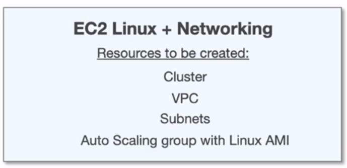
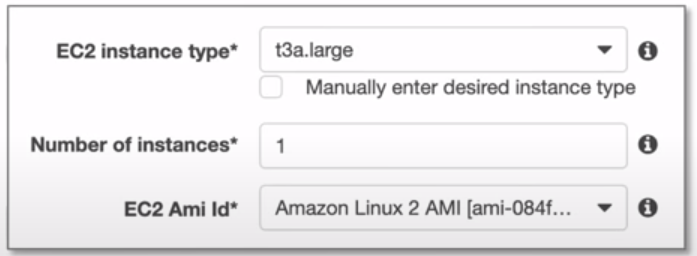
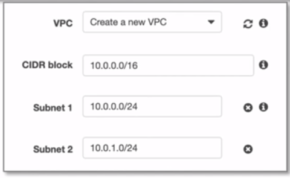
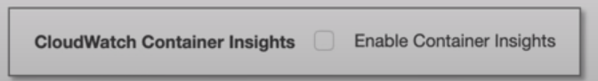
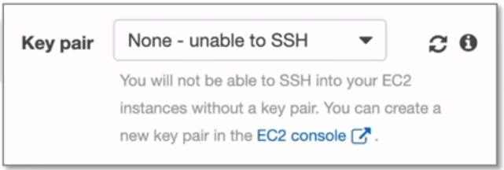
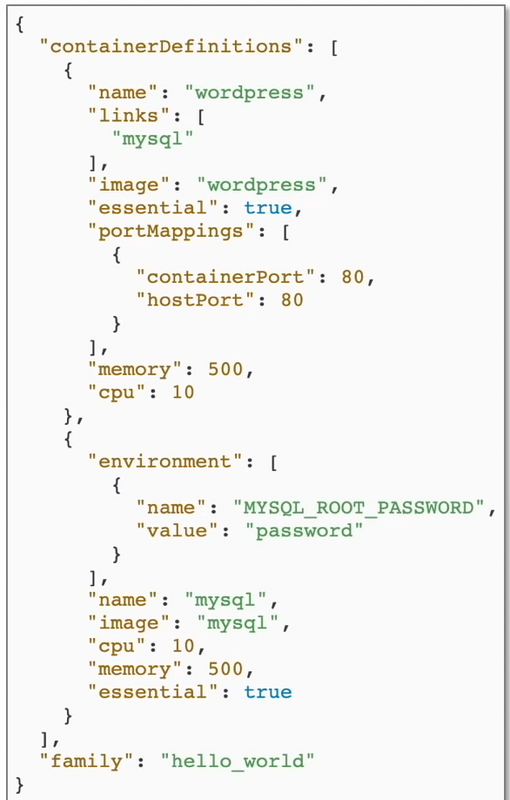
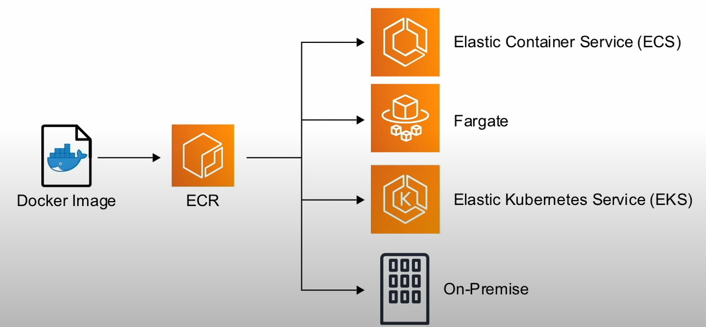

# Elastic Container Service ( ECS )

## Introducción

Servicio de administración de **contenedores**
Altamente seguro, fiable y es una forma
escalable de ejecutar contenedores

## Componentes de ECS

- **Cluster**
  - Múltiples instancias EC2 que estarán en un contenedor docker
- **Task Definition**
  - Archive JSON que define la configuración de ( hasta 10 )
  contenedores que quieras ejecutar
- **Task**
  - Ejecuta contenedores definidos en `Task Definition`.
  Las tareas no permanecen en ejecución una vez que se
  ha completado la cargo de trabajo
- **Service**
  - Se asegura que las tareas permanezcan ejecutándose
  eg. web-apps servers
- **Container Agent**
  - Binario en cada instancia EC2 que supervisa, inicia y
  detiene tareas

## Creando un ECS Cluster

Para crear un cluster ECS en la consola
de aws, debes seguir los siguientes
pasos:

1. Crear el Cluster
2. Elegir entre usar `spots` o `on demand`
3. Elegir el tipo de instancia EC2
4. Número de instancias
5. Volumen de almacenamiento de EBS
6. EC2 puede ser **Amazon Linux 1** or **Amazon Linux 2**
7. Asignar un `IAM Role`
8. Si usar `CloudWatch Container Insights`
9. *Elegir `Key Pair`

*\* Puedes acceder mediante SSH a la
instancia EC2 y hacer cambios pero
generalmente no es recomendado

## Task Definition File

  
  

  Puedes tene multiples contenedores dentro
  de una `task definition`

  Una **imagen** ( docker )
  puede ser provista via **ECR** o mediante
  un repositorio docker oficial,
  P.ej Docker Hub

  Debes tener un contenedor **essential**
  . Si este contenedor falla o se detiene,
  todos los contenedores serán detenidos

  AWS tiene un asistente para `Task Definitions`
  en lugar de tener que crearlo a mano
  

## Elastic Container Registry ( ECR )

Servicio totalmente gestionado que hace fácil
**guardar**, **administrar** y **desplegar** imágenes Docker

