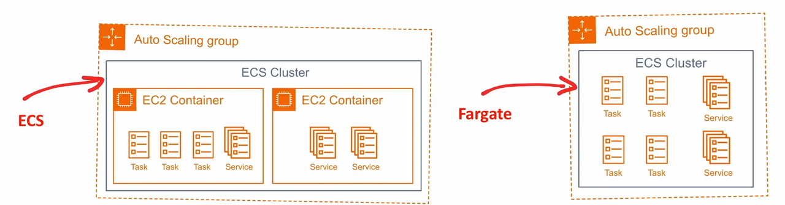
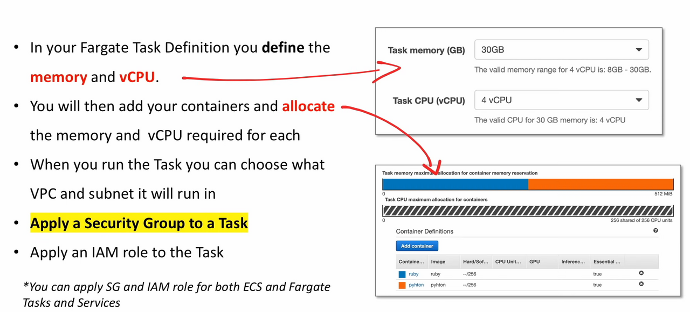

# Fargate

## Introduction

**Contenedores sin Servidor**. No te preocupes por los servidores.
Ejecuta contenedores y paga en base a la duración y consumo.

- Puedes tener un cluster ECS ( no provisto por
instancias EC2 ) y luego ejecutar `Tasks` como `Fargate`
- Ya no tiene que
**aprovisionar**,
**configurar**, y
**escalar**
clusters de instancias EC2 para ejecutar contenedores
- Se cobra por lo menos un minuto y después por segundo
- Se pagas en base a la duración y el consumo

## Configurando Fargate Tasks

## Fargate Vs Lambda

Lambda y Fargate son muy similares pero tienen unas
diferencias claves

|                  | **Fargate**                        | **Lambda**                                                |
|------------------|------------------------------------|-----------------------------------------------------------|
| **Cold Starts**  | Si ( menos )                       | Si                                                        |
| **Duración**     | Tanta como quieras                 | 15 min                                                    |
| **Memoria**      | Hasta 30Gb                         | Hasta 3Gb                                                 |
| **Contenedores** | Tú proporcionas los contenedores   | Limitado a contenedores estándar                          |
| **Integración**  | Más Manual                         | Se integra perfectamente con otros servicios sin servidor |
| **Precio**       | Al menos 1 min y luego por segundo | Pagas por 100ms                                           |

