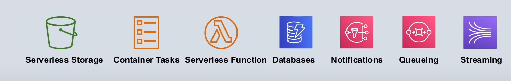
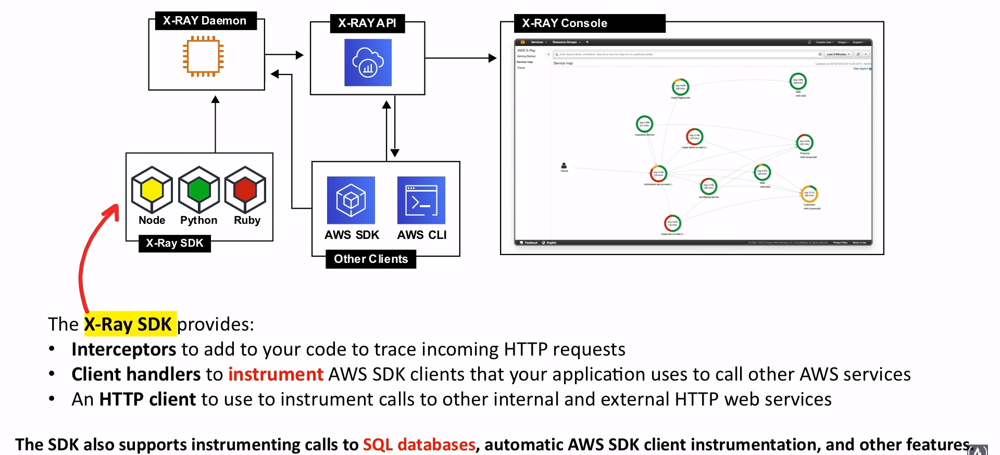

# X-Ray

Ayuda a los desarrolladores a **analizar y depurar aplicaciones**
utilizando arquitecturas orientadas hacia
<span class="text-red">micro-servicios</span>

## Introducción

## ¿Qué es la Arquitectura Orientada a Micro-servicios?

El micro-servicio es un enfoque arquitectónico y organizativo
de desarrollo de software en el que el software se compone de
**pequeños servicios independientes** que se comunican
a través de APIs bien definidas



Estos servicios son mantenidos por pequeños equipos autónomos

Las arquitecturas de micro-servicios hacen que las
aplicaciones sean más fáciles de escalar
y más rápidas de desarrollar, permitiendo la innovación y acelerando
el tiempo de comercialización de nuevas funciones

## ¿Qué es Rastreo Distribuido?

El rastreo distribuido, también llamado
rastreo distribuido de solicitudes
es un método utilizado para perfilar y
monitorizar aplicaciones, especialmente aquellas construidas
utilizando una arquitectura de micro-servicios. El rastreo distribuido
ayuda a identificar dónde se producen los fallos y qué causa
**un rendimiento deficiente**

## ¿Qué es la Supervisión del Rendimiento?

Es la disponibilidad, monitorización y
gestión del rendimiento de las aplicaciones de software.
APM se esfuerza por detectar y diagnosticar complejos
problemas de rendimiento de las aplicaciones para mantener un
nivel de servicio esperado

## X-Ray como un Sistema de Rastreo Distribuido

- Recoge datos sobre las peticiones que sirve su aplicación
- Visualiza y filtra los datos obtenidos para identificar
**problemas** y vías de **optimización**.

Para cualquier solicitud rastreada a su aplicación, puede ver
información detallada no sólo sobre las solicitudes y
respuesta, sino también sobre las llamadas que su aplicación
realiza a los recursos de AWS, micro-servicios, ¿
bases de datos y API web HTTP

## Anatomía de X-Ray



## Instrumentación

### ¿Qué es la Instrumentación?

Capacidad de controlar o medir el nivel de
rendimiento de un producto, diagnosticar errores y
escribir información de seguimiento

```javascript
const app = express();
const AWSXRay = require('aws-xray-sdk');

app.use(AWSXRay.express.openSegment('MyApp'));

app.get('/', function(req, res) {
  res.render('index.html');
});

app.use(AWSXRay.express.closeSegment());
```

## X-Ray Daemon

<div style="display: flex; gap: 1rem">
  
  <div style="order: 1;">
  En lugar de enviar los datos de rastreo directamente a X-Ray
  el SDK envía **documentos de segmento JSON** a un
  proceso a la escucha del tráfico UDP

  El `daemon` de X-Ray **almacena los segmentos** en una cola
  y los sube a X-Ray por lotes

  Este `daemon` está disponible para Linux, Windows y Mac,
  y su uso está incluido en las plataformas Elastic Beanstalk
  y Lambda

  X-Ray utiliza los datos de rastreo de los recursos de AWS
  que alimentan sus aplicaciones en la nube para generar un
  detallado **gráfico de servicios**.
  </div>
</div>

## Conceptos de Rayos X

### Resumen

1. Aws X-Ray recibe los datos de los servicios como **segments**.
2. X-Ray agrupa los segmentos que tienen una solicitud en
común en **traces**.
3. X-Ray procesa las `traces` para generar un **gráfico de servicios**
que proporciona una representación visual de su aplicación

### Gráfico de Servicios


### Segmentos

Recursos informáticos que ejecutan la lógica de su
aplicación **envían datos** sobre su trabajo son **segmentos**

Un segmento puede enviar la siguiente información:

- **The host:** Nombre de host, alias o IP
- **The request:** Método, dirección del cliente, ruta,
agente de usuario
- **The response:** Estado, contenido
- **The work done:** Horas de inicio y fin, `subsegments`
- **Issues that occur:** Errores, fallos y excepciones, incluyendo
captura automática de pilas de excepciones

### Sub-segmentos

Los `subsegments` proporcionan información de tiempo más
granular y detallada sobre las llamadas posteriores que su
aplicación realizó para cumplir con la solicitud original

Un `subsegments` puede contener detalles adicionales sobre
una llamada a un servicio de AWS, una API HTTP externa o
una base de datos SQL

Incluso puede
<span class="text-red">**definir `subsegments` arbitrarios**</span>
para registrar funciones o líneas de código específicas
en su aplicación

```javascript
const AWS = Require('aws-sdk');
const AWSXRay = require('aws-xray-sdk');

exports.handler = (event, context, callback) => {
  const segment = AWSXRay.getSegment();
  const subsegment = segment.addNewSubSegment('custom-subsegment');

  processWithManyTasks();
  subsegment.close();

  callback();
}

function processWithManyTasks() {
  // Many many tasks...
}
```

### Trazas

Un `trace` recoge todos los segmentos generados por una
única petición

Un **trace ID** rastrea la ruta de una solicitud a través
de su aplicación

El primer servicio soportado con el que interactúa la
petición HTTP **añade un trace ID header** a la solicitud, y
lo propaga hacia abajo para rastrear la latencia, la disposición
y otros datos de la solicitud

### Muestreo ( Sampling )


### Trace Header

Todas las peticiones son rastreadas, hasta el mínimo configurable.
Después de alcanzar ese mínimo,
<span class="text-red">**solo un porcentaje de peticiones son
rastreadas para evitar costos innecesarios**</span>

La decisión de muestreo y el ID de rastreo se añaden
a la petición HTTP en *tracing headers**
denominada **X-Amzn-Trace-Id**


### Filter Expressions


### Groups


### Anotaciones y Metadatos

Puede agregar información adicional al segmento como una
**anotación** y/o **metadatos**

Las anotaciones y los metadatos se agregan en el nivel
de `segment` y se puede agregar a cualquier
segmento/sub-segmento

- **Anotación**
  - Pares clave-valor que están **indexados** para usar con
  expresiones de filtro
  - X-Ray permite hasta
  <span class="text-red">**50 anotaciones**</span> por `segment`
  - Use anotaciones para registrar los datos que desea usar para
  agrupar `trace` en la consola, o al llamar la API GetTraceSummary
- **Metadatos**
  - Pares clave-valor que **no están indexados**
  - Los valores pueden ser de cualquier tipo, incluidos objetos
  y listas.
  - Use metadatos para registrar los datos que desea
  almacenar en el `segment` pero no es necesario usarlo
  para buscar `traces`

Puede ver anotaciones y metadatos en el
<span class="text-red">**segment/subsegment details**</span>
en la consola de X-Ray

### Errores, Fallas y Excepciones

When an exception occurs while your app is serving an instrumented
request the X-Ray SDK records
<span class="text-red">**exceptions details**</span> and the
<span class="text-red">**stack trace**</span>
( if available )

|               |                     |                       |
|---------------|---------------------|-----------------------|
| **Errores**   | Errores del cliente | errores 400 / 4XX     |
| **Fallas**    | Fallas del servidor | errores 500 / 5XX     |
| **Throttled** | Throttling errors   | 429 Too Many Requests |

Puede ver las excepciones en
<span class="text-red">**segment detail**</span>
en la consola de X-Ray

## X-Ray - Integración con Servicios AWS

- **Lambda**
- **API Gateway**
- **Elastic Load Balancer ( ELB )**
- **Simple Notification Service ( SNS )**
- **Simple Queue Service ( SQS )**
- **Amazon EC2**
- App Mesh
- CloudTrail
- CloudWatch
- AWS Config
- Elastic Beanstalk ( EB )
- Elastic Container Services ( ECS )
- ECS Fargate

*\* Los servicios en negrita son los que tienen más
casos de uso*

## X-Ray - Lenguajes Soportados

- Go
- Java
- Node Js
- Python
- Ruby
- .Net
- PHP

## Cheat Sheet

- X-Ray **ayuda a los desarrolladores a analizar y depurar aplicaciones**
que utilizan la arquitectura de **micro-servicios**
- X-Ray es un **Sistema de Trazado Distribuido**, siendo
un método utilizado para perfilar y monitorear aplicaciones,
especialmente aquellas construidas usando un
arquitectura de micro-servicios para identificar
dónde ocurren las fallas y lo que causa un bajo rendimiento
- **X-Ray Daemon** es una aplicación de software que escucha
el tráfico en el puerto UDP 2000, recopila datos de segmento
sin procesar y lo transmite a la API de AWS X-Ray.
Los datos generalmente no se envían directamente la API
de X-Ray, sino que pasan a través de X-Ray Daemon
que sube por lotes
- **Segmentos** proporciona el nombre del recurso, detalles sobre
la solicitud y el trabajo realizado
- **Los subsæ-egmentos** brindan información de tiempo más
granular y detalles sobre las llamadas que su aplicación hizo
al completar la solicitud original
- **Gráfico de Servicio** es una visualización de diagrama
de flujo de la respuesta promedio por micro-servicio y visualmente
señalar fallas en caso de haber
- **Traces** recopila todos los segmentos generados por una
sola solicitud para que pueda rastrear la ruta de las
solicitudes a través de múltiples servicios
- **Muestreo** es un algoritmo que decide qué solicitud
debe ser rastreada. Por **defecto** el SDK de X-Ray
<span class="text-red">**registra la primera solicitud cada segundo**</span>
y el
<span class="text-red">**5% de cualquier solicitud adicional**</span>

- **Tracing Header** es el nombre **X-Amzn-Trace-Id** e identifica
un rastro que pasó a los servicios posteriores
- **Filter Expressions** le permite restringir la especificación
rutas o usuarios
- **Groups** permiten guardar `FilterExpressions` para que
pueda filtrar rápidamente `traces`
- **Anotaciones y Metadatos** permiten capturar información adicional
mediante pares clave-valor
  - Las anotaciones están **indexadas** para su uso con
  `FilterExpressions` con un límite de 50
  - Los metadatos **no están indexados**. Usarlos para
  registrar datos que no necesita usar para filtrar `traces`
- **Errores** son errores 400 / 4XX
- **Fallos** son errores 500 / 5XX
- **Throttle** es un error 429 Too Many Requests
- X-Ray es compatible con los siguientes **lenguajes:**
  - Go
  - Java
  - Node Js
  - Python
  - Ruby
  - .Net
  - PHP
- Compatibilidad con X-Ray **Integraciones con Servicios AWS**:
  - **Lambda**
  - **API Gateway**
  - **Elastic Load Balancer ( ELB )**
  - **Simple Notification Service ( SNS )**
  - **Simple Queue Service ( SQS )**
  - **Amazon EC2**
  - App Mesh
  - CloudTrail
  - CloudWatch
  - AWS Config
  - Elastic Beanstalk ( EB )
  - Elastic Container Services ( ECS )
  - ECS Fargate

<style>
.text-red {
  color: red;
}
</style>
