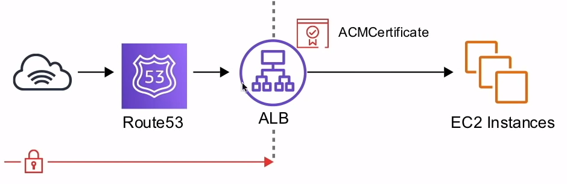
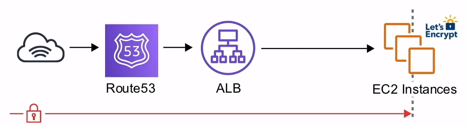

# ACM

**Provee**, **administra** y **despliega** de manera pública
o privada certificados SSL/TSL para ser usados en servicios AWS

## Introducción

ACM maneja la complejidad de crear y administrar certificados
**SSL/TSL** públicos para tus sitios web y aplicaciones basadas
en AWS

ACM dispone de dos tipos de certificados:

1. **Público** - Certificado otorgado por ACM
<>**( Gratis )**

2. **Privado** - Certificado propio almacenado en ACM
<>**( $400 mensuales )!!!**

ACM puede manejar multiples sub-dominios y `wildcard domains`

ACM puede ser incorporado a los siguientes recursos de AWS:

- ELB
- CloudFront
- Api Gateway
- Elastic Beanstalk ( a través de ELB )

## ACM Ejemples

### SSL Termina en el Balanceador de Carga

Todo el tráfico en transito más allá de el ALB está desencriptado

Puede añadir tantas instancias EC2 al ALB sin necesitar instalar
certificados en cada instancias. Teóricamente es menos seguro

### SSL Terminando de Extremo a Extremo

El tráfico en transito es encriptado en todo el flujo de la
aplicación

Garantiza la encriptiación de extremo a extremo. Los certificados
se vuelven más complejos de mantener

