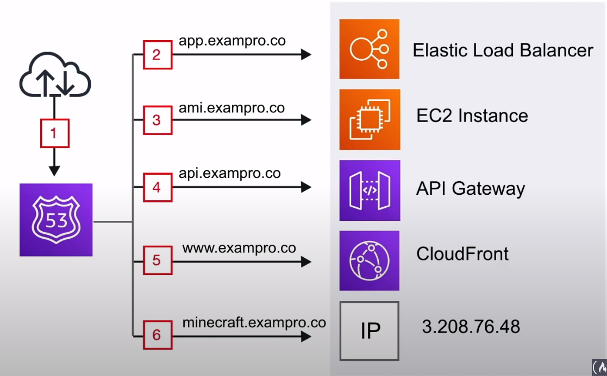
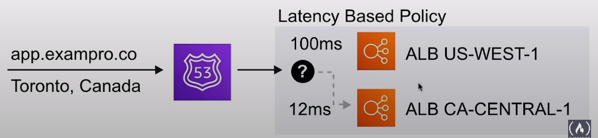
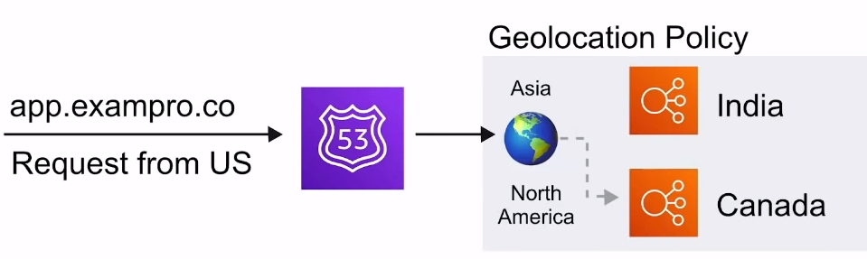

# Route53

DNS en la nube con una alta disponibilidad y escalabilidad
**Registro y administra dominios**
crear reglas de enrutamiento DNS,
por ejemplo, la conmutación por error ( failover )

## Introducción

Route53 es un service de nombres de dominio, **piensa**
en Godaddy o NameCheap pero con una mayor sinergia con
los servicios de AWS

Puedes:

- Registrar y mantener dominios
- Crear varios conjuntos de registros en los dominios
- Implementar flujos de trafico complejos,
p. eje Blue/Green deploy, failover
- Monitoreo continuo hacia los registros mediante `health checks`
- Resolver VPC's fuera de AWS

## Caso de Use

Usa Route53 para obtener dominios personalizados para
que apunten a recursos de AWS

1. El tráfico entrante de Internet
2. Dirigir el tráfico a nuestro backend de la aplicación web
  mediante ALB
3. Enrutar el tráfico a una instancia que utilizamos para
ajustar nuestra AMI
4. Enrutar el tráfico hacia `API gateway` que alimenta
nuestra API
5. Enrutar el tráfico a CloudFront que sirve nuestro
sitio web estático alojado en S3
6. Enrutar el tráfico a una IP elástica ( EIP ) que es una
IP estática que aloja el servidor de Minecraft de nuestra empresa

## Conjuntos de Registros

Creamos conjuntos de registros que nos permiten apuntar
nuestro dominio ( exampro.co ) y los subdominios a través
de registros de dominio

Por ejemplo podemos enviar nuestro subdominio www usando un
registro A para apuntar a una dirección IP específica

Aws tiene su propio registro especial `Alias` que extiende la
funcionalidad del DNS. Dirigirá el tráfico a recursos
específicos de AWS

Los registros `Alias` son inteligentes y pueden detectar
el cambio de una dirección IP y mantener continuamente ese
punto final apuntando a el recurso correcto

En la mayoría de los casos, usted querrá usar **Alias** al
enrutar el tráfico a los recursos de AWS

## Políticas de Enrutamiento

Existen
**7 diferentes tipos** de
políticas de enrutamiento que dispone Route53

### Resumen

- **Enrutamiento Simple**
  - Política de enrutamiento por defecto, tener múltiples
  direcciones conlleva a una selección aleatoria
- **Enrutamiento Ponderado**
  - Enrutamiento del tráfico basado en valores ponderados
  para dividir el tráfico
- **Enrutamiento Basado en la Latencia**
  - Dirige el tráfico al recurso de la región con menor latencia
- **Enrutamiento de Conmutación por Error**
  - Enruta el tráfico si el punto final primario no es saludable
  a punto final secundario
- **Enrutamiento por Geo-Localización**
  - Enrutar el tráfico en función de la ubicación de sus usuarios
- **Enrutamiento por Geo-Proximidad**
  - Dirige el tráfico en función de la ubicación de sus
  recursos y, opcionalmente, desplazar el tráfico de los
  recursos en una ubicación a los recursos en otro lugar
- **Enrutamiento de Respuesta con Multiples Valores**
  - Responde a las consultas DNS con hasta ocho registros sanos
  seleccionados al azar

### Enrutamiento Simple

La política de simple enrutamiento es la más básica política
de Route53, por ello es asignada por **Defecto**

- Puedes tener 1 registro y multiples direcciones IP
- Cuando tienes multiples IPs por un registro, Route53
devolverá **aleatoriamente** solo una dirección IP

Por ejemplo, si tienes un registro para www.exampro.com'
con 3 diferentes direcciones IP, el usuario será dirigido
**aleatoriamente a 1 de ellas**
cuando visite el sitio

### Enrutamiento Ponderado

La política de enrutamiento ponderado permite dividir el tráfico
basado en diferentes `weights` asignados

Esto permite enviar cierto porcentaje a un servidor y la parte
restante puede ser dirigida a un servidor completamente diferente

Por ejemplo, si tienes ejecutándose un ALB con características
experimentales, podrías probar enviar un pequeño monto para
minimizar el impacto de los afectados

### Enrutamiento Basado en la Latencia

La política de enrutamiento basado en la latencia permite
dirigir el tráfico hacia la conexión con una menor latencia
posible para tu usuario final.
**Se basa en la región**

### Enrutamiento de Conmutación por Error ( Revisar)

La política de enrutamiento de computación por error permite
crear una configuración activa/pasiva destinada a situaciones
en donde quieras que tu sitio primario se encuentre en cierta
localización y el secundario recupere la información de otra

Route53 automáticamente hace seguimiento a los health-checks
de tu sitio primario para determinar el estado de los `endpoints`.
Si algún `endpoint` es determinado como **fallido**, todo el
tráfico es automáticamente dirigido hacia la localización secundaria

Por ejemplo, nosotros tenemos una web-app backend primaria y
secundaria por ALB. Route53 determina que nuestra app primaria
se encuentra con problemas por tanto está fallando, Route53
automáticamente usará la app secundaria

### Enrutamiento por Geo-Localización

La política de enrutamiento por geo-localización permite
dirigir el tráfico basado en la ubicación geográfica de
donde se originó la solicitud

Por ejemplo, esto le permitiría dirigir todo el tráfico
procedente desde regiones de América del Norte,
donde las consultas de otras regiones
podrían dirigirse a servidores alojados en esa región (potencialmente
con precios e idiomas específicos para esa región)

### Enrutamiento por Geo-Proximidad

Las políticas de enrutamiento de geo-proximidad le permiten
dirigir el tráfico en función de la ubicación geográfica de
sus usuarios, y sus recursos de AWS

Puede dirigir más o menos tráfico a un recurso específico
especificando un valor, denominado **Bias**

Los valores de Bias amplían o reducen el tamaño de la región
geográfica a la que se dirige el tráfico. **Debe utilizar
`traffic flow` de Route53** para utilizar las políticas de
enrutamiento de Geo-Proximidad

### Enrutamiento de Respuesta con Multiples Valores

Las políticas de enrutamiento de respuesta con multiples valores
le permiten configurar Route53 para que devuelva múltiples
direcciones IP para sus servidores web, en respuesta a
las consultas del DNS

Se pueden especificar múltiples valores para casi cualquier
`records`. Route53 realiza automáticamente comprobaciones
de la salud de los recursos y sólo devuelve los valores de
los que se consideran sanos ( disponibles/sin fallos )

Similar a `Simple Routing`, pero realiza una `health-check`
para el conjunto de `records`

## Health Checks

- Verifica la disponibilidad cada
**30s** por defecto
- Puede ser reducido hasta
**10s**

- Una comprobación de salud puede **iniciar una conmutación
por error** si el estado es devuelto como no está disponible

- Una alarma de CloudWatch puede ser creada para informarte
sobre estados `unhealthy`
- Un `health check` puede
**observar a otros `health check`**
para crear reacciones en cadena

Puede crear hasta **50 `health checks`** para `endpoints`
de AWS que estén dentro o vinculados a la misma cuenta de AWS

### Precios

|                                                                                                                            | Puntos de enlace de AWS                      | Puntos de enlace no pertenecientes a AWS    |
|----------------------------------------------------------------------------------------------------------------------------|----------------------------------------------|---------------------------------------------|
| Comprobaciones de estado básicas                                                                                           | 0,50 USD* por comprobación de estado mensual | 0,75 USD por comprobación de estado mensual |
| Características opciones de comprobación de estado; HTTPS; Coincidencia de cadenas; Intervalo rápido; Medición de latencia | 1,00 USD al mes por característica opcional  | 2,00 USD al mes por característica opcional |

## Resolver

Formalmente se conocen como **.2 resolver**

Un servicio regional que te permite enrutar consultas DNS
entre tus VPCs y tus conexiones

La resolución de DNS son para **Entornos Híbridos** ( On-Promise
y Cloud )

## Cheat Sheet

- Route53 es un proveedor DNS, registra y administra dominios,
Piensa en el como Godaddy o NameCheap
- **Enrutamiento simple**
  - Política de enrutamiento por defecto, tener múltiples
  direcciones conlleva a una selección aleatoria
- **Enrutamiento ponderado**
  - Enrutamiento del tráfico basado en valores ponderados
  para dividir el tráfico
- **Enrutamiento basado en la latencia**
  - Dirige el tráfico al recurso de la región con menor latencia
- **Enrutamiento de conmutación por error**
  - Enruta el tráfico si el punto final primario no es saludable
  a punto final secundario
- **Enrutamiento por geo-localización**
  - Enrutar el tráfico en función de la ubicación de sus usuarios
- **Enrutamiento por geo-proximidad**
  - Dirige el tráfico en función de la ubicación de sus
  recursos y, opcionalmente, desplazar el tráfico de los
  recursos en una ubicación a los recursos en otro lugar
- **Enrutamiento de respuesta con multiples valores**
  - Responde a las consultas DNS con hasta ocho registros sanos
  seleccionados al azar

