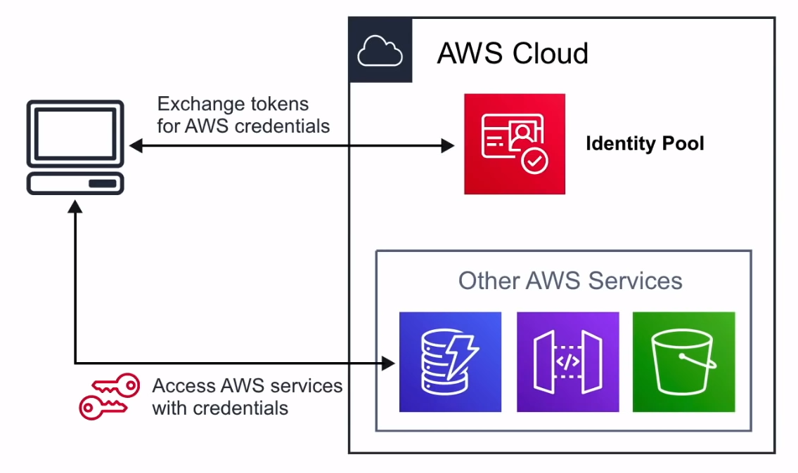

# Amazon Cognito

Administrador descentralizado para realizar integraciones
tales como
**autenticar** e
iniciar/cerrar sesión en tus aplicaciones.

## Introducción

### Cognito User Pools

Directorio de usuarios con autenticación a IpD para conceder
acceso a su aplicación

### Cognito Identity Pools

Proporcionar credenciales temporales para que los usuarios
accedan a servicios de AWS

### Cognito Sync

Sincroniza los datos y preferencias del usuario en todos
los dispositivos

## Web Identity Federation and IpD

### Web Identity Federation

Intercambia información de identidad y seguridad entre un
proveedor de identidades ( IdP ) y una aplicación

### Identity Provider ( IdP )

Proveedor de confianza que le permite utilizar su medio de
autenticación para acceder los servicios.
Los proveedores de identidad pueden ser:
**Facebook, Amazon, Google,
Twitter, Github, LinkedIn**

## Cognito User Pools

Los **User Pools** son directorios de usuarios utilizados
para gestionar las acciones de las aplicaciones web y móviles,
tales como:

- Registro
- Inicio de sesión
- Recuperación de la cuenta
- Confirmación de la cuenta

Permite a los usuarios iniciar sesión directamente en la
`User Pool`, o utilizando la `Web Identity Federation`

Utiliza AWS Cognito como intermediario de identidades entre
AWS y el proveedor de identidades

La autenticación exitosa del usuario genera un JWTs

Los `User Pools` pueden ser considerados como la cuenta utilizada
para acceder al sistema, es decir, la dirección de correo
electrónico y la contraseña

## Cognito Identity Pools

**Identity Pools** provee
**credenciales AWS temporales**
para acceder a los services. Por ej: S3, DynamoDB.
Puede pensar en `Identity Pools` como el mecanismo real que
autoriza el acceso a los recursos de AWS

## Cognito Sync

Sincroniza los **datos del usuario** y las **preferencias**
entre dispositivos con una línea de código

Cognito utiliza **sincronización push** para empujar las
actualizaciones y sincronizar los datos.
Utiliza SNS para enviar estas notificaciones a todos
dispositivos del usuario cuando los datos en la nube cambian

## Cheat Sheet

- Cognito es un sistema de autenticación gestionado de forma
descentralizada. Cuando necesite añadir fácilmente la autenticación
a su aplicación móvil o de escritorio piense en Cognito
- **User Pool** permite a los usuarios autenticarse
utilizando OAuth a IpD como Facebook, Google, Amazon para conectarse
a las aplicaciones web. Cognito User Pool es en sí mismo un IpD
- Los User Pools utilizan **JWTs** para persistir la autenticación
- Los **Identity Pools** proporcionan **credenciales AWS temporales**
para acceder a servicios como S3 o DynamoDB
- **Cognito Sync** puede sincronizar **datos de usuario** y
**preferencias** entre dispositivos con una línea de código
( impulsado por SNS )
- **Web Identity Federation** intercambia información de identidad
y seguridad entre un proveedor de identidades ( IdP )
- **Proveedor de identidad ( IdP )** un proveedor de confianza
que le permite utilizar la autenticación para acceder a
otros servicios. Por ejemplo, Facebook, Twitter, Google y Amazon
- **OIDC** es un tipo de proveedor de identidad que utiliza OAuth
- **SAML** es un tipo de proveedor de identidad que utiliza SSO

