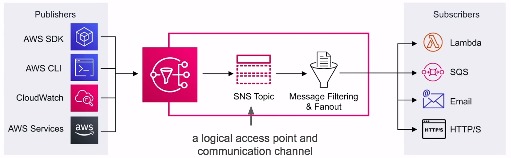

# Simple Notification Service ( SNS )

**Subscribe** y
**envía notificaciones**
via mensajes de texto, email, webhooks, lambdas, SQS y
notificaciones móviles

## Introducción

**Simple Notification Service ( SNS )** es un servicio de
mensajería pub/sub de alta disponibilidad, duradero, seguro
y totalmente gestionado que permite **desacoplar** micro-servicios,
sistemas distribuidos y aplicaciones sin servidor.

### Application Integration

- Los `publishers` envían eventos a un `topic` del SNS
- Los `subscribers` se suscriben a los `topics` del SNS para
que se les envíen los eventos a ellos

### ¿Qué es Pub/Sub?

El patrón `Publish-Subscribe` comúnmente implementado en
**sistemas de mensajería**. En un **sistema pub/sub** el
emisor de mensajes ( **publishers** ) no envían los mensajes
directamente hacia los receptores ( **subscribers** ). En
su lugar, envían los mensajes hacia un
**event bus**. El `event bus`
categoriza estos mensajes en grupos. Luego los receptores
se subscriben a estos grupos. Cada vez que aparecen nuevos
mensajes dentro de su suscripción, los mensajes se les
entregan inmediatamente.

- Los `publishers` no sabe quiénes son sus suscriptores
- Los `subscribers` no **remueven** los mensajes
- Los mensajes son, en cambio, automáticamente y de manera
inmediata son **enviados**
hacia los subscriptores
- Mensajes y eventos son términos intercambiables en pub/sub

## SNS Topics

**Topics** te permiten agrupar multiples subscriptores.

Un `topic` es capaz de entregar en multiples protocolos
a la vez, p.ej, email, mensajes de texto, http/s

Cuando los `topics` entregan los mensajes hacia los
subscriptores, estos automáticamente le dan un formato al
mensaje acorde al protocolo del subscriptor

Puedes encriptar los `topics` vía **KMS**

**Los `publishers` no se preocupan por el protocolo de los suscriptores.**

**Los `subscribers` escuchan los mensajes entrantes.**

## SNS Subscriptions

Una suscripción sólo puede suscribirse a un protocolo y a
un `topic`

SNS posse los siguientes protocolos:

- **HTTP y HTTPS**
  - Crear webhooks en su aplicación web
- **Email**
  - Bueno para las notificaciones internas por correo electrónico
  ( sólo admite **texto plano**)
- **Email-JSON**
  - Te envía json por correo electrónico
- **Amazon SQS**
  - Coloca el mensaje SNS en la cola SQS
- **AWS Lambda**
  - Activa una función lambda
- **SMS**
  - Envía un mensaje de texto
- **Punto final de la aplicación de la plataforma**
  - Push móvil

## Application As Subscriber

Envía mensajes de notificaciones push directamente a las
aplicaciones en **dispositivos móviles**

Los mensajes de notificación push enviados a un terminal móvil
pueden aparecer en la aplicación móvil como en alertas de
mensajes, insignias, actualizaciones o incluso alertas sonoras

### Push Notification Types

- **ADM**
  - Amazon Device Messaging
- **APNs**
  - Apple Push Notification Services
- **Baidu**
  - Baidu Cloud Push
- **FCM**
  - Firebase Cloud Messaging
- **MPNS**
  - Microsoft Push Notification Service For Windows Phone
- **WNS**
  - Windows Push Notification Service

## Cheat Sheet

- **Simple Notification Services ( SNS )** es un servicio de
mensajería pub/sub
- SNS es para **Integración de aplicaciones**. Permite que los
servicios y aplicaciones desacopladas puedan comunicarse
entre sí
- El `topic` es un punto de acceso lógico y un canal de comunicación.
- Un `topic` es capaz de entregar a múltiples protocolos
- Se pueden cifrar los `topics` a través de KMS
- **Los `publishers`** utilizan la API de AWS a través de la
CLI o el SDK de AWS para enviar mensajes a un `topic`.
Muchos servicios de AWS se integran con SNS y actúan como `publishers`
- **Los `subscribers`** se suscriben a los `topics`.
Cuando un `topic` recibe un mensaje, automáticamente e
inmediatamente envía mensajes a los suscriptores
- Todos los mensajes publicados en el SNS se almacenan de forma
redundante en múltiples Zonas de Disponibilidad ( AZ )
- SNS posse los siguientes protocolos:
  - **HTTP y HTTPS**
    - Crear webhooks en su aplicación web
  - **Email**
    - Bueno para las notificaciones internas por correo electrónico
    ( sólo admite **texto plano**)
  - **Email-JSON**
    - Te envía json por correo electrónico
  - **Amazon SQS**
    - Coloca el mensaje SNS en la cola SQS
  - **AWS Lambda**
    - Activa una función lambda
  - **SMS**
    - Envía un mensaje de texto
  - **Punto final de la aplicación de la plataforma**
    - Push móvil
  
