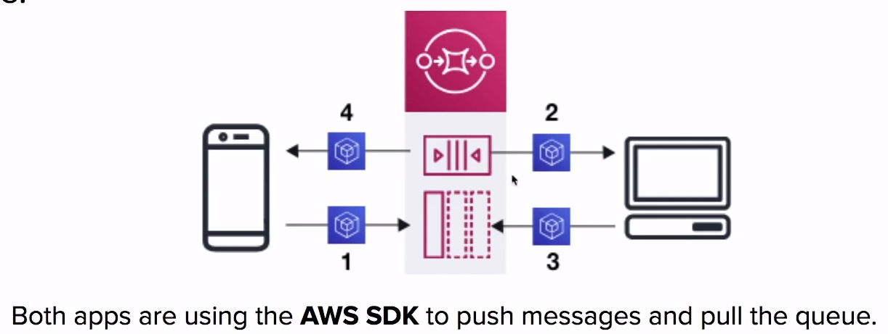

# Simple Queue Services ( SQS )

**Servicio de colas**
completamente gestionado que te permite desacoplar y
escalar micro-servicios, sistemas distribuidos y
aplicaciones sin servidor

## Introducción

SQS es para **Integrar Aplicaciones**

AWS SQS es una solución para **`distributed queueing`** de
mensajes generados por su aplicación. Conecta aplicaciones aisladas
mediante el paso de mensajes entre sí

Una **cola** es un repositorio temporal para mensajes que están
esperando para ser procesados

**El SQS se basa en el pull.
No se basa en el push!**

### ¿Qué es un Sistema de Mensajería?

Usado para proporcionar una comunicación asíncrona y desacoplar
procesos via mensajes/eventos de un emisor y un receptor
( productor y consumidor )

### Queueing

- No es reactivo
- Comunicación simple.
- Generalmente borrará los mensajes una vez que hayan sido consumidos.
- **No es en tiempo real**

Ejem:

- SQS
- Sidekiq
- RabbitMQ

### Streaming

- Multiples consumidores son
**reactivos** a eventos
( mensajes )
- Los eventos tienen una largo periodo de duración, por lo que
operaciones complejas pueden ser aplicadas
- **Es en tiempo real**

Ejem:

- Kinesis
- Nats
- Kafka

## Case de Uso SQS

1. Una aplicación publica mensajes hacia la cala
2. La otra aplicación extrae la cola y busca el mensaje
3. La otra aplicación reporta que ha completado su tarea y
marca el mensaje para su finalización
4. La aplicación de origen extrae la cola y verifica que el
mensaje no se encuentra en la cola

## SQS Limitaciones

### Tamaño Mensajes

El tamaño de los menajes puede ser entre **1 byte y 256KB**

**Amazon SQS Extended Client Library
para Java***

Te permite enviar mensajes entre **256KB a 2GB** de tamaño.
El mensaje será almacenado en S3 y la librería referenciará
a este objecto en S3

### Retención de Mensajes

Cuanto tiempo SQS mantendrá el mensaje en la cola antes de
borrarlo

La retención de mensajes por **defecto es de 4 días**

Puede ser ajustada a un mínimo de **60 segundos** hasta
un máximo de **14 días**

## Queue Types

### Standard Queues

Las **Standard Queues** de AWS SQS le permiten un
**número casi ilimitado** de número de transacciones por segundo

Garantiza que un mensaje será entregado **al menos una vez**

**Más de una copia** de un mensaje podría ser potencialmente
entregado **fuera de orden**

Proporciona un **ordenamiento de mejor esfuerzo** que ayuda
a asegurar que un mensaje se entregue generalmente en el
mismo orden en que fue enviado

### FIFO Queues

Las colas de AWS SQS **First-In-First-Out** admiten múltiples
grupos de mensajes ordenados dentro de una misma cola

Limitado a **300** transacciones por segundo

Las colas SQS FIFO tienen las mismas capacidades que una
cola estándar

## SQS - Visibility Timeout

¿Cómo evitamos que otra aplicación lea un mensaje mientras otra
está ocupada con ese mismo mensaje?
( Evitar que alguien haga la misma tarea )

Un **visibility time-out** es el periodo de tiempo que los mensajes
están **invisibles en la cola de SQS**, después de que un
lector se encuentre procesando ese mensaje

Los mensajes serán **borrados** de la cola
**después de que un trabajo se haya procesado**.
( antes de que expire el de visibilidad)

Si un trabajo **NO** se procesa antes de que expire el tiempo
de visibilidad, el mensaje volverá a ser visible y otro lector
lo procesará.

¡Esto puede dar lugar a que el mismo mensaje sea
procesado **dos veces**!

### Valores de Visibility Timeout

- 30 segundos por defecto
- 0 segundos mínimo
- 12 horas máximo

## SQS - Short vs Long Polling

**Polling** es el método en el que recuperamos los mensajes de
las colas

### Short Polling

**Short polling ( por defecto )** devuelve los mensajes
inmediatamente, incluso si la cola de mensajes está vacía

Cuando necesites un mensaje **de inmediato**, el short polling
es lo que quieres usar

### Long Polling

Long Polling espera hasta que el mensaje **llega a la cola**,
o hasta que expire el **tiempo de espera**.

Long Polling hace que sea **poco costoso recuperar los mensajes**
de la cola tan pronto como los mensajes estén disponibles

El uso de un Long Polling reducirá el coste porque puede
**Reducir el número de recepciones vacías**.

**La mayoría de los casos** querrás
usar Long Polling

Puede habilitar el Long Polling al recibir un mensaje estableciendo
el tiempo de espera en segundos en el **ReceiveMessageRequest**.

## Cheat Sheet

- SQS es un servicio de colas. Piense en Sidekiq o RabbitMQ
- SQS se utiliza para la integración de aplicaciones, permite
desacoplar servicios y aplicaciones
- Para leer SQS es necesario hacer **pull** a la cola usando
el SDK de AWS. SQS no está basado en "push".
- SQS admite colas Standard y FIFO
  - Standard permite mensajes casi ilimitados por segundos,
  no garantiza el orden de entrega, siempre entrega
  al menos una vez, debe proteger de nuevo los mensajes duplicados
  que se están procesando
  - FIFO mantiene el orden de los mensajes con un límite de 300
- Hay dos tipos de polling, Sort ( por defecto ) y Long
  - El Sort polling devuelve los mensajes inmediatamente,
  incluso si la cola de mensajes está vacía
  - El long polling espera hasta que el mensaje llegue a la cola
  o el tiempo de espera expire
- En la mayoría de los casos se prefiere el **Long polling**
a sort polling
- El **Tiempo de espera de visibilidad** es el periodo de
tiempo en que los mensajes son invisibles en la cola de SQS
- Los mensajes serán eliminados de la cola después de que
su trabajo haya sido procesado. ( antes de que expire el
tiempo de visibilidad )
- Si el tiempo de espera de visibilidad expira, el mensaje
se hará visible a la cola
- El tiempo de espera de visibilidad por defecto es de 30 segundos.
0 segundos como mínimo hasta un máximo de 12 horas
- SQS puede retener mensajes desde 60 segundos hasta 14 días
y por defecto es de 4 días
- El tamaño de los mensajes oscila entre 1 byte y 256KB,
Extended Client Library para Java puede aumentar hasta 2GB

