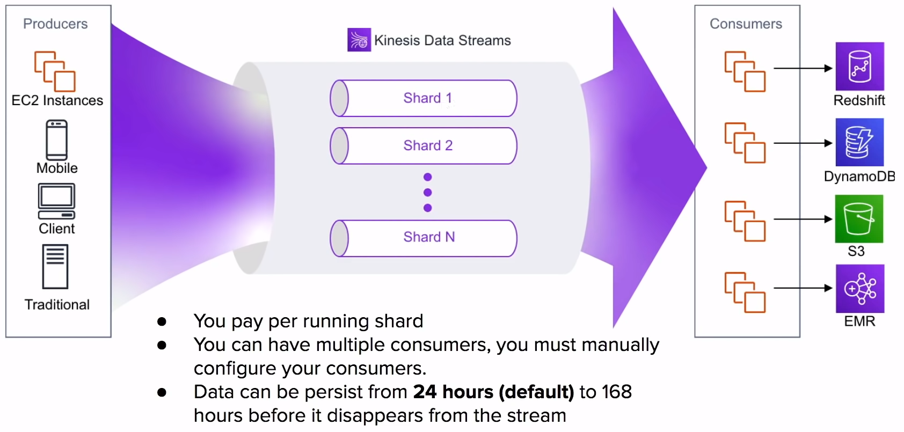
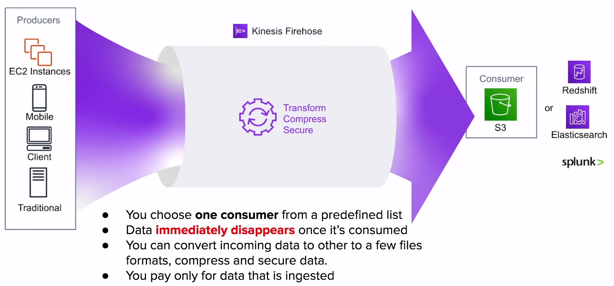

# Kinesis

Servicio de
**transmisión de datos**
escalable y duradero en tiempo real para analizar datos
de multiples fuentes

## Introducción

Amazon Kinesis es la solución completamente administrada por
AWS **colecciona**, **procesa** y
**analiza streaming de información** en la nube

Cuando necesites información en
**tiempo real**
piensa en Kinesis

### Streaming Data Ejemplos

- Precios de las acciones
- Datos del juego ( como los jugadores juegan )
- Datos de redes sociales
- Datos geo-espaciales
- Datos del flujo de clics

### Kinesis Streams Types

- Kinesis Data Streams
- Kinesis Firehose Delivery Streams
- Kinesis Data Analytics
- Kinesis Video Analytics

## Kinesis Data Streams

## Kinesis Firehose Delivery Streams

## Kinesis Video Analytics

## Kinesis Data Analytics

Puedes especificar `Firehose` o `Data Streams` como entrada
o salida

La información que pasa a través de `Data Analytics` es
ejecutada a través de una sentencia **SQL personalizada**
y el resultado es la salida

Esto permite el análisis en tiempo real de sus datos

## Cheat Sheet

- **Amazon Kinesis** es la solución de AWS para **coleccionar**
**procesar** y **analizar streaming de datos** en la nube.
Cuando necesites información
**en tiempo real** piensa en Kinesis

- **Kinesis Data Streams** - Pago por ejecución, los datos
pueden persistir dentro del stream, los datos se ordenan y cada
consumidor mantienen su propia posición.
Los consumidores deben agregarse manualmente ( codificados ),
los datos persisten de **24 horas (predeterminado)**
a **168 horas**
- **Kinesis Firehose** - Pague solo por los datos procesados,
la información **desaparece inmediatamente** una vez procesada.
Consumidor a elección de un conjunto predefinido de servicios:
S3, Redshift, ElasticSearch o Splunk
- **Kinesis Data Analytics** - Le permite realizar
**consultas en tiempo real**. Necesita Kinesis Data
Streams/Firehose como entrada y salida
- **Kinesis Video Analytics** procesa y almacena videos de forma
segura y los datos codificados de audio para consumidores
como SageMaker, Rekognition u otro servicio para aplicar ML
y procesamiento de video
- KPL (Kinesis Producer Library) es una biblioteca de Java
para escribir información a stream

