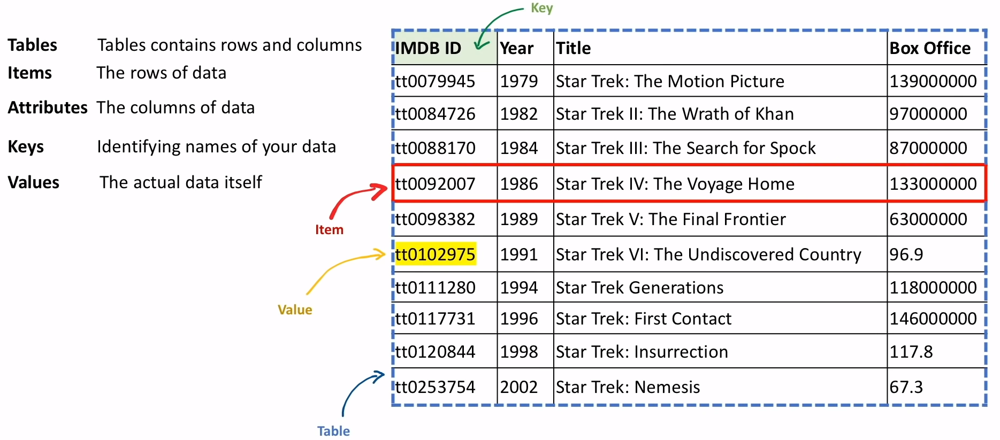
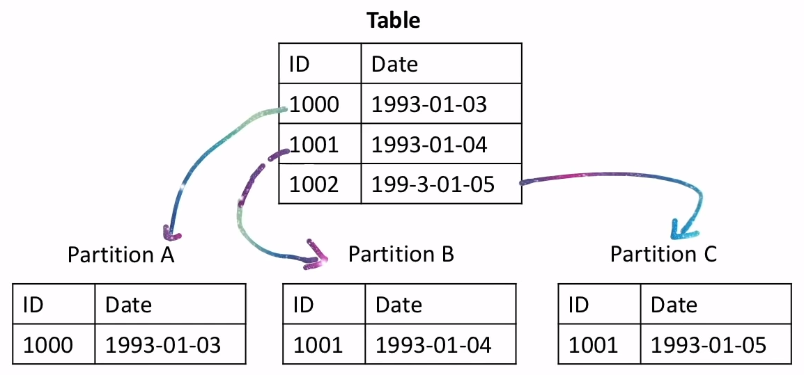
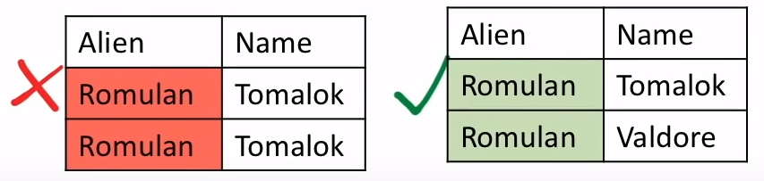
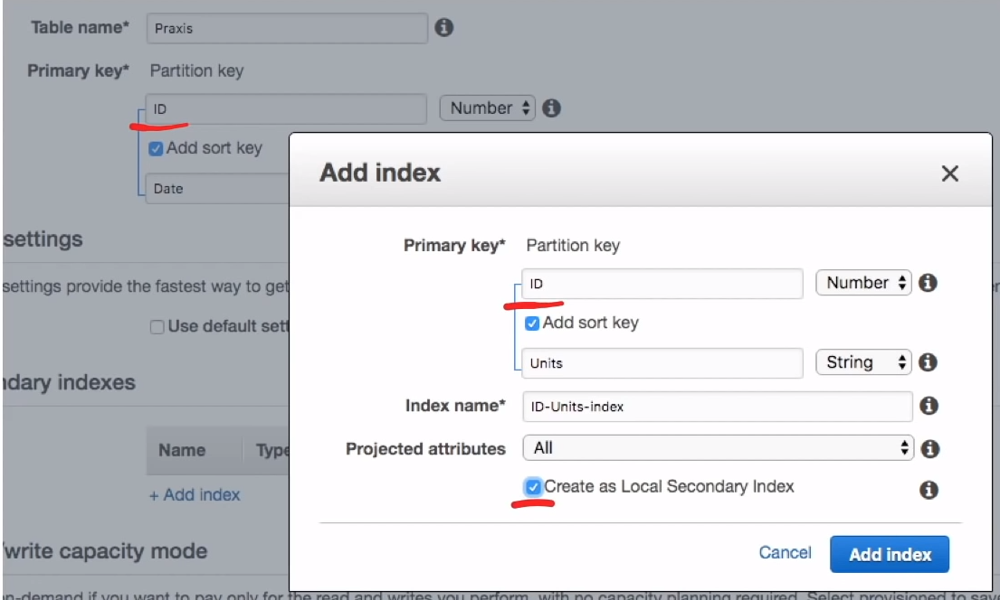

# DynamoDB

Base de datos NoSQL basada en **llave-valor** y documentos que
<span class="text-red">**garantiza consistencia en lectura
y escritura**</span> a cualquier escala

## Introducción

**DynamoDB** es una base de datos NoSQL de
**claves/valores** y **documentos**
para aplicaciones a escala de Internet

Tiene muchas características:

- Totalmente gestionada
- Multi-región
- Multi-maestro
- Base de datos duradera
- Seguridad integrada
- Copia de seguridad y restauración
- Caché en memoria

Proporciona:

- Lecturas eventualmente consistentes ( por defecto )
- Lecturas fuertemente consistentes

**Todos los datos se almacenan en SSD y se distribuyen en
3 diferentes AZs**

### ¿Qué es Almacenar un Key/Value?

Forma de almacenar que tiene una **llave** que hace referencia
a un **valor** y nada más

```json
{
  "title": "Just Do It"
}
```

### ¿Qué es Almacenar un Documento?

Una forma de almacenar información que tiene
**información anidada**

```json
{
  "serie": "DS9",
  "episodes": [
    {
      "season": 1,
      "episodes": 19,
      "title": "Just Do It"
    }
  ]
}
```

## Anatomía de DynamoDB



## Read Consistency

Cuando la información es actualizada, esta tiene que ser escrita
en todas las copias. **Es posible que la información sea**
<span class="text-red">**inconsistente**</span> cuando
se esté leyendo desde una copia que todavía no haya sido
actualizada

Tienes la capacidad de escoger la **read consistency** en
DynamoDB para satisfacer tus necesidades

### Eventual Consistent Reads

- Se usa por defecto
- Cuando se actualizan las copias es posible que se lea
y se le devuelva una copia incoherente
- <span class="text-red">**Lectura rápida**</span> pero no hay
<span class="text-red">**garantía de consistencia**</span>
- Todas las copias eventualmente
<span class="text-red">**se vuelven consistentes en
segundos**</span>

### Strongly Consistent Reads

- Cuando las copias se están actualizando y se intenta leer
no devolverá un resultado hasta que todas las copias sean consistentes
- Tienes
<span class="text-red">**una garantía de consistencia**</span>
pero la contrapartida es una
<span class="text-red">**alta latencia ( lecturas lentas )**</span>

## Partitions

### ¿Qué es una Partición?

Una partición es una asignación de almacenamiento para una
tabla, respaldada por unidades de estado sólido ( SSD ) y se
que se replican automáticamente a través de múltiples Zonas de
Disponibilidad ( AZ ) dentro de una región de AWS

Una partición es cuando
**se corta la tabla en trozos más pequeños de datos**
( una partición ).
<span class="text-red">**Acelera las lecturas**</span> para
tablas muy grandes agrupando lógicamente datos similares



DynamoDB <span class="text-red">**automáticamente**</span>
crea particiones por ti cuando tu data crece

DynamoDB comienza con una sola partición

Hay dos casos en los que DynamoDB creará una nueva partición:

1. Por cada **10GB** de datos
2. Cuando se superan las RCUs o WCUs para una sola partición

Cada partición tiene un máximo de **3000 RCUs** y **1000 WCUs**

- **RCU** - Unidad de capacidad de lectura
- **WCU** - Unidad de Capacidad de Escritura

## Primary Keys

Cuando creas una tabla tienes que definir una **clave primaria**.
La clave primaria determina **dónde y cómo** se almacenarán
sus datos en las particiones

**La clave primaria no puede modificarse nunca**.

DynamoDB no tiene el tipo de datos `Date`, por lo que para
las fechas hay que utilizar una cadena de texto

- El uso de una `Partition Key` se denomina clave
primaria *Simple*.
- Utilizar tanto una `Partition` como Sort` se denomina
clave primaria **Compuesta**.

## Primary Keys Design

Dos cosas a la hora de diseñar su clave primaria

Distinta - La clave debe ser tan distinta ( única ) como
sea posible
Uniforme - La clave debe dividir uniformemente los datos

### Simple Primary Key

- Sólo clave de partición
- No hay dos elementos que puedan tener la misma `Partition Key`



### Composite Primary Key

- Partition + Sort Key
- Dos elementos pueden tener la misma `partition key`, pero
las llaves `Partition` y `Sort` combinadas deben ser únicas


## Query and Scan

La mejor forma de aprender que es una **Query** y un **Scan**
es usar la consola de DynamoDB

### Query

- Permite **encontrar elementos** en una tabla basándose en
valores de clave primaria
- Consultar cualquier tabla o índice secundario que tenga una
clave primaria **compuesta**
( clave de partición y de ordenación )
- Por defecto se lee como **Eventually Consistent**
( si quiere desea una consistencia fuerte
establezca `ConsistentRead` a `true` )
- Por defecto devuelve todos los atributos de los elementos
- Puede devolver atributos específicos utilizando
`ProjectExpression`
- Por defecto está ordenado de forma **ascendente**.
Establezca `ScanIndexForward` a `false` para invertirlo o
hacerlo descendente

Ejemplo para la `query`. Hay muchas más opciones
que puede suministrar

```json
{
  "ConsistentRead": true,
  "ScanIndexForward": true,
  "ProjectionExpression": "id, name, createdAt, updatedAt",
  "limit": 20,
}
```

### Scan

- Escanear **todos los artículos** y luego devolver
uno o más items a través de filtros
- Los escaneos pueden realizarse en tablas e índices secundarios
- Por defecto devuelve todos los atributos de los elementos
- Se pueden devolver atributos específicos utilizando
`ProjectExpression`
- Las operaciones de escaneo son secuenciales.
Se puede acelerar un escaneo mediante escaneos paralelos
utilizando los parámetros `Segments` y `Total Segments`
como parámetros

**Evite los escaneos cuando sea posible.**

- Mucho **menos eficiente** que ejecutar una `query`
- A medida que la tabla crece, los escaneos tardan más en completarse.
- Una tabla grande puede utilizar
**todo el rendimiento previsto** en un solo escaneo.

## Provisioned Capacity

**La capacidad de rendimiento provista** es la cantidad
**máxima** de capacidad que su aplicación puede **leer** o
**escribir** por segundo desde una tabla o índice

El rendimiento se mide en unidades de capacidad:

- **RCUs** es unidades de capacidad de lectura
- **WCUs** es unidades de capacidad de escritura

Puede configurar DynamoDB para que **aumente** o **disminuya**
la capacidad en función de la utilización

Si supera su capacidad, obtendrá el error
`ProvisionedThroughputExceededException`

Esto se conoce como `Throttling`. Las solicitudes que son
`throttled` serán descartadas ( pérdida de datos )

## On-Demand Capacity

La capacidad **On-Demand** es pagar por solicitud. Por lo que
tu pagas por cuanto usas

El modo on-demand es bueno para:

- Nuevas tablas con carga de trabajo desconocidas
- Trafico imprevisible
- Es fácil pagar solo por lo que se usa

El rendimiento está limitado por los límites superiores
**por defecto** para una tabla:

- 40.000 RCUs
- 40.000 WCUs

Dado que **no hay un límite duro** impuesto por el usuario, On-demand
podría llegar a ser muy caro en función del escenario emergente

## Calculando Lecturas

### Read Capacity Units ( RCU )

Una `read capacity unit` representa:

- Una lectura **fuertemente** consistente por segundo
- O dos lecturas **eventualmente** consistente por segundo
- Para un item hasta 4KB de tamaño

### Cómo Calcular RCUs Fuertemente Consistente

1. Redondear los datos al múltiplo de 4 más cercano
2. Dividir los datos entre 4
3. Veces por el número de lecturas

Ejem.

- 50 reads at 40Kb per item
  - `(40/4) * 50 = 500 RCUs`
- 10 reads at 6Kb per item
  - `(8/4) * 10 = 20 RCUs`
- 33 reads at 17Kb per item
  - `(20/4) * 33 = 132 RCUs`

### Cómo Calcular RCUs Eventualmente Consistente

1. Redondear los datos al múltiplo de 4 más cercano
2. Dividir los datos entre 4
3. Veces por el número de lecturas
4. Dividir el número final por 2
5. Redondear al número entero más cercano

Ejem.

- 50 reads at 40Kb per item
  - `(40/4) * 50 / 2 = 250 RCUs`
- 10 reads at 6Kb per item
  - `(8/4) * 10 / 2 = 16.5 = 17 RCUs`
- 33 reads at 17Kb per item
  - `(20/4) * 33 / 2 = 35 RCUs`

### Write Capacity Units ( WCU )

Una `write capacity unit` representa:

- Una lectura por segundo
- Para un item hasta 1KB de tamaño

### Cómo Calcular WCUs

1. Redondear los datos al múltiplo de 1 más cercano
2. Veces por el número de lecturas

Ejem.

- 50 writes at 40KB per item
  - `40 x 50 = 2.000 WCUs`
- 11 writes at 1KB per item
  - `1 x 11 = 11 WCUs`
- 18 writes at 500 Bytes per item
  - `1 x 18 = 18 WCUs`

## Global Tables

Amazon DynamoDB global tables provee una solución completamente
administrada para implementar una base de datos
**multi-regional**, multi-master, sin tener que crear y
mantener su propia solución

Para crear una `global table` primero debes:

1. Utilizar KMS CMK
2. Habilitar Streams
3. Tipo de flujo de la imagen nueva y antigua

## Transacciones

### ¿Qué es una Transacción?

Representa un cambio que se producirá en la base de datos.
Si cualquier condiciones dependientes fallan, una transacción
se revertirá

Las transacciones son ACID:

- **A**tomicity ( Atomicidad )
- **C**onsistency ( Consistencia )
- **I**solation ( Aislamiento )
- **D**urability ( Duraderas )

Las transacciones de DynamoDB permiten hacer **todo o nada**
de los cambios en múltiples elementos tanto **dentro de las tablas**
como entre ellas

DynamoDB realiza **dos** lecturas o escrituras subyacentes de
cada elemento de la transacción:

1. Una para preparar la transacción
2. Otra para confirmar la transacción

Estas dos operaciones de lectura/escritura subyacentes son
visibles en las métricas de **Amazon CloudWatch**

Puede utilizar `ConditionCheck` con las transacciones de DynamoDB
para realizar comprobaciones pre-condicionales

## Time to Live ( TTL )

El tiempo de vida ( TTL ) permite que los elementos de DynamoDB
**expiren** ( se eliminen ) en un momento determinado

El TTL es ideal para mantener las bases de datos pequeñas y
manejables, adecuada para los datos temporales continuos

por ejemplo, datos de sesión, registros de eventos
patrones de uso

Ponga en **TTL attribute** el tiempo que tendrá una cadena en
formato DateTime que determinará cuándo se borrará este registro
será eliminado

DynamoDB **no tiene un tipo de dato DateTime**. Para utilizar
el TTL debe utilizar una cadena que debe estar en formato **Epoch**.
( Datetime representado como números )

*¡Una base de datos más pequeña supone un ahorro de dinero!*

## Streams

Cuando se habilita un **stream** en una tabla, DynamoDB
captura cada modificación de los elementos para que pueda
reaccionar a esos cambios

Cuando se produce un **Insert**, **Update** o **Delete**, el
cambio será capturado y enviado a la función **lambda**.

- Los cambios se envían por lotes a su lambda personalizada
- Los cambios se envían a su lambda personalizada casi en tiempo-real
- Cada registro del flujo aparece exactamente una vez en el flujo
- Para cada elemento que se modifica, los registros del flujo
aparecen en la misma secuencia que las modificaciones reales

## Common Exceptions

### ThrottlingException

La tasa de peticiones excede el rendimiento permitido. Esta excepción
puede ser devuelta si realiza alguna de las siguientes operaciones
demasiado rápido: **CrearTabla**, **ActualizarTabla**, **BorrarTabla**

### ProvisionedThroughputExceededException

Ha superado el rendimiento máximo permitido para
una tabla o para uno o más índices secundarios globales

El SDK de AWS **reintentará automáticamente** con
**retornos exponenciales** cuando se produzca un error,
es decir, volverá a intentar la solicitud 50ms 100ms 200ms
hasta un minuto antes de parar

## Indexes

### ¿Qué es un índice?

Un índice de base de datos es una **copia** de columnas
seleccionadas de datos en una base de datos que se utiliza
para ordenar rápidamente

DynamoDB tiene dos tipos de índices:

1. LSI - Índice secundario local
( sólo se puede crear al iniciar una tabla )
1. GSI - Índice secundario global

**Por lo general, debería utilizar el índice global en lugar
del local.**

**La consistencia es un factor decisivo.**
Un índice secundario local **puede proporcionar** una
fuerte consistencia
Un índice secundario global **no puede proporcionar** una
fuerte consistencia

### Local Secondary Index( LSI )

Es "local" en el sentido de que cada partición de un LSI tiene
como ámbito una partición de la tabla base que
**tiene el mismo valor de clave de partición**

El tamaño total de los elementos indexados para cualquier
valor de clave de partición **no puede superar los 10 GB**

**Comparte la configuración de rendimiento provisionado** para
la actividad de lectura y escritura con la tabla que está indexando

Limitado a 5 por tabla ( por defecto )

---

- Los LSI se crean al iniciar una tabla
- Los LSIs no pueden ser añadidos, modificados o eliminados
después de su creación
- Una LSI necesita **tanto** una clave de partición como de ordenación
- La clave de partición debe **ser la misma** que la tabla base
- La clave de ordenación debe **ser diferente** de la tabla base



### Global Secondary Index ( GSI )

Se considera "global" porque las consultas sobre el índice pueden
**abarcar todos los datos de la tabla base, en todas las particiones**

Los índices no tienen restricciones de tamaño ( ilimitados )

Tienen su propia configuración de rendimiento provisionado. Consumen
capacidad pero no de la tabla base

Limitado a 20 por tabla ( por defecto )

---

- El GSI puede ser añadido, modificado o eliminado
en cualquier momento.
- La clave de la partición debe **ser diferente** de la
tabla base
- La clave de ordenación es opcional pero no obligatoria

### LSI vs GSI


| **Características**                                       | **Local Secondary Index**                                                                                     | **Global Secondary Index**                                       |
|-----------------------------------------------------------|---------------------------------------------------------------------------------------------------------------|------------------------------------------------------------------|
| **Esquema de la clave**                                   | Compuesto                                                                                                     | Simple o compuesto                                               |
| **Atributos de la clave**                                 | La clave de partición debe ser la misma que la tabla base                                                     | La clave de partición y ordenación puede ser cualquier atributo  |
| **Restricción de tamaño por valor de clave de partición** | Todos los elementos indexados deben tener 10 GB o menos                                                       | Ilimitado                                                        |
| **Operaciones de índice en línea**                        | Crear el índice al crear la tabla                                                                             | Añadir, modificar o eliminar el índice en cualquier momento      |
| **Consultas y particiones**                               | Consulta sobre una sola partición, según lo especificado por el valor de la clave de partición en la consulta | Consulta sobre toda la tabla, en todas las particiones           |
| **Consistencia de lectura**                               | Consistencia fuerte o eventual                                                                                | Sólo consistencia eventual                                       |
| **Consumo de rendimiento previsto**                       | Comparte unidades de capacidad con la tabla base                                                              | Tiene su propia capacidad                                        |
| **Atributos proyectados**                                 | Puede solicitar atributos que no se proyectan en el índice                                                    | Sólo puede solicitar los atributos que se proyectan en el índice |

## Accelerator ( DAX )

DAX es un **caché en memoria** totalmente gestionado para dynamoDB
que se ejecuta en un clúster

Los tiempos de respuesta de DynamoDB pueden ser de
**milisegundos de un solo dígito**. Dax puede reducir los
tiempos de respuesta a **microsegundos**.

- Un clúster DAX está formado por uno o más nodos
- Cada nodo ejecuta su propia instancia del software de
almacenamiento en caché DAX
- Uno de los nodos sirve como nodo primario para el cluster
- Los nodos adicionales ( si están presentes ) sirven como
réplicas de lectura
- Su aplicación puede acceder a DAX especificando el endpoint
para el cluster DAX
- El software de cliente DAX trabaja con el endpoint del
cluster para realizar un balanceo de carga y enrutamiento inteligente
- Las solicitudes entrantes se distribuyen uniformemente entre
todos los los nodos del cluster

### Casos de uso

DAX es ideal para:

- Aplicaciones que requieren el
**tiempo de respuesta más rápido posible** para las lecturas,
por ejemplo, ofertas en tiempo real, juegos sociales y
aplicaciones de comercio
- Aplicaciones que **leen un pequeño número de elementos**
con más frecuencia que otras
- Aplicaciones que son **intensivas en lecturas**, pero que
también son sensibles a los costes
- Aplicaciones que requieren lecturas repetidas de un gran
conjunto de datos

DAX **NO** es ideal para:

- Aplicaciones que requieren lecturas muy consistentes
- Aplicaciones que no requieren tiempos de respuesta de
microsegundos para las lecturas, o que no necesiten descargar
la actividad de lectura repetida de tablas subyacentes
- Aplicaciones que son **intensivas en escritura**, o que
no realizan mucha actividad de lectura
- Aplicaciones que ya utilizan una solución de almacenamiento
en caché diferente con DynamoDB y utilizan su propia lógica
del lado del cliente para trabajar con esa solución de
almacenamiento en caché

## Cheat Sheet

- DynamoDB es una base de datos **NoSQL** de clave/valor y documentos
- DynamoDB es adecuada para cargas de trabajo con cualquier
cantidad de datos que
**requieren un rendimiento de lectura y escritura predecible**
y un escalado automático de grande a pequeño y en cualquier
punto intermedio
- DynamoDB escala hacia arriba y hacia abajo para soportar cualquier
**capacidad de lectura y escritura** por segundo si
especifica el modo de capacidad capacidad aprovisionada o
puede establecer el modo Bajo Demanda y no hay poca o ninguna
planificación de la capacidad
- DynamoDB puede configurarse para soportar
**Lecturas casi consistentes (por defecto)** y
**Lecturas fuertemente consistentes** en base a cada llamada
- Los datos de **Lecturas Eventualmente Consistentes** se
devuelven inmediatamente pero los datos pueden ser inconsistentes.
Las copias de los datos serán generalmente consistentes en 1s
- Las **lecturas fuertemente consistentes** siempre leerán de
la partición líder ya que siempre tiene una copia actualizada.
Los datos nunca serán inconsistentes, pero la latencia puede
ser mayor. Las copias de datos serán consistentes con una
garantía de 1 segundo
- DynamoDB almacena 3 copias de datos en unidades SSD en 3 AZ
en una región
- Los tipos de datos más comunes de DynamoDB son
**B** ( Binario ), **N** ( Número ), **S** ( Cadena )
- Las tablas constan de **items** ( filas ) y los elementos
constan de **attributes** ( columnas )
- Una **Partición** es cuando DynamoDB divide la tabla en
en trozos de datos más pequeños, lo que acelera la lectura
de tablas muy grandes.
- DynamoDB crea automáticamente particiones para:
  - Cada 10 GB de datos
  - Cuando superan los límites RCUs ( 3000 ) o WCUs ( 1000 )
  para una sola partición
  - Cuando DynamoDB ve un patrón de una partición caliente
  dividirá esa partición para intentar solucionar el problema
- DynamoDB intentará **dividir uniformemente** las RCUs y WCUs
en las particiones
- Las claves primarias definen **dónde y cómo** se almacenarán
sus datos en las particiones
- Las claves primarias son de dos tipos:
  - **Simple** - Usando sólo una clave de partición
  - **Compuesta** - Utilizando tanto una clave de partición como
  Clave de ordenación )
- La clave de partición también se conoce como **HASH**.
- La clave de ordenación también se conoce como **RANGE**.
- Cuando se crea una **clave primaria simple**, el valor de la
clave de **partición debe ser único**
- Cuando se crea una **clave primaria compuesta**, el valor
combinado de la clave de partición y el valor de la clave de
ordenación **deben ser únicos**
- Cuando se utiliza la clave de ordenación, los registros de
la partición se agrupan lógicamente se agrupan en orden **ascendente**
- **Las Tablas Globales de DynamoDB** ofrecen una solución
totalmente gestionada para implementar bases de datos
multi-regionales y multi-master
- DynamoDB admite transacciones a través de las funciones **TransactWriteItems**
y **TransactGetItems**.
- Las **transacciones** permiten consultar varias tablas
a la vez y es un enfoque de todo o nada (todas las llamadas
a la API deben tener éxito)
- **DynamoDB Streams** permite configurar una función lambda
cada vez que los datos se modifican en una tabla para reaccionar
a los cambios
  - Los Streams no consumen RCUs
- DynamoDB tiene dos tipos de índices:
  - **LSI** - Índices secundarios locales
    - Soporta lecturas de consistencia **fuerte** o eventual
    - Sólo se pueden crear al iniciar una tabla ( no se pueden
    modificarse o eliminarse a menos que también se elimine
    la tabla )
    - Sólo tipo de clave **primaria compuesta**
    - 10GB o menos por partición
    - Comparte unidades de capacidad con la tabla base
    - Debe compartir la clave de partición ( PK ) con
    la tabla base
  - **GSI** - Índice secundario global
    - Sólo lecturas de consistencia eventual. **No puede** proporcionar
    consistencia fuerte
    - Puede crear, modificar o eliminar en cualquier momento
    - Tipos de claves primarias **simples** y **compuestas**
    - Puede tener cualquier atributo como
    Claves de Partición ( PK ) o clave de ordenación ( SK )
    - No hay restricción de tamaño por partición
    - Tiene su propia configuración de capacidad
- **Scan**
  - Su(s) tabla(s) debe(n) estar diseñada(s) de tal manera que
  sus patrones de acceso primario a la carga de trabajo
  **no utilicen escaneos** En general, los escaneos deberían
  ser usados con moderación, por ejemplo, un informe poco frecuente
  - Escanea a través de todos los elementos de una tabla y
  luego devuelve uno más elementos a través de filtros
  - Por defecto devuelve todos los atributos de cada elemento.
  Utilice **ProjectExpression** para limitar
  - Los escaneos son secuenciales, se puede acelerar un escaneo
  a través de escaneos paralelos utilizando **Segmentos**
  y **Segmentos totales**.
  - Los escaneos pueden ser lentos, especialmente con tablas
  muy grandes, consumiendo fácilmente el rendimiento provisionado
  - Los **scans** son una de las formas más caras de acceder
  a los datos en DynamoDB
- **Query**
  - Buscar elementos basados en valores de clave primaria
  - La tabla debe tener una clave compuesta para poder consultar
  - Por defecto las consultas son Eventualmente Consistentes.
  Establezca **ConsistentRead** a **True** para cambiar a
  Strongly Consistent
  - Por defecto devuelve todos los atributos de cada elemento
  encontrado por una consulta. Utilice **ProjectExpression**
  para limitar
  - Por defecto se ordena de forma ascendente. Establezca **ScanIndexForward**
  a **False** para invertir el orden a descendente
- DynamoDB dispone de dos modos de capacidad **Provisto** y
  **Sobre demanda**
- Puede cambiar entre estos modos una vez cada 24 horas
- La capacidad de rendimiento **provisionada** es la cantidad
máxima de capacidad de capacidad que su aplicación puede
**leer** o **escribir** **por segundo** desde
una tabla o índice
  - La capacidad **provisionada** es adecuada para cargas de
trabajo predecibles predecibles o estables
  - **RCUs** - Unidades de capacidad de lectura
  - **WCUs** - Unidades de Capacidad de Escritura
  - Debe activar el escalado automático con
  Modo de capacidad provisionada. En este modo,
  se establece un min y un max entre estos valores
  y limita las llamadas que superan el techo
  durante demasiado tiempo
  - Si superas tu capacidad provisionada, obtendrás
  una excepción: **ProvisionedThroughputExceededException**
  ( throttling )
  - El **throttling** se produce cuando las solicitudes
  se bloquean debido a una frecuencia de lectura o escritura
  superior a los umbrales establecidos, la capacidad
  provisionada establecida, partición de particiones,
  desajuste de la capacidad de la tabla/índice
- La capacidad **bajo demanda** se paga por solicitud.
Así que usted paga sólo por lo que utiliza
  - On-Demand es adecuado para cargas de trabajo
  **nuevas** o **imprevisibles**
  - El rendimiento sólo está limitado por los límites superiores
  por defecto para una tabla ( 40K RCUs y 40K WCUs )
  - Puede producirse `throttling` si se supera el doble de la
  capacidad máxima durante 30 minutos. Por ejemplo, si anteriormente
  el pico hasta máximo es 30K ops/seg, no podría alcanzar un
  pico inmediatamente a 90K ops/seg, pero sí a 60K ops/seg.
  - Dado que no hay un límite estricto, On-Demand podría llegar
  a ser muy caro en base a los escenarios emergentes
- **Cálculo de las lecturas (RCU)**
  - Una unidad de capacidad de lectura representa: **una**
  capacidad de lectura **fuertemente consistente** por segundo,
  o **dos** lecturas **eventualmente consistentes** por segundo,
  para un elemento de hasta **4KB** de tamaño
  - Cómo calcular las RCUs para **fuerte**
    - Redondear los datos al 4 más cercano, por ejemplo,
    de 10 a 12
    - Dividir el paso anterior por 4, por ejemplo, 12 / 4 = 3
    - Multiplique por el número de lecturas, por ejemplo,
    3 x 50 = 150 RCUs
  - Cómo calcular las UCR de **eventual**.
    - Redondear los datos al 4 más cercano, por ejemplo,
    10 a 12
    - Dividir el paso anterior por 4, por ejemplo, 12 / 4 = 3
    - Multiplique por el número de lecturas, por ejemplo,
    3 x 50 = 150 UCR
    - Divida el número final por 2, por ejemplo, 150 / 2 = 75
    - Redondear al número entero más cercano, p. ej.,
    16,4 a 17
- **Cálculo de las escrituras ( WCU )**
  - Una unidad de capacidad de escritura representa: una escritura
  por segundo, para un elemento de hasta **1KB** de tamaño
  - Cómo calcular las escrituras
    - Redondear los datos al 4 más cercano, por ejemplo,
    10 a 12
    - Multiplique por el número de lecturas, por ejemplo,
    12 x 10 = 120 WCUs
- El **Acelerador de DynamoDB ( DAX )** es una caché en memoria
totalmente gestionada a través de la caché para DynamoDB que
se ejecuta en un clúster
  - **Las lecturas son eventualmente consistentes**.
  - Las solicitudes entrantes se distribuyen uniformemente
  entre todos los nodos del clúster
  - DAX puede reducir los tiempos de respuesta de lectura a **microsegundos**.
  - **DAX es ideal para:**
    - Tiempos de respuesta más rápidos posibles
    - Aplicaciones que leen un pequeño número de elementos
    con mayor frecuencia
    - Aplicaciones que son **lectura intensiva**.
  - **DAX no es ideal para:**
    - Aplicaciones que requieren lecturas muy consistentes
    - Aplicaciones que no requieren tiempos de respuesta de
    lectura de microsegundos
    - Aplicaciones que son **intensivas en escritura**,
    o que no realizan mucha actividad de lectura
    - Si no necesitas DAX considera usar **ElastiCache**
- DynamoDB posse comandos de la API utilizando la CLI, por ejemplo
**aws dynamodb <comando>**
  - **get-item** devuelve un conjunto de atributos para el
  elemento con la clave primaria dada. Si no hay ningún elemento
  que coincida, entonces no devuelve ningún dato y no habrá
  ningún elemento del ítem en la respuesta
  - **put-item** Crea un nuevo elemento, o sustituye un
  elemento antiguo con el elemento nuevo. Si ya existe
  el elemento con la misma clave primaria que el nuevo elemento
  en la tabla especificada, el nuevo elemento sustituye
  completamente al elemento existente
  - **update-item** edita los atributos de un elemento existente,
  o añade un nuevo elemento a la tabla si aún no existe
  - **batch-get-item** devuelve los atributos de uno o varios
  elementos de una o varias tablas. Los elementos solicitados
  se identifican por la clave primaria. Una sola operación
  puede recuperar hasta **16MB de datos**, que pueden contener
  **hasta 100 elementos**.
  - **batch-write-item** escribe o elimina varios elementos
  en una o varias tablas. Puede escribir hasta **16MB de datos**,
  soporta hasta **25 peticiones de puesta o borrado**.
  Los elementos individuales que se escriben pueden ser de
  **hasta 400KB**.
  - **create-tabla** añade una nueva tabla a su cuenta,
  los nombres de las tablas deben ser únicos dentro de cada región
  - **update-tabla** modifica la configuración del
  rendimiento provisionado, índices secundarios globales o
  la configuración de DynamoDB Streams para una tabla determinada
  - **delete-table** elimina una tabla y todos sus elementos
  - **transact-get-items** es una operación sincrónica que
  recupera atómicamente varios elementos de una o varias tablas,
  pero no de los índices, en una sola cuenta y región.
  La llamada puede contener hasta **25 objetos**. El tamaño agregado
  de los elementos de la transacción
  **no puede superar los 4 MB**
  - **transact-write-items** una operación de escritura sincrónica
  que agrupa hasta **25 solicitudes de acción**. Estas acciones
  pueden dirigirse a elementos en diferentes tablas, pero
  no en diferentes cuentas de AWS o regiones, y no hay dos
  acciones que tengan como objetivo el mismo elemento
  - **query** busca elementos basados en el valor de las
  llaves primarias. Puedes hacer una consulta hacia una tabla
  o hacia index secundarios que tengan una llave primaria compuesta
  - **scan** devuelve uno o más elementos y sus atributos
  accediendo a cada elemento de una tabla o de un índice secundario

<style>
.text-red {
  color: red;
}
</style>
