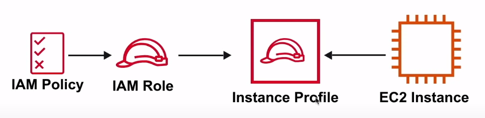
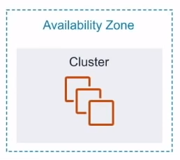
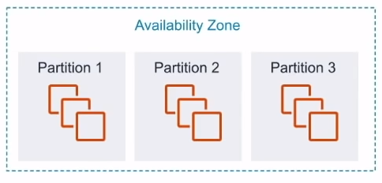
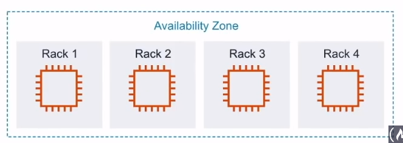
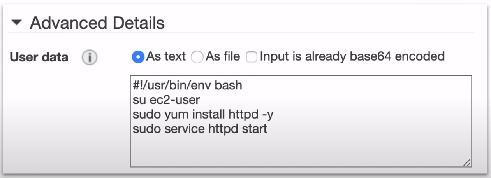
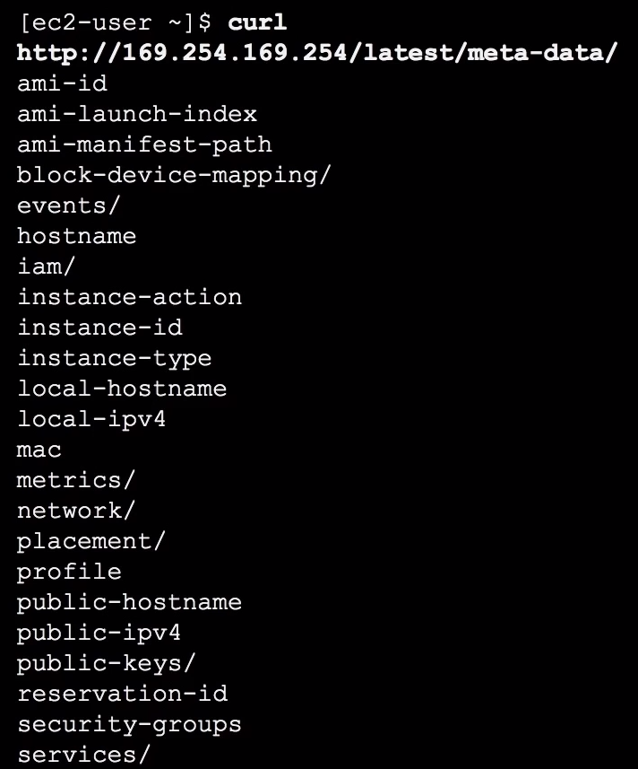

# Elastic Cloud Compute ( EC2 )

Servicio de computación en la nube. Escoge
**OS**, **Almacenamiento**, **Memoria**, **Conexiones**.
Ejecuta y accede a tu servidor mediante SSH
**en minutos**

## Introducción

Elastic Compute Cloud ( EC2 ) es un **servidor altamente configurable**.
EC2 es re-dimensionable. Tarda **minutos** en lanzar
nuevas instancias. Todo y cualquier cosa en AWS utiliza
instancias EC2 por debajo

Elija su sistema operativo a través de
**Máquina Virtual de Amazon ( AMI )**

- RedHat
- Ubuntu
- Windows
- Amazon Linux
- Abrir SUSE

Elija su **tipo de instancia**

- t2.nano - 1 vCPU - 0.5GB Mem - $4.75/mes
- C4.8xlarge - 36 vCPU - 60GB Mem - $1161/mes

Añadir almacenamiento **( EBS, EFS )**

- SSD
- HHD
- Cinta magnética virtual
- Múltiples volúmenes

Configure su instancia

- Grupos de seguridad
- Pares de claves
- Datos de usuario
- Roles IAM
- Grupos de Colocación

## Tipos de instancias y uso

### Propósito general

**A1 | T3 | T3a | T2 | M5 | M5a | M4.**

Equilibrio de los recursos de memoria de cálculo y de red

#### Casos de uso

Servidores web y repositorios de código

### Compute Optimized

**C5 | C5n | C4.**

Ideal para aplicaciones vinculadas a la computación que se
benefician de un procesador de alto rendimiento

#### Casos de uso

Modelado científico, servidores de juegos dedicados y
motor de servidor de anuncios

### Optimización de la memoria

**R5 | R5a | X1e | Alta memoria | z1d.**

Rápido rendimiento para cargas de trabajo que procesan grandes
conjuntos de datos en memoria

#### Casos de uso

Caches en memoria, bases de datos en memoria, análisis de
big data en tiempo real

### Accelerated Optimized

**P3 | P2 | G3 | F1.**

Aceleradores de hardware o co-procesadores

#### Casos de uso

Aprendizaje automático, finanzas computacionales, análisis sísmico
reconocimiento de voz

### Almacenamiento optimizado

**I3 | I3en | D2 | H1.**

Acceso de lectura y escritura alto y secuencial a conjuntos
de datos muy grandes en el almacenamiento local

#### Casos de uso

Bases de datos NoSQL, en memoria o transaccionales, warehouse

## Tamaño de las instancias

El tamaño de las instancias EC2 **generalmente es el doble**
en precio y atributos clave

| **Nombre**    | **vCPU** | **On-Demand por hora** | **On-Demand por mes** | **** |
|---------------|----------|------------------------|-----------------------|------|
| **t2.small**  | 1        | $0.023                 | $16.79                |      |
| **t2.medium** | 2        | $0.0464                | $33.87                |      |
| **t2.large**  | 2        | $0.0928                | $67.74                |      |
| **t2.xlarge** | 4        | $0.1856                | $135.48               |      |

## Perfil de la instancia

En lugar de incrustar sus credenciales de AWS
( Clave de acceso y secreto ) en su código para que su
instancia tenga permiso para acceder a determinados servicios
puede **adjuntar un rol a una instancia** mediante
**perfil de la instancia**

**Es recomendable**
**evitar siempre incrustar las
credenciales de AWS**
**cuando sea posible**

Un **perfil de instancia** contiene una referencia a un rol.
La instancia EC2 está asociada al perfil de instancia.
Cuando se selecciona un rol IAM al lanzar una instancia EC2,
AWS creará automáticamente el perfil de instancia para usted.
Los perfiles no se ven fácilmente a través de la consola de AWS

## Grupos de Colocación

Los Grupos de Colocación le permiten elegir
**la colocación lógica**
de sus instancias para optimizar la **comunicación**,
**rendimiento** o **durabilidad**. Los grupos de colocación
son **gratis**

### Clústeres

- Agrupa las instancias dentro de una **AZ**.
- Rendimiento de red de baja latencia para la comunicación
comunicación de nodo a nodo
- Muy adecuado para aplicaciones de computación de
alto rendimiento (HPC)
- Los clusters no pueden ser multi-AZ

### Partición

- Distribuye las instancias en particiones lógicas
- Cada partición no comparte el hardware subyacente
entre sí ( rack por partición )
- Muy adecuado para grandes cargas de trabajo distribuidas
y replicadas ( Hadoop, Cassandra, Kafka )

### Distribución

- Cada instancia se coloca en un rack diferente
- Cuando las instancias críticas deben mantenerse separadas
unas de otras
- Se pueden distribuir un máximo de 7 instancias.
Los spreads pueden ser multi-AZ

## UsedData

Puedes proporcionar un EC2 con **UserData** que es un **script**
que se ejecutará automáticamente al lanzar una instancia EC2.
Puede instalar paquetes, aplicar actualizaciones o lo que quieras

Este ejemplo configura un servidor web apache

Desde dentro de la instancia de EC2, esta URL especial puedes
ver el script UserData
ej. `curl http://169.254.169.254/latest/user-data`

## MetaData

Desde su instancia EC2 puede acceder a información
sobre el EC2 a través de un endpoint url especial en
**169.254.169.253**

Deberías entrar por SSH en tu instancia EC2 y puedes
usar el comando curl
`curl https://169.254.169.254/latest/meta-data`

- **/public-ipv4** - Obtiene la dirección IPV4 pública actual
- **/ami-id** - El ID de la AMI utilizado para lanzar esta
instancia EC2
- **/instance-type** - El tipo de instancia de esta instancia
EC2

Combine los metadatos con los scripts de datos de usuario
para realizar todo tipo de avances en la automatización
de AWS

## Cheat Sheet

- **Elastic Compute Cloud ( EC2 )** es un servicio de
computación en la nube
- Configure su EC2 eligiendo su **OS**, **Almacenamiento**, **Memoria**,
**Propiedad de la red**
- Inicie por SSH su servidor **en cuestión de minutos**.
- EC2 viene en una variedad de tipos de instancias especializadas
para diferentes escenarios:
  - **Propósito general** equilibrio de recursos de computación,
  memoria y recursos de red
  - **Optimización de la computación**, ideal para
  aplicaciones de computación que se benefician de un
  procesador de alto rendimiento
  - **Optimización de la memoria** rendimiento rápido para
  cargas de trabajo que procesan grandes conjuntos de datos
  en memoria
  - **Optimización de la aceleración** aceleradores de hardware
  o coprocesadores
  - **Optimizado para el almacenamiento** alto, secuencial,
  de lectura y escritura acceso a conjuntos de datos muy grandes
  en el almacenamiento local
- Cada Tamaño de instancias **generalmente dobles** en precio
y atributos clave
- **Grupos de colocación** le permiten elegir la colocación lógica
de su instancia para optimizar la comunicación,
el rendimiento o la rendimiento o durabilidad.
Los grupos de colocación son **gratuitos**.
- **UserData** un script que se ejecutará automáticamente al
lanzar una instancia EC2
- **MetaData** meta datos sobre la instancia actual. Usted
a estos metadatos a través de un endpoint local con SSH
en la instancia EC2, por ejemplo `curl http://169.254.169.254/latest/meta-data`.
Los metadatos pueden ser el tipo de instancia,
la dirección actual, etc.
- **Perfiles de Instancia** un contenedor para un rol IAM que
puede pasar la información del rol a una instancia EC2 cuando

