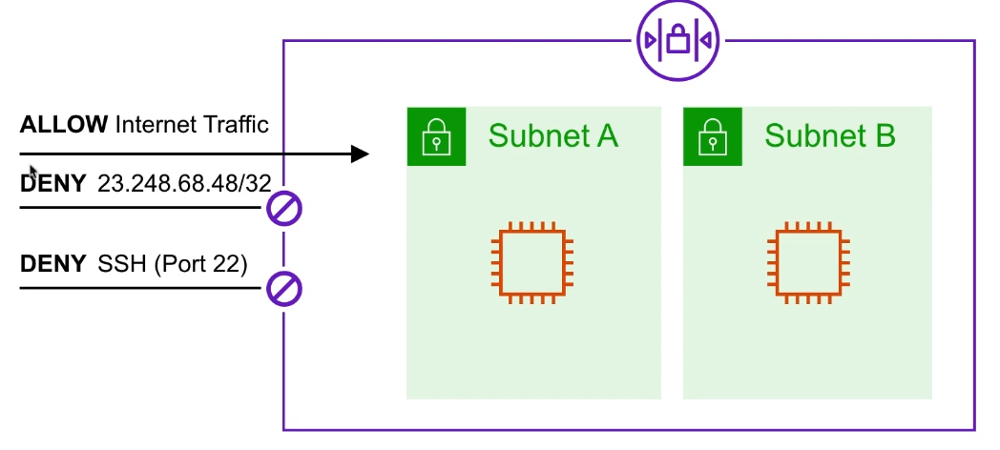

# Network Access Control List ( NACLs )

Una capa ( opcional ) de seguridad que actúa como
**cortafuegos**
para controlar el tráfico **de entrada y salida**
**sub-red(es)**

## Introducción

### Caso de uso

Determinamos que hay un actor malicioso en una determinada
dirección IP que está intentando acceder a nuestras instancias
por lo que bloqueamos su IP

Nunca necesitamos acceder por SSH a las instancias por lo que
añadimos un DENY para estas sub-redes. Esto es sólo una medida
adicional en caso de que el puerto SSH de nuestros
Grupos de Seguridad se deje abierto

## Cheat Sheet

- La lista de control de acceso a la red se conoce comúnmente
como NACLs
- Las VPCs reciben automáticamente una NACLs por defecto que
permite **todo** el tráfico saliente y entrante
- Cada sub-red dentro de una VPC debe estar asociada a una NACL
- Las sub-redes sólo pueden asociarse a 1 NACL a la vez.
La asociación de una sub-red con una nueva NACL eliminará la
asociación anterior
- Si un NACLs no está explícitamente asociado a una sub-red
la sub-red se asociará automáticamente con el
NACLs por defecto
- Las NACLs tienen reglas de entrada y salida.
Al igual que los Grupos de Seguridad
- Las reglas pueden **permitir** o **denegar** el tráfico.
A diferencia de los Grupos de Seguridad que sólo pueden permitir
- NACLs son STATELESS (cualquier tráfico entrante permitido
es también permitido en la salida)
- Cuando se crea una NACL, ésta denegará todo el tráfico
por defecto.
- Las NACLs contienen una serie de reglas numeradas que se evalúan
en orden de menor a mayor
- Si necesita bloquear una sola dirección IP puede hacerlo
a través de NACLs

