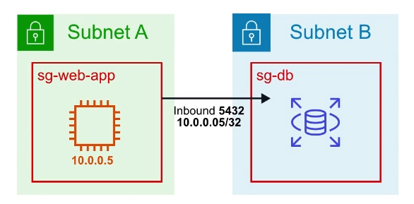
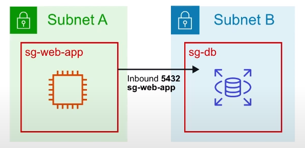
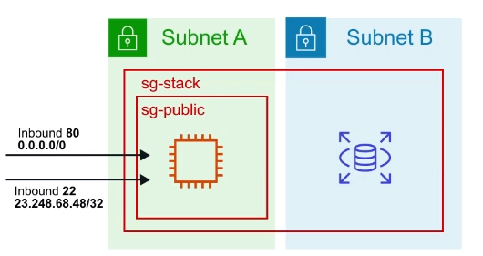

# VPC Security Groups

Un **virtual firewall** que controla el tráfico
hacia y desde las instancias EC2

## Introducción

Los grupos de seguridad actúan como un **virtual firewall**
a nivel de instancia

Los grupos de seguridad están asociados a las instancias EC2

Cada grupo de seguridad contiene un conjunto de reglas que
filtran el tráfico que **entra ( inbound )** y
**sale ( outbound )** de las instancias EC2

No hay reglas "DENY". **Todo el tráfico se bloquea por defecto**
a menos que una regla lo permita específicamente

**Múltiples instancias** en múltiples sub-redes pueden pertenecer
a un **Grupo de Seguridad**

## Casos de uso

### Caso 1

Puede especificar que el origen sea un rango de IP o una
IP específica ( **/32** es una dirección IP específica )

### Caso 2

Se puede especificar que el origen sea otro grupo de seguridad

### Caso 3

Una instancia puede **pertenecer a varios grupos de seguridad**,
y las reglas son **permisivas** ( en lugar de restrictivas ).
Es decir, si tienes un grupo de seguridad que no tiene Allow
y añades un allow a otro que permitirá

## Límites

Puede tener **hasta 10.000 grupos de seguridad en una región**
( por defecto son 2.500 )

Puede tener **60 reglas de entrada y salida** por grupo de seguridad

**16 grupos de seguridad** por interfaz de red elástica
( ENI ) ( por defecto 5 )

## Hoja de trucos

- Los grupos de seguridad actúan como un firewall
a nivel de instancia
- A menos que se permita específicamente
todo el **tráfico entrante** es **bloqueado por defecto**
- Todo el **tráfico de salida** de la instancia es
**permitido por defecto**
- Puede especificar que el origen sea un rango de IP,
una única dirección IP u otro grupo de seguridad
- Los grupos de seguridad son **STATELESS**,
si el tráfico está permitido en la entrada
también se permite la salida
- Cualquier cambio en un Grupo de Seguridad tiene efecto inmediato
- Las instancias EC2 pueden pertenecer a múltiples
Grupos de Seguridad
- Los Grupos de Seguridad pueden contener múltiples
instancias EC2
- Usted **no puede bloquear direcciones IP específicas**
con Grupos de Seguridad, para esto se necesita
una Lista de Control de Acceso a la Red ( NACL )
- Puede tener hasta 10.000 grupos de seguridad por región,
por defecto son 2.500
- Puede tener 60 reglas de entrada y salida por grupo de seguridad
- Puede tener 16 grupos de seguridad asociados a un ENI,
por defecto 5

