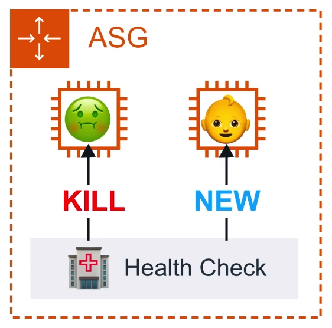
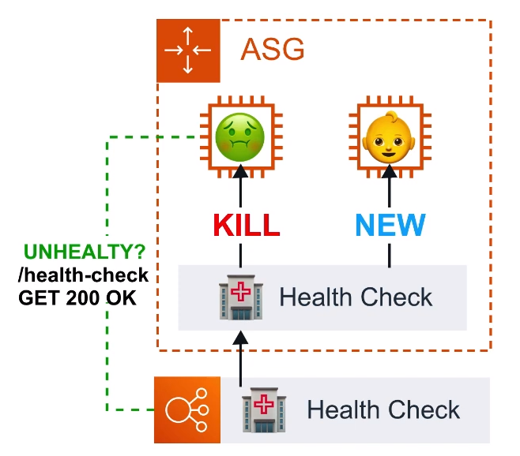
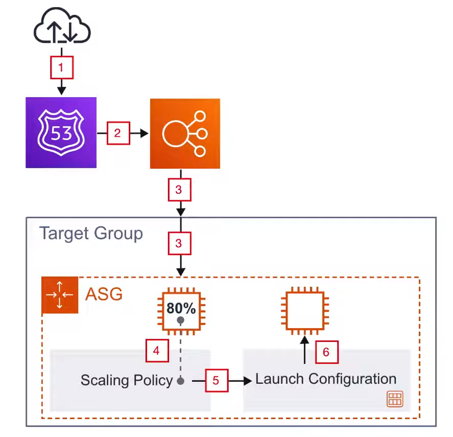

# Auto Scaling Groups

Establezca reglas de escalado que lanzarán automáticamente
instancias EC2 adicionales o también cerrar instancias
para satisfacer la demanda actual

## Introducción

Los grupos de escalado automático ( ASG ) contienen
una colección de instancias EC2 que se tratan como un grupo para
para el escalado automático y la gestión

El escalado automático puede producirse mediante

1. Configuración de la capacidad
2. Sustitución de los controles de salud
3. Políticas de escalado

## Configuración de la capacidad

El tamaño de un Grupo de Auto-escalado se basa en **Mín**,
**Máx** y **Desired Capacity**

**Min** es el número de instancias EC2 que deben
estar funcionando

**Máx** es el número de instancias EC2 que pueden
estar en funcionamiento

**Desired Capacity** es el número de instancias EC2 que
desea ejecutar idealmente

ASG siempre lanzará instancias para cumplir con
capacidad mínima

## Reemplazo de Chequeos de Salud

### EC2 Health Checks Type

ASG realizará una comprobación de salud en las instancias EC2
para determinar si hay un problema de software o hardware.
Esto se basa en las **Comprobaciones de estado de EC2**.
Si una instancia se considera poco saludable.
ASG terminará y lanzará una nueva instancia

### ELB Health Checks Type

ASG realizará una comprobación de salud basada en la
comprobación de salud de ELB.
El ELB puede realizar comprobaciones de salud haciendo ping
a un endpoint HTTP(S)
con una respuesta esperada. Si el ELB determina que una instancia
no es saludable, envía esta información a ASG, que
terminará la instancia no saludable

## Políticas de escalado

- **Scaling OUt:** Añadir más instancias
- **Scaling In:** Eliminación de más instancias

### Política de escalado de seguimiento de objetivos

Mantiene una métrica específica en un valor objetivo

Ej. Si la **Utilización media de la CPU** supera el 75%, se añade
otro servidor

### Política de Escalado Simple ( LEGACY )

Escala cuando una **alarma es violada**.

  <strong>
  No se recomienda, política de escalado simple.
  Utilizar políticas de escalado con pasos
  con pasos ahora
  </strong>

### Política de escalado con pasos

Escala cuando una **alarma es violada**, puede
**escalar basándose en el cambio de valor de la alarma**.

## Integración con ELB

ASG puede asociarse con Elastic Load Balancers ( ELB ).
Cuando ASG se asocia con ELB se pueden establecer comprobaciones
de salud más ricas

**Los balanceadores de carga clásicos** se asocian
**directamente** a el ASG

**Los balanceadores de carga de aplicación y de red** se asocian
**indirectamente** a través de sus Grupos de Destino

## Caso de uso

<ol style="flex-basis: 60ch;">
  <li>
    Un tráfico de Internet llega a nuestro dominio
    </li>
  <li>
    Route53 apunta ese tráfico a nuestro equilibrador de carga
    </li>
  <li>
    Nuestro equilibrador de carga pasa el tráfico a su grupo
    de destino
    </li>
  <li>
    El grupo de destino está asociado a nuestro ASG y envía
  el tráfico a las instancias registradas con nuestro ASG
  </li>
  <li>
    La política de escalado del ASG comprobará si nuestras instancias
  están cerca de su capacidad
  </li>
  <li>
    La política de escalado determina que necesitamos otra instancia
  y lanza una nueva instancia EC2 con la configuración de lanzamiento
  configuración de lanzamiento a nuestro ASG
  </li>

  

## Configuración de lanzamiento

Una configuración de lanzamiento es una plantilla de
configuración de instancia que un ASG utiliza para lanzar
instancias EC2

Una configuración de lanzamiento es el mismo proceso que el
lanzamiento de una una instancia EC2, salvo que se está
guardando esa configuración para lanzar una instancia para
más tarde

La configuración de lanzamiento **no puede ser editada**.
Cuando necesite actualizar su configuración de lanzamiento,
debe crear una nueva o clonar la configuración
existente y asociar manualmente la nueva configuración de lanzamiento.

**Las Plantillas de Lanzamiento** son Configuraciones de
Lanzamiento con Versionado. Todos parecen seguir usando
Configuraciones de Lanzamiento

## Cheat Sheet

- Un ASG es una colección de instancias EC2 agrupadas para
el escalado y gestión
- **Scalding Out** añadir servidores
- **Entrar** eliminar servidores
- **Scaling Up** aumentar el tamaño de una instancia,
por ejemplo, actualizar la configuración de lanzamiento con
un tamaño mayor
- El tamaño de un ASG se basa en un **Min**, **Max** y
**Capacidad deseada**
- **Política de escalado de objetivos** escala en base a
cuando se supera el valor objetivo de una métrica,
por ejemplo, cuando la utilización media de la CPU Utilización
superior al 75%
- **La política de escalado simple ("Legacy")** desencadena
un escalado cuando se supera una alarma
- **La política de escalado con pasos** le permite crear
pasos basados en los valores de las alarmas de emulación
- **La capacidad deseada** es el número de instancias EC2 que
desea ejecutar idealmente
- Un ASG siempre lanzará instancias para cumplir con la
capacidad mínima
- **Las comprobaciones de salud** determinan el estado actual
de una instancia en el ASG
- Las comprobaciones de salud pueden ejecutarse en
ELB o en instancias EC2
- Cuando un Autoscaling lanza una nueva instancia utiliza una
Launch Configuration que contiene los valores de configuración
de para esa nueva instancia,
por ejemplo, AMI, InstanceType, Role
- La configuración de lanzamiento no puede ser editada y
debe ser clonada o crear una nueva
- La configuración de lanzamiento debe actualizarse manualmente
editando la configuración de Auto Scaling

