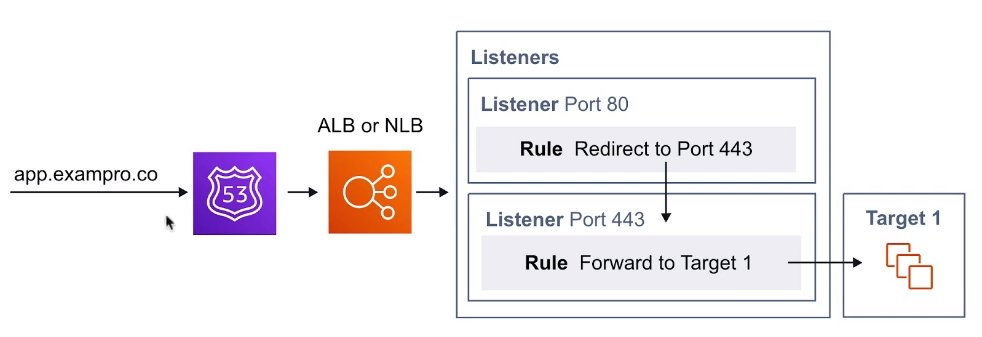
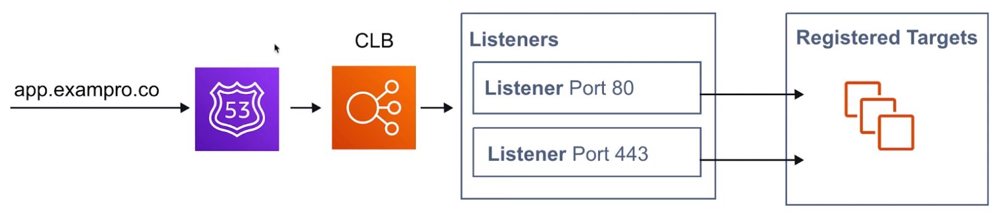
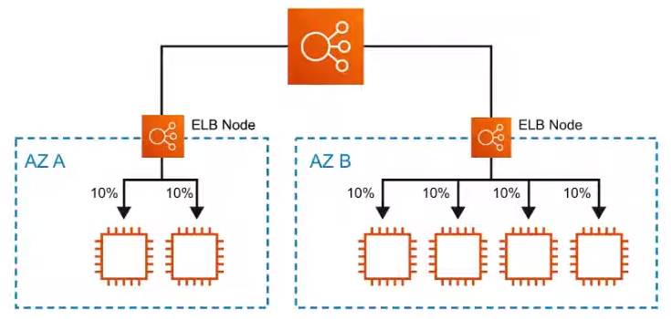
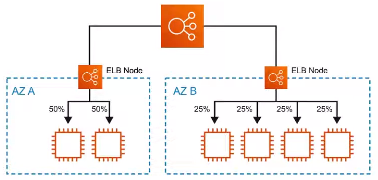

# Elastic Load Balancer

**Distribuye** el tráfico entrante de la aplicación a través
de múltiples objetivos, como instancias de Amazon EC2,
contenedores, direcciones IP y funciones Lambda

## Introducción

Los balanceadores de carga pueden ser hardware físico o
software virtual que acepta el tráfico entrante y luego
distribuye el tráfico a múltiples objetivos.
Pueden **equilibrar** la carga a través de diferentes reglas.
Estas reglas varían en función de los tipos de
balanceadores de carga

**Elastic Load Balancer** es la solución de AWS para
equilibrar la carga tráfico, y hay 3 tipos disponibles:

1. Application Load Balancer - ALB ( HTTP/HTTPS )
2. Network Load Balancer- NLB ( TCP/UDP )
3. Classic Load Balancer- CLB ( LEGACY )

## Rules of Traffic

### Listeners

El tráfico entrante se evalúa contra los `listeners`. Los `listeners`
evalúan cualquier tráfico que coincida con el puerto del Listener.
Para el CLB, las instancias EC2 se registran directamente
en el Equilibrador de carga

### Rules ( Not available for CLB )

Los `listeners` invocarán las reglas para decidir
qué hacer con el tráfico. Generalmente el siguiente
paso es reenviar el tráfico a un grupo de destino

### Target Groups ( Not available for CLB )

Las instancias EC2 se registran como objetivos
en un grupo de destino

---

**Para ALB o NLB** el tráfico se envía a los Listeners.
Cuando el puerto coincide, entonces se comprueban las reglas
para saber qué hacer. Las reglas reenviarán el tráfico
a un grupo de destino. El grupo de destino distribuirá uniformemente
distribuirá el tráfico a las instancias registradas
a ese grupo de destino

**Para el CLB** el tráfico se envía a los Listeners.
Cuando el puerto coincide entonces reenvía el tráfico a cualquier
instancia EC2 que estén registradas en el Classic Load Balancer.
CBL no permite aplicar reglas a los listeners

## Application Load Balancer ( ALB )

Los **ALB** están diseñados para equilibrar el tráfico
**HTTP** y **HTTPS**

Operan en la capa 7 (modelo OSI)

El ALB tiene una característica llamada **Rutamiento de solicitudes**
que permite añadir reglas de enrutamiento a sus escuchas
basadas en el protocolo HTTP

El Firewall de Aplicaciones Web ( WAF ) puede ser adjuntado
al ALB

Ideal para aplicaciones web

## Network Load Balancer ( NLB )

Los **NLB** están diseñados para equilibrar el tráfico TCP/UDP.

Operan en la capa 4 (modelo OSI)

Pueden manejar **millones de peticiones por segundo**
manteniendo una latencia extremadamente baja

Pueden realizar un equilibrio de carga entre zonas

Ideal para juegos de vídeo multi-jugador o cuando el
rendimiento de la red es crítico

## Classic Load Balancer ( CLB ) - LEGACY

Fue el primer primer equilibrador de carga de AWS
**( legacy )**

Puede equilibrar el tráfico **HTTP**, **HTTPS** o **TCP**.
( no al mismo tiempo )

Puede utilizar
**características específicas de la Capa 7 ( Modelo OSI )**
como **Sticky Sessions**

También puede utilizar
**balanceo estricto de la Capa 4 ( Modelo OSI )**
para aplicaciones puramente TCP

Puede realizar un balanceo de carga entre zonas

Responderá con un **504 error ( timeout )** si la
aplicación subyacente no responde, ej,
**a nivel del servidor web o de la base de datos**

No se recomienda su uso, en su lugar utilice **NBL** o **ALB**

## Sticky Sessions

Sticky Sessions es un método avanzado de equilibrio de carga
que permite
**vincular la sesión de un usuario a una instancia EC2 específica**

Asegurar que todas las **solicitudes** de la sesión se
**se envíen a la misma instancia**.

Típicamente **utilizado** con un **Balanceador de Carga Clásico**

**Puede habilitarse para el ALB** aunque sólo puede establecerse
en un Grupo de destino, no en instancias EC2 individuales

Las cookies se utilizan para recordar qué instancia EC2

Útil cuando la información específica
**se almacena localmente en una sola instancia**

## X Forwarded For Header

Si **necesita la dirección IPv4** de un usuario, compruebe
la cabecera **X-Forwarded-For**

La cabecera **X-Forwarded-For ( XFF )** es un método de
comando para identificar la **dirección IP de origen** de un
cliente que se conecta a un servidor web a través de un
proxy HTTP o un equilibrador de carga  

## Health Checks

Las instancias que son monitorizadas por el ELB **reportan**
Health Checks como **InService, o OutOfService**.

Los Health Checks se comunican directamente con la instancia
para determinar su estado

El ELB **no termina ( mata ) la instancia no saludable**.
Sólo redirige el tráfico a las instancias sanas

Para el ALB y el NLB, las comprobaciones de estado se
encuentran en el **Grupo de destino**

## Cross Zone Load Balancing

Sólo para **Classic** y **Network** Load Balancer

### Cross Zone Load Balancing Enabled

Las solicitudes se distribuyen uniformemente entre las instancias
**en todas las** AZ

### Cross Zone Load Balancing Disabled

Las peticiones se distribuyen uniformemente entre las instancias
**sólo dentro** es AZ

## Request Routing

Aplicar reglas a las solicitudes entrantes y luego
**reenviar** o **redirigir** el tráfico

Puede realizar las siguientes verificaciones:

- Encabezado de host
- IP de origen
- Ruta de acceso
- Encabezado HTTP
- Método del encabezado HTTP
- Cadena de consulta

## CheatSheet

- Existen tres Elastic Load Balancers:
  - Application Load Balancer ( ALB )
  - Network Load Balancer ( NLB )
  - Classic Load Balancer ( CLB )
- Un ELB debe tener **al menos dos** AZ
- Los ELB **no pueden ir por regiones**. Debe crear uno por región
- El ELB tiene **listeners**, **rules** y **target groups** para
enrutar el tráfico
- El NLB tiene **listeners** y **target groups** para enrutar
el tráfico
- CLB tiene **listeners** y las instancias EC2 están
**registradas directamente** como objetivos de CLB
- ELB es para el tráfico HTTP(S) y el nombre implica que es bueno
para aplicaciones web
- NLB es para TCP/UDP es bueno para el alto rendimiento
de la red, por ejemplo, videojuegos
- El CLB es legacy y se recomienda utilizar el ALB o el NLB
- Utilice **X-Forwarded-For ( XFF )** para obtener la IP
original del tráfico entrante que pasa por el ELB
- Puede adjuntar el Web Application Firewall ( WAF ) al ALB pero
no a NLB o CLB
- Puede adjuntar Amazon Certification Manager SSL a
cualquiera de los ELB para SSL
- El ALB dispone de reglas de enrutamiento de
solicitudes avanzadas, con las que puede enrutar basándose
en la cabecera del subdominio, la ruta y otra información HTTP(S)
- Se pueden habilitar las `Sticky Sessions` para CLB o ALB
y las sesiones son recordadas a través de Cookies

