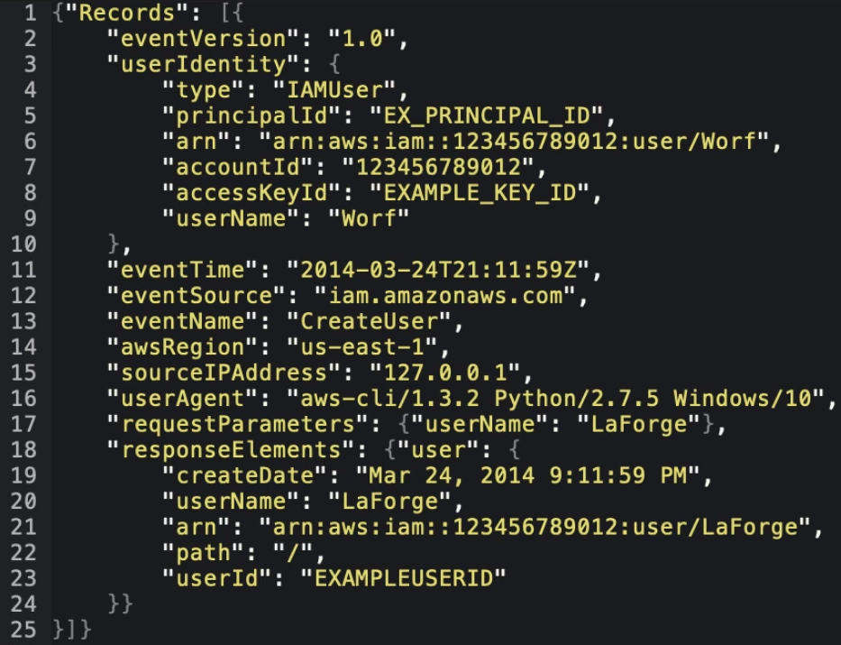

# CloudTrail

Registra las llamadas a la API entre los servicios de AWS.
Cuando necesite saber **a quién culpar**

## Introducción

AWS CloudTrail es un servicio que permite la **gobernanza**,
**conformidad**, **auditoría operativa**,
y **auditoría de riesgos** de su cuenta de AWS

AWS CloudTrail se utiliza para
**monitorear las llamadas a la API** y
**Acciones** realizadas en una cuenta de AWS

Identificar fácilmente qué usuarios y cuentas hicieron la
llamada a AWS, por ejemplo

- **Donde** Dirección IP de origen
- **Cuando** EventoHora
- **Quién** Usuario, UserAgent
- **Qué** Región, Recurso, Acción

## Historial de eventos

CloudTrail ya está registrando por defecto y recogerá los registros
de los **últimos 90 días** a través del **Historial de Eventos**

si necesita más de 90 días necesita crear un **Trail**.

Los Trails se envían a S3 y no tienen una interfaz gráfica
como el Historial de Eventos.
Para analizar un Trail tendrás que usar **Amazon Athena**.

## Opciones de los rastros

- Un Trail puede ser configurado para
**registrar en todas las regiones**
- Un rastro puede ser configurado para
**todas las cuentas de una organización**.
- Se puede **encriptar los registros** utilizando
Server Side Encryption a través del Servicio de
Gestión de Claves ( SSE- KMS )
- Podemos asegurar la Integridad de nuestros logs para ver si
han sido manipulados, tenemos que activar
**Validación de archivos de registro**

## CloudTrail a CloudWatch

CloudTrail puede ser configurado para entregar eventos al
log de CloudWatch

## Eventos de gestión vs. eventos de datos

### Eventos de gestión

Rastrea las operaciones de gestión. Activados por defecto.
No se pueden desactivar

- **Configuración de la seguridad**
  - Por ejemplo, operaciones de la API IAM AttachRolePolicy
- **Registro de dispositivo**
  - Por ejemplo, operaciones de la API AWS EC2 CreateDefaultVpc
- **Configuración de reglas para el enrutamiento de datos**
  - Por ejemplo, las operaciones de la API CreateSubnet
  de Amazon EC2
- **Configurar el registro**
  - ej. Operaciones de la API AWS CloudTrail

### Eventos de datos

Rastrea operaciones específicas para servicios específicos
de AWS. Los eventos de datos son registros de alto volumen
y resultarán en cargos adicionales. **Desactivado por defecto**

Los dos servicios que se pueden rastrear son S3 y
Lambda. Por lo que se rastrearían acciones como:
GetObject, DeleteObject, PutObject

## Cheat Sheet

- CloudTail registra las llamadas entre los servicios de AWS
- **gobernanza**, **cumplimiento**, **auditoría operativa**,
y **auditoría de riesgos** son palabras clave relacionadas
con CloudTail
- Cuando necesite saber **a quién culpar** piense en CloudTail
- CloudTail registra por defecto los datos de eventos de los
últimos 90 días a través del **Historial de Eventos**
- Para rastrear más allá de los 90 días necesita crear un **Trail**.
- Para asegurarse de que los registros no han sido manipulados
necesita activar la opción **Verificación de archivos de registro**.
- Los registros de CloudTail pueden ser encriptados usando **KMS**.
- CloudTail puede ser configurado para registrar todas las
cuentas de AWS en una organización y todas las regiones de
una cuenta
- Los registros de CloudTail se pueden transmitir a los
registros de CloudWatch
- Los registros se envían a un bucket de S3 que se especifica
- CloudTrail registra dos tipos de eventos: **Eventos de gestión**
y **Eventos de datos**
- Los **Eventos de Datos** registran las operaciones de
datos de los recursos ( S3, Lambda ),
por ejemplo, GetObject, DeleteObject, PutObject
- Los eventos de datos están **desactivados** por defecto
al crear una ruta.
- Los logs de Trail en S3 se pueden analizar con Amazon Athena

