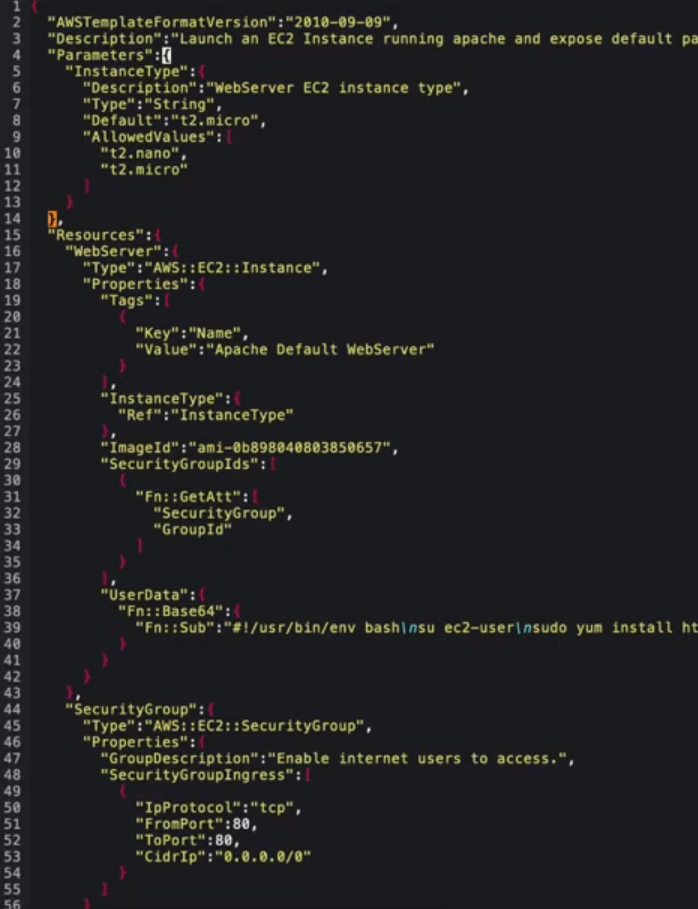
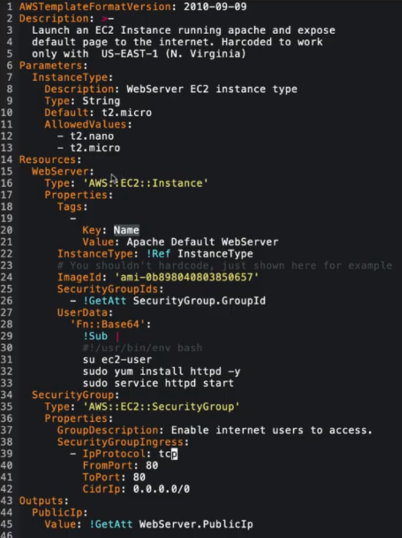
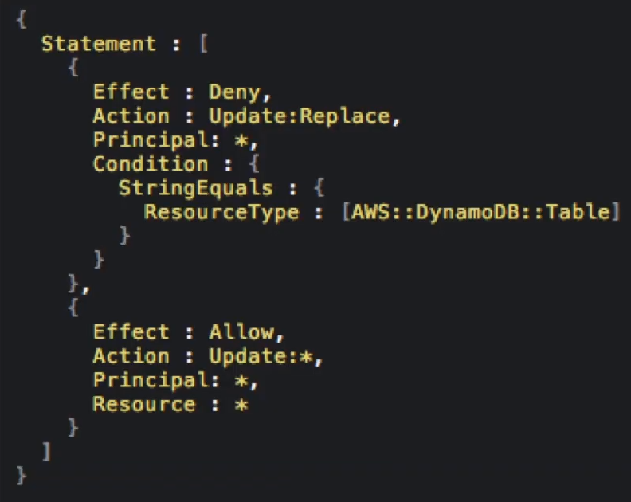
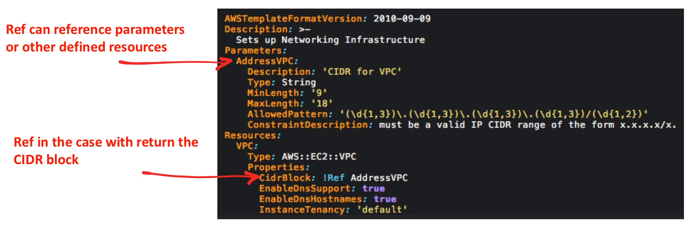
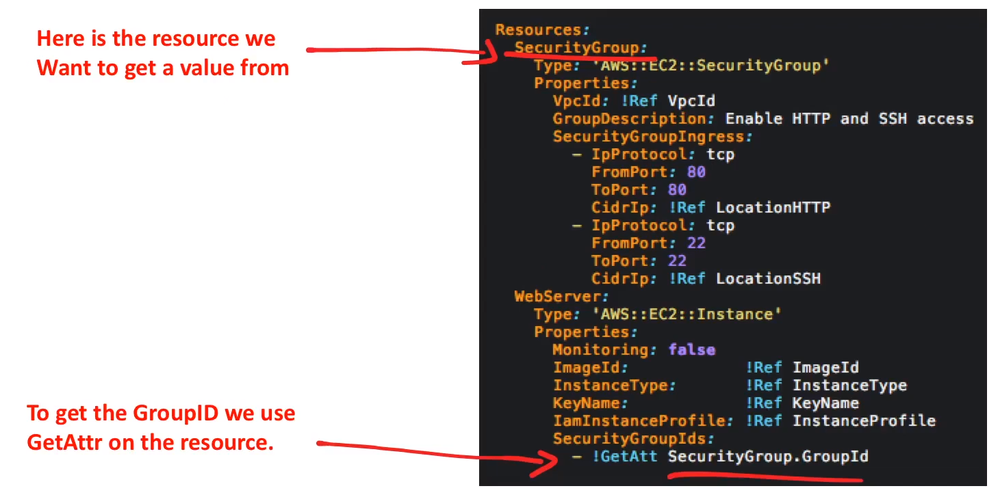
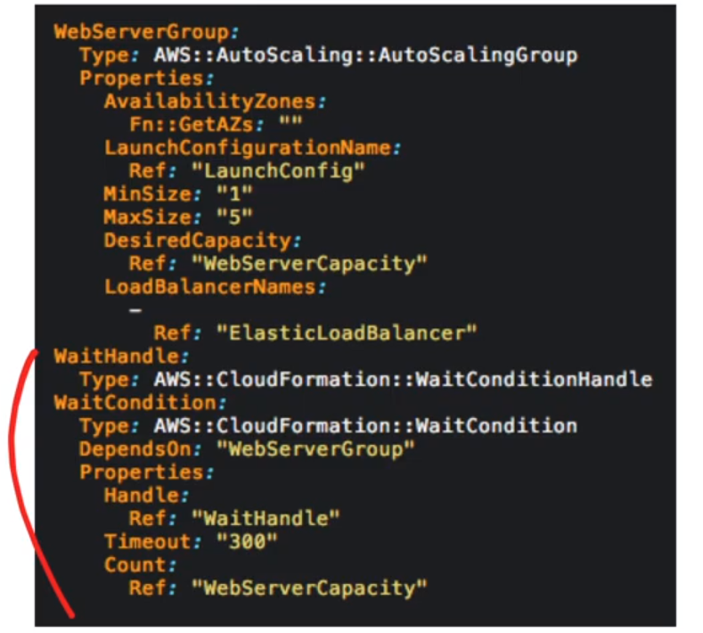

# CloudFormation

Un lenguaje de plantillas que **define los recursos de AWS**
para ser aprovisionados. **Automatizar** la creación de
recursos mediante código

## Introducción

### ¿Qué es la infraestructura como código? ( IaC )

El proceso de gestión y aprovisionamiento de centros de datos
informáticos ( eg, AWS ) a través de archivos de definición
legibles por máquina ( p. ej., archivos YAML, JSON )
en lugar de archivos de configuración de hardware físico
o herramientas de configuración interactivas
( ¡deja de hacer la configuración manual! )

### Caso de uso

La gente paga una suscripción mensual y para ejecutar un
servidor de Minecraft. Ellos eligen **donde** quieren y
**qué tamaño** de servidor quieren ejecutar

Podemos usar sus **insumos** y usar un AWS Lambda para crear
una nuevo stack de CloudFormation.
Hacemos que un lambda les envíe el correo electrónico
de su nueva dirección IP del servidor Minecraft y los detalles

## Formatos de plantillas

CloudFormation puede ser escrito en dos formatos diferentes

### JSON



### YAML



## Plantilla Anatomía

### MetaDatos

Información adicional sobre la plantilla

### Descripción

Una descripción de lo que se supone que hace esta plantilla

### Parámetros

Valores a pasar a la plantilla en tiempo de ejecución

### Mappings

Una tabla de búsqueda. Mapea las claves a los valores para
que usted cambie sus valores a otra cosa

### Condiciones

Si se crean recursos o se asignan propiedades

### Transformación

Aplica macros ( como aplicar un mod que cambie la
anatomía para que sea personalizada )

### Recursos

Un recurso que quieres crear, por ejemplo, un rol de IAM,
una instancia de EC2, Lambda, RDS

CloudFormation Templates **requiere** que
**al menos un recurso en la lista de recursos**

### Outputs

Valores que devuelve eg. Una dirección ip del nuevo
servidor creado

## Actualizaciones de el stack

**Cuando se necesita hacer un cambio en el stack** en lugar
de borrar y volver a crear el stack. Puede modificar la
plantilla de CloudFormation y subir una actualización de
del stack y CloudFormation **inteligentemente** cambiará o
borrará y volverá a crear los recursos

Hay dos maneras de realizar una actualización de el stack

1. **Actualización directa:** Usted actualiza directamente
el stack, envía cambios y AWS CloudFormation los implementa inmediatamente.
**Usa las actualizaciones directas cuando quieras desplegar**
**rápidamente tus actualizaciones**
2. **Ejecución de conjuntos de cambios:** Puede pre-visualizar
los cambios que CLoudFormation hará en su stack, y luego decidir
si aplicar esos cambios.
**Utilice conjuntos de cambios cuando quiera asegurarse de**
**que CloudFormation no haga cambios involuntarios**

---

Cuando envías una actualización, CloudFormation se actualiza
de forma diferente dependiendo del estado de sus recursos y
las circunstancias:

**Actualización sin interrupción:**

1. Actualiza los recursos **sin interrumpir** el funcionamiento
2. Y **sin cambiar** el ID físico del recurso

**Actualización con alguna interrupción:**

1. Actualiza el recurso **con alguna interrupción**.
2. Y **conserva** el ID físico

**Sustitución:**

1. **Realiza** el recurso durante una actualización
2. También **genera un nuevo** ID físico

## Prevenir las actualizaciones de el stack

Puede que quieras que ciertos recursos no se actualicen.
Impedir una actualización del stack podría ser para evitar
**pérdidas de datos** o **interrupción del servicio**

**StackPolicy** es un documento JSON que define las acciones
de actualización que se pueden realizar en los recursos designados.



## Pilas anidadas

Los **NestedStacks** permiten referenciar plantillas CFN
dentro de otras plantillas CFN dentro de otra:

1. Crear plantillas modulares **( reutilización )**
2. Ensamblar plantillas grandes **( reducir la complejidad )**

- Se pueden anidar stacks sobre stacks anidados
- Los stacks padre tienen acceso inmediato a los stacks hijo
- El stack raíz es accesible por todos los stacks anidados

## Detección de la deriva

### ¿Qué es la deriva?

La deriva es cuando la configuración real de su stack difiere
de lo que CloudFormation espera

### ¿Por qué ocurre el Drift?

Cuando los desarrolladores comienzan a hacer cambios manuales
en el stack ( el ejemplo más común es borrar recursos )
En lugar de cambiar la configuración actualizando y
relanzando la plantilla de CloudFormation

### Función de CloudFormation "Detecte Drift"

CloudFormation puede detectar la deriva y decirle si los recursos
eliminados o han sido modificados

### Nest Stacks y detección de drift

Cuando se detecta la deriva en el stack,
CloudFormation no detecta la deriva en cualquier stack
anidado que pertenezca a esa stack. En su lugar
puede iniciar una operación de detección de desviaciones
directamente en el stack anidado

### Stack Drift Status

- **DELETED** - El recurso ha sido borrado
- **MODIFIED** - Se ha producido un cambio en el recurso
- **NOT_CHECKED** - CloudFormation no ha verificado el recurso
- **IN_SYNC** - Todo está como se esperaba

## Rollbacks

Cuando **creas**, **actualizas** o **destruyes** un stack podrías
encontrar un error:

Por ejemplo, tu plantilla de CloudFormation tiene un
error de sintaxis

Por ejemplo, su stack está tratando de eliminar un recurso que
ya no existe

CloudFormation intentará **Rollback** en caso de error para
devolver su stack a su estado anterior

Los Rollbacks están activados **por defecto**. Puedes ignorar
el rollback usando la bandera **--ignore-rollback**
a través de la CLI de AWS

El rollback puede fallar. A veces tendrá que investigar y
cambiar la configuración de los recursos o posiblemente
tenga que llegar a a AWS Support de pago para resolver
el rollback fallido

- Cuando un rollback está en curso, verá **ROLLBACK_IN_PROGRESS**.
- Cuando un rollback tiene éxito, verá **UPDATE_ROLLBACK_COMPLETE**.
- Cuando un rollback falla verá **UPDATE_ROLLBACK_FAILED**.

## Pseudo Parámetros

**Parámetros predefinidos** por AWS CloudFormation.
No los declare en su plantilla.
Utilícelos de la misma manera que lo haría con un parámetro,
como el argumento para la función **Ref**.

```yaml
Outputs:
  MyStacksRegion:
    Value: !Ref "AWS::Region"
```

### Parámetros más comunes

| **Parámetro**      | **Descripción**                                                                                         | **Example**                                                                                         |
|--------------------|---------------------------------------------------------------------------------------------------------|-----------------------------------------------------------------------------------------------------|
| **AWS::Partition** | Devuelve la partición en la que se encuentra el recurso                                                 | aws-us-gov                                                                                          |
| **AWS::Region**    | Devuelve una cadena que representa la región de AWS en la que se está creando el recurso que lo engloba | us-east-1                                                                                           |
| **AWS::StackId**   | Devuelve el ID del stack tal y como se especifica en el comando create-stack de AWS CloudFormation      | arn:aws:cloudformation:us-west-2:123456789012:stack/test-stack/c29bcb7d-d948-4436-850a-1d91b0df546c |
| **AWS::StackName** | Devuelve el nombre del stack tal y como se especifica en el comando create-stack de AWS CloudFormation  | my-cfn-stack                                                                                        |
| **AWS::URLSuffix** | Devuelve el sufijo de un dominio. El sufijo suele ser `amazonaws.com`, pero puede variar según la región| amazon.com.cn                                                                                       |

## Atributos de los recursos

### CreationPolicy

Evita que su estado alcance la creación completa hasta que
AWS CloudFormation reciba un número especificado de
señales de éxito o se supere el período de tiempo de espera

```yaml
Resources:
  Type: AWS::AutoScaling::AutoScalingGroup
  CreationPolicy:
    ResourceSignal:
      Count: 3
      Timeout: PT15M
```

### DeletionPolicy

Reserva o ( en algunos casos ) respalda un recurso cuando
su stack es eliminado. **Delete**, **Retain** or **Snapshot**

```yaml
Resources:
  MyObInstance:
    Type: AWS::RDS::DBInstance
    DeletionPolicy: Snapshot
```

### UpdatePolicy

Cómo manejar una actualización para ASG, ElastiCache,
Domain o Alias Lambda

```yaml
UpdatePolicy:
  AutoScalingReplacingUpdate:
    WillReplace: True
```

### UpdateReplacePolicy

Para retener o ( en algunos casos ) respaldar la instancia
física existente de un recurso cuando es reemplazado durante
una operación de actualización del stack.
**Delete**, **Retain** or **Snapshot**

```yaml
Resources:
  MyObInstance:
    Type: AWS::RDS::DBInstance
    UpdateReplacePolicy: Snapshot
```

### DependsOn

Ese recurso se crea sólo después de la creación del recurso
especificado en el atributo **DependsOn**.

```yaml
Resources:
  MyEC2Instance:
    Type: AWS::EC2::Instance
    DependsOn: MyObInstance
  MyObInstance:
    Type: AWS::RDS::DBInstance
```

## Funciones intrínsecas

Utilice funciones intrínsecas en sus plantillas para
**asignar valores a las propiedades que no están disponibles**
**hasta el tiempo de ejecución**.

| **Function**             | **Descripción**                                                                                                          |
|--------------------------|--------------------------------------------------------------------------------------------------------------------------|
| **fn::Base64**           | Devuelve la representación Base64 de la cadena de entrada                                                                |
| **fn::Cidr**             | Devuelve una matriz de bloques de direcciones CIDR                                                                       |
| ***Condition Functions** | Fn::And Fn::Equals Fn::If Fn::Not Fn::Or                                                                                 |
| **fn::FindInMap**        | Devuelve el valor correspondiente a las claves de un mapa de dos niveles declarado en la sección Mappings                |
| **fn::Transform**        | Una macro para realizar un procesamiento personalizado en partes de una plantilla de stack                               |
| **fn::GetAZs**           | Devuelve una matriz que enumera las zonas de disponibilidad de una región especificada                                   |
| **fn::ImportValue**      | Devuelve el valor de una salida exportada por otro stack                                                                 |
| **fn::Join**             | Añade un conjunto de valores en un único valor, separado por el delimitador especificado                                 |
| **fn::Select**           | Devuelve un único objeto de una lista de objetos por índice                                                              |
| **fn::Split**            | Divide una cadena en una lista de valores de cadena para poder seleccionar un elemento de la lista de cadenas resultante |
| **fn::Sub**              | Sustituir las variables de una cadena de entrada por los valores que se especifiquen                                     |
| **fn::GetAttr**          | Devuelve el valor de un atributo de un recurso de la plantilla                                                           |
| **Ref**                  | Devuelve el valor del parámetro o recurso especificado                                                                   |

## Ref And Get Attr

### Ref

Ref devuelve **diferentes cosas** para diferentes recursos.
Tienes que buscar cada recurso en los AWS Docs para saber
lo que devuelve. Por ejemplo, ARN, nombre del recurso, ID físico



### Fn::GetAttr

GetAttr le permite acceder a muchas variables diferentes
en un recurso. Tendrás que consultar los AWS Docs para ver
lo que está disponible por recurso



Cuando necesites un valor para un recurso
**y no puedas obtenerlo de** Ref **puedes obtenerlo de** Fn::GetAttr

## Condiciones de espera

Las condiciones de espera **esperan** una **condición**

Se utilizan en dos casos:

1. Para coordinar la **creación de recursos en el stack*
con acciones de configuración que son
**externas a la creación del stack**.
2. **Para seguir el estado** de un proceso de configuración

**WaitCondition** es muy similar a **CreationPolicy**.
AWS recomienda utilizar **CreationPolicy** para **EC2** y **ASG**

- **CreationPolicy** espera en el recurso dependiente
- **WaitCondition** espera en la condición de espera
( externa )



## Cheat Sheet

- Cuando se pide **automatizar** el aprovisionamiento de recursos
**piense en CloudFormation**
- Cuando se menciona la Infraestructura como Código ( IaC )
**piense en CloudFormation**
- CloudFormation puede ser escrito en JSON o YAML
- Cuando CloudFormation encuentre un error, hará un rollback
con el estado **ROLLBACK_IN_PROGRESS**
- Las plantillas de CloudFormation de más de 51.200 bytes
( 0.05MB ) son demasiado grandes para subirlas directamente,
y deben ser importarse a CloudFormation a través de
un bucket de S3
- **NestedStacks** le ayuda a dividir su plantilla de CloudFormation
en plantillas re-utilizables más pequeñas que pueden componerse
en plantillas más grandes
- **Se debe definir al menos un recurso** bajo la propiedad resource
para que una plantilla de CloudFormation **sea válida**.
- Secciones de la plantilla de CloudFormation
  - **Metadatos** - Información extra sobre la plantilla
  - **Descripción** - Una descripción de lo que la plantilla
  debe hacer la plantilla
  - **Parámetros** - Es la forma en que se introducen las
  entradas del usuario en las plantillas
  - **Transformaciones** - Aplica macros ( como aplicar un
  mod que cambia la anatomía para que sea personalizada)
  - **Salidas** - Son valores que puedes usar para importar en
  otros stacks
  - **Mapas** - Asigna claves a valores, como una tabla de búsqueda
  - **Recursos** - Define los recursos que quieres aprovisionar,
  **Se requiere al menos un recurso**
  - **Condiciones** - Es si los recursos son creados o
  se asignan propiedades
- Las actualizaciones del stack se pueden realizar de dos
maneras diferentes:
  - **Actualización directa**
    - Se actualiza directamente el stack
    - Envías los cambios y AWS CloudFormation los despliega inmediatamente
  - **Ejecución de conjuntos de cambios**
    - Puede pre-visualizar los cambios que CloudFormation
    hará es su stack ( Change Set )
    Luego decide si quiere aplicar esos cambios
- **Las actualizaciones de la pila**
**cambiarán el estado de sus recursos** basándose en las circunstancias:
  - **Actualización sin interrupción** - Actualiza el recurso
  **sin interrumpir** el funcionamiento y **sin cambiar**
  el ID físico del recurso
  - **Actualizaciones con algunas interrupciones** -
  Actualiza el recurso **con alguna interrupción** y **conserva**
  el ID físico
  - **Reemplazo** - **Recrea** el recurso durante una actualización,
  también **genera un nuevo** ID físico
  - Se puede utilizar una **Política de Stack** para evitar
  las actualizaciones del stack en recursos para evitar la
  pérdida de datos o la interrupción de los servicios
- La función **Drift Detection** permite a CloudFormation
decirle cuando su configuración esperada ha cambiado a causa
de las anulaciones manuales. Por ejemplo, un CFN crea un SG
pero un desarrollador lo elimina
- **Rollbacks** ocurren cuando CloudFormation encuentra un error
cuando se crea, actualiza o destruye un stack
  - Cuando un rollback está en progreso verás **ROLLBACK_IN_PROGRESS**.
  - Cuando un rollback tiene éxito, verá **UPDATE_ROLLBACK_COMPLETE**.
  - Cuando una reversión falla, verá **UPDATE_ROLLBACK_FAILED**.
- Los **Pseudo parámetros** son parámetros predefinidos.
Ej. !Ref AWS::Region return us-east-1
- Atributos de los recursos
  - **CreationPolicy** - Evita que su estado llegue a create
  complete hasta que AWS CloudFormation reciba un número
  especificado de número de señales de éxito o se supere
  el periodo de tiempo de espera
  - **DeletionPolicy** - Reservar o ( en algunos casos ) respaldar
  de un recurso cuando se elimina su stack.
  **Delete**, **Retain** o **Snapshot**
  - **UpdatePolicy** - Cómo manejar una actualización para ASG,
  ElastiCache, Dominio o Lambda Alias
  - **UpdateReplacePolicy** - Para retener o
  ( en algunos casos ) la instancia física existente de un
  recurso cuando se sustituye durante una operación de
  actualización del stack.
  **Delete**, **Retain** o **Snapshot**
  - **DependsOn** - Este recurso se crea sólo después de la
  creación del recurso especificado en el atributo DependsOn
- **Las funciones intrínsecas** permiten asignar propiedades
  que no están disponibles hasta el tiempo de ejecución.
  Las más importante son **dos**:
  - **Ref** - Devuelve el valor del parámetro especificado
  o recurso
  - **Fn:GetAttr** - Devuelve el valor de un atributo
  de un recurso de la plantilla
- aws cloudformation **create-stack** - Comando CLI para crear
un stack
- aws cloudformation **update-stack** - Comando CLI para actualizar
un stack
- **Serverless Application Model ( SAM )** es una **extensión**
de CloudFormation que permite definir aplicaciones sin servidor

<style>
.text-red {
  color: red;
}
</style>
