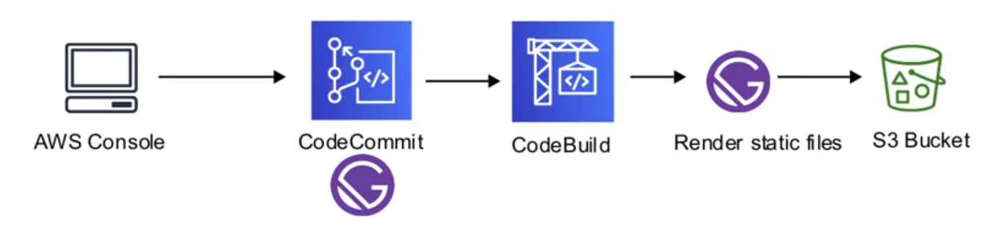
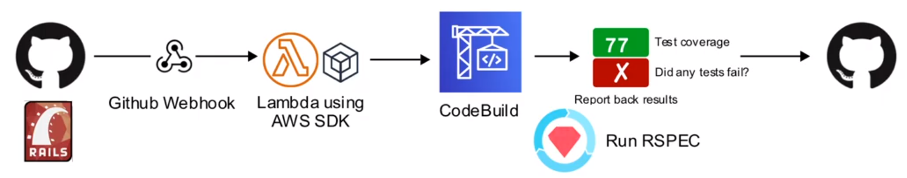

# CodeBuild

Un **build pipeline** completamente gestionado para crear,
construir y probar proyectos de código

## Introducción

- Un **servicio de construcción** totalmente gestionado en
la nube
- Compila su código fuente, **ejecuta pruebas unitarias** y
**produce artefactos** que están listos para ser desplegados
- Elimina la necesidad de aprovisionar, gestionar y escalar sus
propios servidores de compilación
- Proporciona un entorno de compilación pre-empaquetado para
los lenguajes de programación y herramientas de compilación
populares como Apache Maven, Gradle y otros.
- También puede personalizar los entornos de compilación para
utilizar sus propias herramientas de compilación
- Se amplía automáticamente para satisfacer los picos de
demanda de compilación

## Build Environments

Imágenes Docker gestionadas por CodeBuild.
Compruebe la imagen para ver lo que viene pre-instalado

- Amazon Linux 2
- Amazon Linux 2
- Ubuntu 18.04
- Ubuntu 18.04
- Windows Server Core 2016

## Use Cases

### Generate out Static Page from a JAMStack

Un sitio web construido con Gatsby necesita generar páginas estáticas
y la entrega para el alojamiento de sitios web estáticos en S3



### Run Test Code and Report Test Coverage

Un desarrollador necesita asegurarse de que su código pasa
todas las pruebas antes de de que se le permita hacer un PR



## Buildspec YML

El Buildspec proporciona las **instrucciones de construcción**.
El Buildspec.yml debe estar en la raíz de la carpeta del proyecto

### Properties

- **Versión** - La versión de la especificación de compilación
( 0.2 recomendada )
  - Afecta al shell por defecto en el entorno de construcción
    - 0.1 Ejecuta cada comando de compilación en una
    instancia separada
    - 0.2 Ejecuta todos los comandos de compilación en la
    misma instancia
- **Fases** - Los comandos se ejecutan durante cada fase de
la compilación
  - **install** - Sólo para instalar paquetes en el entorno
  de construcción
  - **pre_build** - Comandos que se ejecutan antes de la construcción
  - **build** - Comandos que se ejecutan durante la construcción
  - **post_build** - Comandos que se ejecutan después de la construcción
- **Artifacts** - aquí podemos encontrar la salida de la
construcción y cómo prepararla para subirla al bucket de
salida de S3

```yaml
version: 0.2

phases:
  install:
    commands:
      - bundle install
  pre_build:
    commands:
      - service postgresql start
      - export DATABASE_CLEANER_ALLOW_REMOTE_DATABAS_URL=true
      - export RAILS_ENV=test
  build:
    commands:
      - bundle exec rake db:create
      - bundle exec rake db:schema:load
      - bundle exec rake db:migrate
  post_build:
    commands:
      - bundle exec rspec
      - bundle exec cucumber
```

## CheatSheet

- **CodeBuild** es un **proceso de construcción** totalmente
gestionado para crear servidores temporales para construir y
probar el código
- Compila el código fuente, ejecuta pruebas unitarias y
produce artefactos que están listos para desplegar
- Proporciona un entorno de construcción pre-empaquetado o
puede construir sus propios propios entornos como un
contenedor Docker
- Utiliza un **Buildspec.yml** para proporcionar instrucciones
de compilación. Este archivo debe almacenarse en la raíz
de su proyecto
  - Versión 0.1 - ejecuta cada comando de construcción en
  una instancia separada
  - Versión 0.2 - ejecuta todos los comandos de construcción
  en la misma instancia
  - Los comandos se ejecutan en diferentes **fases**:
    - **install** - sólo para instalar paquetes en el
    entorno de compilación
    - **pre_build** - comandos que se ejecutan antes de construir
    - **build** - comandos que se ejecutan durante la construcción
    - **post_build** - comandos que se ejecutan después de
    la construcción

<style>
.text-red {
  color: red;
}
</style>
