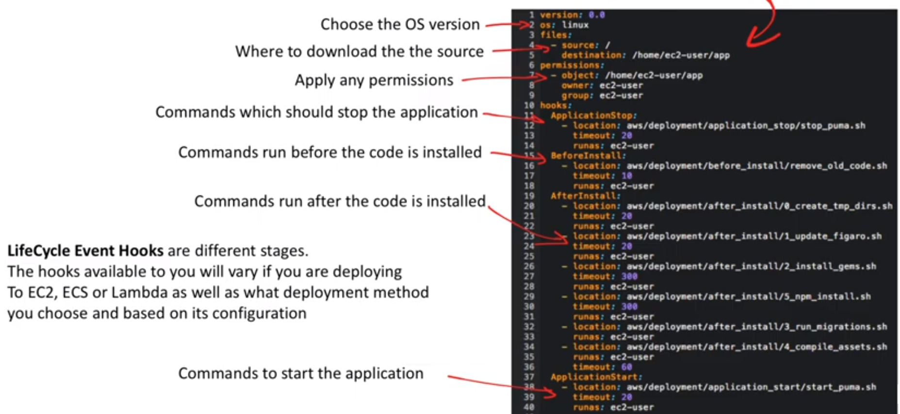
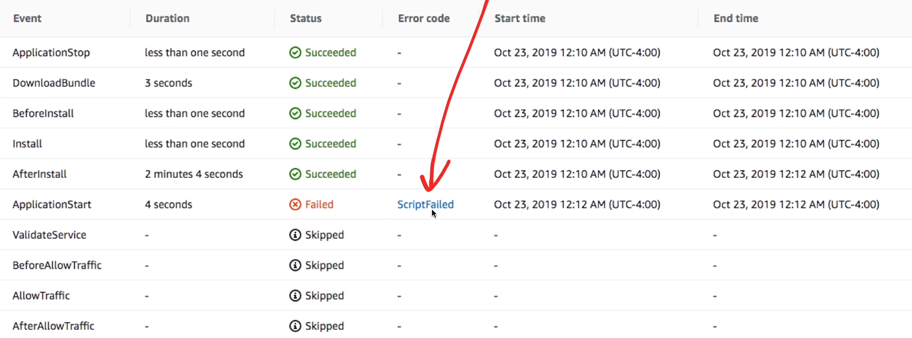

# CodeDeploy

Un **deploy pipeline** totalmente gestionado para desplegar en
entornos de staging o de producción

## Introducción

- Un **servicio de despliegue** totalmente gestionado en la nube
- Puede desplegar EC2, On-Promise, Lambda o ECS
- Lanzar rápidamente nuevas funciones
- Actualice las versiones de las funciones de AWS Lambda
- Evitar el tiempo de inactividad durante el despliegue de
la aplicación
- Realiza despliegues **In-Place** o **Blue/Green**
- Se integra con las herramientas CI/CD existentes.
Por ejemplo, Jenkins, CodePipeline
- Se integra con las herramientas de gestión de la
configuración existentes.
Por ejemplo, Puppet, Chef, Ansible

## Core Components

### Application

El identificador único de la aplicación que se está desplegando.
Asegura la combinación correcta de revisión, configuración
de despliegue y grupo son referenciados durante el despliegue

### Deployment Groups

Un conjunto de instancias EC2 o funciones Lambda donde la
nueva revisión se despliega

### Deployment

Es el proceso y los componentes utilizados para aplicar una nueva
revisión de la aplicación

### Deployment Configuration

Un conjunto de reglas de despliegue utilizadas durante el despliegue.
Con condiciones de éxito/fracaso incluidas

### AppSpec File

Contiene las acciones de despliegue que CodeDeploy debe ejecutar
durante el despliegue

### Revision

Contiene todo lo necesario para desplegar una nueva versión.
Archivo AppSpec, archivos de aplicación,
archivos de configuración, ejecutables

## In Place

- Se detiene la aplicación en cada instancia del grupo de despliegue
- Se instala la última revisión de la aplicación,
y la nueva versión de la aplicación se inicia y valida
- Puede utilizar un equilibrador de carga para que cada
instancia se des-registre durante su despliegue y luego se
restablece el servicio después de que el despliegue se haya completado
- Sólo las implantaciones que utilizan la plataforma informática
**EC2 u On-Promise** **pueden utilizar el despliegue in in-place**.

## Blue Green

- Las instancias se aprovisionan para el entorno de sustitución
- La última revisión de la aplicación se instala en las
instancias de sustitución
- Se produce un tiempo de espera opcional para actividades
como las aplicaciones pruebas y verificación del sistema
- Las instancias del entorno de sustitución se registran en un
un ELB, lo que hace que el tráfico se redirija a ellas
- Las instancias del entorno original se dan de baja y
pueden ser terminadas o mantenidas en ejecución para otros usos

## appsync.yml

## Lifecycle Hooks

Cuando haces un deploy, puedes ver los eventos y ver si algo
y el tiempo que tarda cada evento. Estos eventos ocurren secuencialmente

---

Cuando un evento falla puedes entrar a **investigar** qué
ha pasado

## CodeDeploy Agent and ServiceRole

### Agent

Necesitarás instalar el Agente de CodeDeploy.
Para que la instancia EC2 pueda informar a CodeDeploy

### ServiceRole

Es posible que tenga que crear un rol de servicio de CodeDeploy
basado en su estrategia de despliegue

## Cheat Sheet

- Un **deploy pipeline** totalmente gestionado para desplegar
en entornos de producción
- Puede desplegar en EC2, On-Promise, Lambda o ECS
- Puede realizar un despliegue **In-Place** o **Blue/Green**.
  - **In-Place** - Las instancias se desconectan brevemente,
  las actualizaciones se aplican a los servidores existentes
  - **Azul/Verde** - Se sustituyen las instancias por otras nuevas.
  Intercambio de entornos
- Componentes principales de CodeDeploy
  - **Aplicación** - Abarca todos los demás componentes.
  ID único de la aplicación que se está desplegando
  - **Grupos de despliegue** - Un conjunto de instancias EC2
  o Lambda Functions donde se despliega la nueva revisión
  - **Despliegues** - Este proceso y componentes utilizados para
  aplicar una nueva revisión de las aplicaciones
  - **Configuración de despliegue** - Un conjunto de reglas
  de despliegue utilizadas durante el despliegue -
  con condiciones de éxito/fracaso
  - **Fichero AppSpec** - Contiene las acciones de despliegue
  que CodeDeploy debe ejecutar durante el despliegue
  - **Revisión** - Es todo lo necesario para desplegar una
  nueva versión: Archivo AppSpec, archivos de aplicación,
  archivos de configuración, ejecutables
- **El AppSpec.yml** describe las instrucciones de despliegue
y debe ser parte del artefacto de despliegue
- Es necesario instalar el CodeDeployAgent en la instancia EC2
para que pueda comunicarse con CodeDeploy
- Necesitas instalar CodeDeployServiceRole en tu instancia EC2
para que tenga permiso para comunicarse con CodeDeploy
y para que CodeDeploy tenga permisos para replicar servidores
o ASGs

